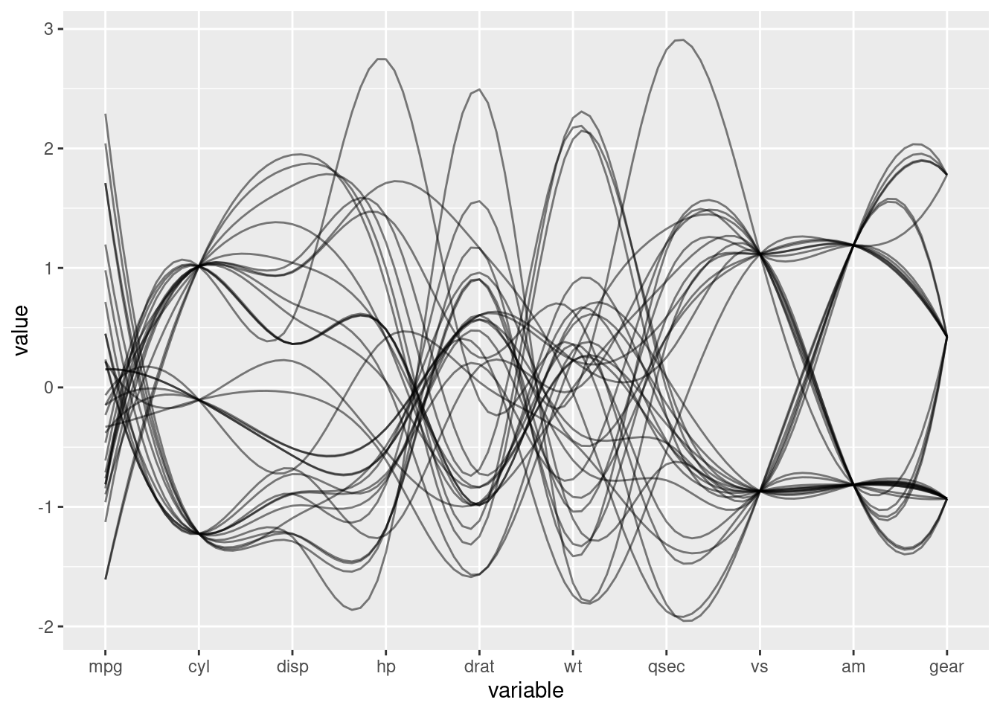
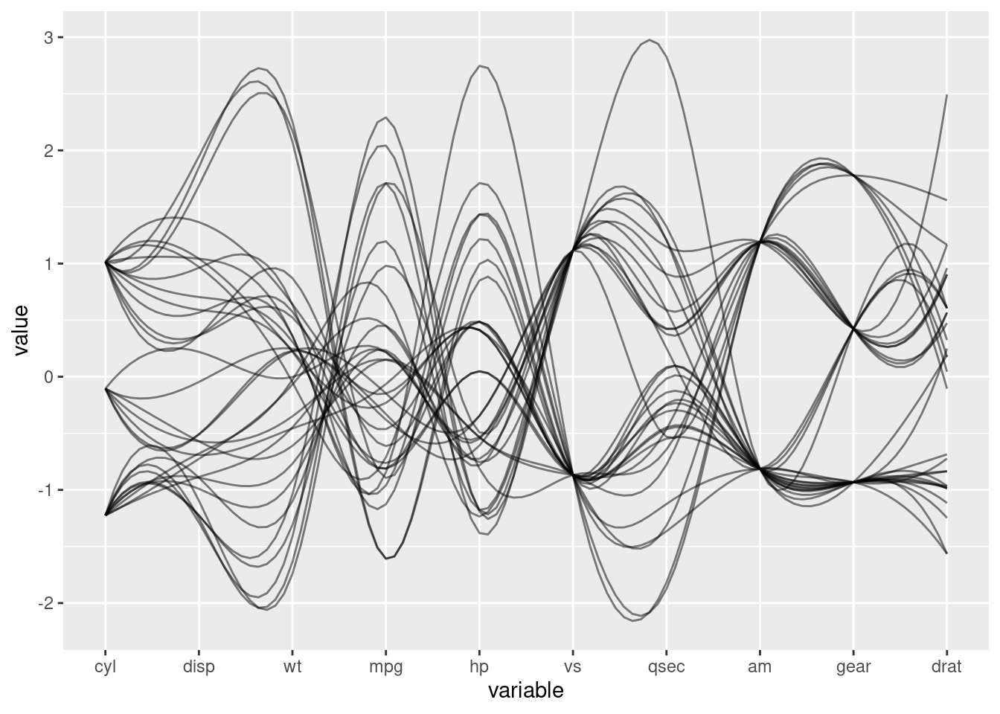
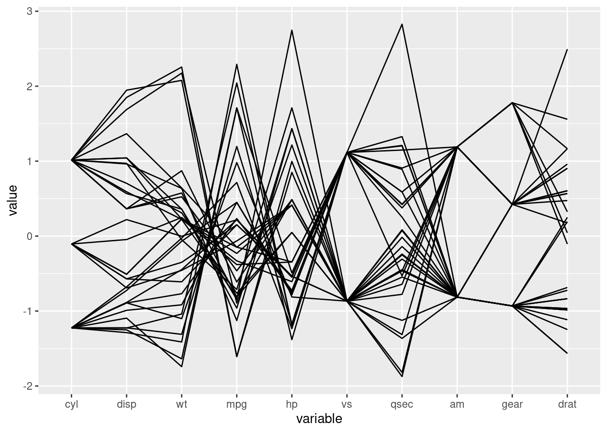

# Best Parallel Coordinates R Package

Shubham Kaushal and Daniel Young

## Introduction

GGally has a ggparcoord function but the user is in charge of what order the features go in along the x axis. There are some built-in functions to arrange them automatically but we propose our own method. We find the two highest correlated features, then greedily continue appending the next highest correlated feature until we have an ordering.

## Example

### Installation

We install from a github repository


```r
#devtools::install_github("ShubhamKaushal15/bestparcoords")
library("bestparcoords") # Must be installed from source
```

### Data

We demo our package with the mtcars dataset. Any preprocessing must be done before we use the package so for example we will remove the last column.


```r
data(mtcars)
mtcars <- mtcars[,-11]
head(mtcars)
```

```
##                    mpg cyl disp  hp drat    wt  qsec vs am gear
## Mazda RX4         21.0   6  160 110 3.90 2.620 16.46  0  1    4
## Mazda RX4 Wag     21.0   6  160 110 3.90 2.875 17.02  0  1    4
## Datsun 710        22.8   4  108  93 3.85 2.320 18.61  1  1    4
## Hornet 4 Drive    21.4   6  258 110 3.08 3.215 19.44  1  0    3
## Hornet Sportabout 18.7   8  360 175 3.15 3.440 17.02  0  0    3
## Valiant           18.1   6  225 105 2.76 3.460 20.22  1  0    3
```

### Default

The default ordering shown here isn't the best, it just leaves the columns in order regardless of their correlation.


```r
GGally::ggparcoord(mtcars, splineFactor=10, alphaLines=0.5)
```



### bestparcoords

Here we show the bestparcoords graph which is a better than the default version because it accentuates the alternating trends between pairs of features which shows the underlying pattern in the data much better.


```r
cols <- bestparcoords::bestparcoord(mtcars)
```



Best parcoords also outputs the features in the order it found, which we can use for other purposes. For example, if we want to display the plot with a different spline factor.


```r
print(cols)
```

```
##  [1] "cyl"  "disp" "wt"   "mpg"  "hp"   "vs"   "qsec" "am"   "gear" "drat"
```

```r
indices <- match(cols, colnames(mtcars))
print(indices)
```

```
##  [1]  2  3  6  1  4  8  7  9 10  5
```


```r
GGally::ggparcoord(mtcars, columns=indices)
```


