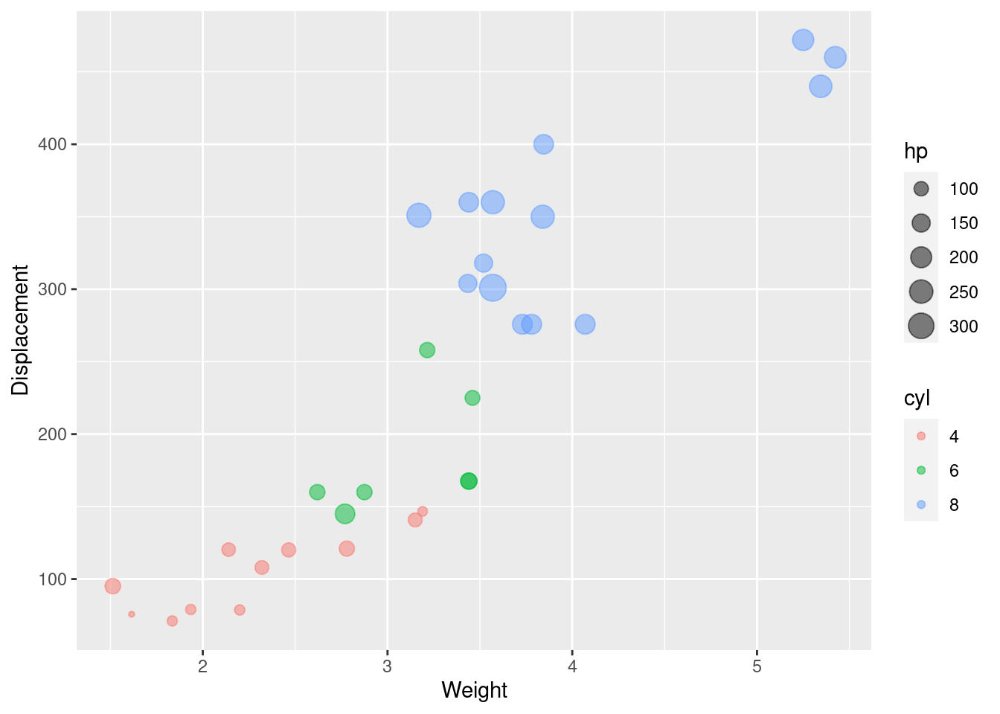

# Bubble chart --- **GPAs of Course at Columbia University**

Longcong Xu


```r
library(ggplot2)
library(dplyr)
library(plotly)
```

## Motivation for the project

In just a few days it will be time for Columbia students to begin choosing their spring 2023 classes. The University offers us a wealth of courses, and I am sure that many students, like me, are unsure of how to choose among the many courses of interest. Yet we don't have a platform to disclose some of the information we care most about to help us make decisions. During my undergraduate years, there was a website that visually provided information about the courses, such as course name, course capacity size, average GPA of the course, etc. I borrowed the idea from [UIUC Course evaluation](https://waf.cs.illinois.edu/discovery/gpa_of_every_course_at_illinois/) and hope to build a platform to showcase the courses that belong to Columbia University. If this platform can be built and made public, it can greatly help students in course selection.

On the University of Illinois at Urbana-Champaign website, the most dominant chart is the bubble chart. Therefore, I would also like to take this opportunity to supplement the EDAV course on bubble charts. The two remaining sections of the document on this page are: an introduction to bubble charts using the data mtcars built into R, and an introduction to plotly package. Although plotly package is briefly described on the EDAV website, I would like to give more examples and introduce how to scale bubble size, how to set pop up text in this package.

## Two methods to create bubble chart --- Example of mtcars

The bubble chart is actually one of the scatter diagrams, except that the bubble chart adds two new dimensions to the scatter diagram. Scatter plots are mainly applicable to two-dimensional continuous variable data, while bubble plots can add categorical data to the plot. The bubble size of the bubble chart provides a new intuitive display perspective, and in addition, the bubble color shade provides another indicator of the data. Due to the limitation on the dataset, I chose the mtcars dataset for a simple interpretation of the bubble chart first.

### Use the package ggplot2

One of the most commonly used packages, ggplot2, extends the scatter plot to a bubble plot. In mtcar dataset, I choose wt(car weight (1000 lbs)), disp(displacement (cu.in.)), hp (Gross horsepower) and cyl (Number of cylinders) attributes. We first started with the simplest one, using Gross horsepower depict bubble size and using Number of cylinders distinct different color of bubbles. As for the alpha, it represent the transparency of air bubbles.


```r
data("mtcars")
df <- mtcars

g1 <- ggplot(df, aes(x = wt, y = disp, size = hp, color = cyl)) +
  geom_point(alpha = 0.5) +
  xlab("Weight") +
  ylab("Displacement")
g1
```


Since the type of Number of cylinders attribute is numeric originally, as the number of cylinders increases, we can see a change in color from dark to light. Although number of cylinders is numeric, there are only four values, so we present it after transforming it into factor to be able to better distinguish this indicator.


```r
df$cyl <- as.factor(df$cyl)
g2 <- ggplot(df, aes(x = wt, y = disp, size = hp, color = cyl)) +
  geom_point(alpha = 0.5) +
  xlab("Weight") +
  ylab("Displacement") 
g2
```



It is clear from the graph that the displacement increases in a linear fashion as the number of cylinders increases.

In addition, we can set the color of the bubbles specifically and the scale the size of the bubbles. Furthermore, if you do not know how to match the color, you can refer [color palette](https://hexcolorpedia.com/).


```r
g3 <- ggplot(df, aes(x = wt, y = disp, color = cyl, size = hp)) +
  geom_point(alpha = 0.5) +
  scale_color_manual(values = c("#AA4371", "#E7B800", "#FC4E07")) +
  scale_size(range = c(1, 13)) + 
  xlab("Weight") +
  ylab("Displacement") +
  theme_set(theme_bw() +theme(legend.position = "bottom"))
g3
```


### The package plotly

The chart implemented by ggplot2 has an obvious drawback, although we can clearly see the difference between different vehicles and some relationships between indicators. But we can't clearly see the brand of the car, since , and we don't know how to choose it. plotly is a package that greatly improves the functionality of interactions in charts. When the mouse hovers over the bubble, the pop up content is generated.


```r
g4 <- plot_ly(df, x = ~wt, y = ~disp,
                      text = ~cyl, size = ~qsec,
                      color = ~cyl, sizes = c(10, 50), 
                      marker = list(opacity = 0.7, sizemode = "diameter"))%>% add_markers()%>%
  layout(xaxis = list(title = "Weight"),yaxis = list(title = "Displacement"))

g4
```

```{=html}
<div id="htmlwidget-bd90fbdb78447ca6d0c0" style="width:80%;height:480px;" class="plotly html-widget"></div>
<script type="application/json" data-for="htmlwidget-bd90fbdb78447ca6d0c0">{"x":{"visdat":{"278432d5a91d":["function () ","plotlyVisDat"]},"cur_data":"278432d5a91d","attrs":{"278432d5a91d":{"x":{},"y":{},"text":{},"marker":{"opacity":0.7,"sizemode":"diameter"},"color":{},"size":{},"alpha_stroke":1,"sizes":[10,50],"spans":[1,20],"type":"scatter","mode":"markers","inherit":true}},"layout":{"margin":{"b":40,"l":60,"t":25,"r":10},"xaxis":{"domain":[0,1],"automargin":true,"title":"Weight"},"yaxis":{"domain":[0,1],"automargin":true,"title":"Displacement"},"hovermode":"closest","showlegend":true},"source":"A","config":{"modeBarButtonsToAdd":["hoverclosest","hovercompare"],"showSendToCloud":false},"data":[{"x":[2.32,3.19,3.15,2.2,1.615,1.835,2.465,1.935,2.14,1.513,2.78],"y":[108,146.7,140.8,78.7,75.7,71.1,120.1,79,120.3,95.1,121],"text":["4","4","4","4","4","4","4","4","4","4","4"],"marker":{"color":"rgba(102,194,165,1)","size":[29.5714285714286,36.1904761904762,50,33.6666666666667,29.1428571428571,35.7142857142857,36.2380952380953,30.9523809523809,20.4761904761905,21.4285714285714,29.5238095238095],"sizemode":"diameter","opacity":0.7,"line":{"color":"rgba(102,194,165,1)"}},"type":"scatter","mode":"markers","name":"4","textfont":{"color":"rgba(102,194,165,1)","size":[29.5714285714286,36.1904761904762,50,33.6666666666667,29.1428571428571,35.7142857142857,36.2380952380953,30.9523809523809,20.4761904761905,21.4285714285714,29.5238095238095]},"error_y":{"color":"rgba(102,194,165,1)","width":[]},"error_x":{"color":"rgba(102,194,165,1)","width":[]},"line":{"color":"rgba(102,194,165,1)"},"xaxis":"x","yaxis":"y","frame":null},{"x":[2.62,2.875,3.215,3.46,3.44,3.44,2.77],"y":[160,160,258,225,167.6,167.6,145],"text":["6","6","6","6","6","6","6"],"marker":{"color":"rgba(252,141,98,1)","size":[19.3333333333333,22,33.5238095238095,37.2380952380952,28.0952380952381,30.9523809523809,14.7619047619048],"sizemode":"diameter","opacity":0.7,"line":{"color":"rgba(252,141,98,1)"}},"type":"scatter","mode":"markers","name":"6","textfont":{"color":"rgba(252,141,98,1)","size":[19.3333333333333,22,33.5238095238095,37.2380952380952,28.0952380952381,30.9523809523809,14.7619047619048]},"error_y":{"color":"rgba(252,141,98,1)","width":[]},"error_x":{"color":"rgba(252,141,98,1)","width":[]},"line":{"color":"rgba(252,141,98,1)"},"xaxis":"x","yaxis":"y","frame":null},{"x":[3.44,3.57,4.07,3.73,3.78,5.25,5.424,5.345,3.52,3.435,3.84,3.845,3.17,3.57],"y":[360,360,275.8,275.8,275.8,472,460,440,318,304,350,400,351,301],"text":["8","8","8","8","8","8","8","8","8","8","8","8","8","8"],"marker":{"color":"rgba(141,160,203,1)","size":[22,16.3809523809524,23.8095238095238,24.7619047619048,26.6666666666667,26.5714285714286,25.8095238095238,23.9047619047619,21.2857142857143,23.3333333333333,14.3333333333333,22.1428571428571,10,10.4761904761905],"sizemode":"diameter","opacity":0.7,"line":{"color":"rgba(141,160,203,1)"}},"type":"scatter","mode":"markers","name":"8","textfont":{"color":"rgba(141,160,203,1)","size":[22,16.3809523809524,23.8095238095238,24.7619047619048,26.6666666666667,26.5714285714286,25.8095238095238,23.9047619047619,21.2857142857143,23.3333333333333,14.3333333333333,22.1428571428571,10,10.4761904761905]},"error_y":{"color":"rgba(141,160,203,1)","width":[]},"error_x":{"color":"rgba(141,160,203,1)","width":[]},"line":{"color":"rgba(141,160,203,1)"},"xaxis":"x","yaxis":"y","frame":null}],"highlight":{"on":"plotly_click","persistent":false,"dynamic":false,"selectize":false,"opacityDim":0.2,"selected":{"opacity":1},"debounce":0},"shinyEvents":["plotly_hover","plotly_click","plotly_selected","plotly_relayout","plotly_brushed","plotly_brushing","plotly_clickannotation","plotly_doubleclick","plotly_deselect","plotly_afterplot","plotly_sunburstclick"],"base_url":"https://plot.ly"},"evals":[],"jsHooks":[]}</script>
```

We can see that if we don't set it, plotly defaults to displaying the horizontal and vertical values, but still doesn't show the brand of the car we want. mtcar dataset shows the brand of the car as rowname, so I did it by adding a new column named Brand to store the brand of each car. The most important thing is to set the hovertemplate, paste function converts its arguments to character strings, and concatenates them.

We pass Brand into the function if we want to display the brand of the car. Also, in R, the \<br\> character is a line break. This way, we can customize, what we want to show in the pop up of the bubble chart. As you can see, hover is able to display not only the parameters used to draw the bubble chart, wt, disp, hp, etc., but also any other parameters in the dataset.


```r
df['Brand'] <- row.names(df)
g5 <- plot_ly(df, x = ~wt, y = ~disp,
                      size = ~hp, sizes = c(10, 50),
                      color = ~cyl, 
                      mode = 'markers',
                      hovertemplate = paste("Brand:",df$Brand, "<br>Weight:" ,df$wt, "<br>", "Displacement:", df$disp),
                      marker = list(opacity = 0.7,sizemode = "diameter")) %>% add_markers()%>%
  layout(xaxis = list(title = "Weight"),yaxis = list(title = "Displacement"))
g5
```

```{=html}
<div id="htmlwidget-40d29f75fd4491b7a858" style="width:80%;height:480px;" class="plotly html-widget"></div>
<script type="application/json" data-for="htmlwidget-40d29f75fd4491b7a858">{"x":{"visdat":{"2784e9fe798":["function () ","plotlyVisDat"]},"cur_data":"2784e9fe798","attrs":{"2784e9fe798":{"x":{},"y":{},"mode":"markers","hovertemplate":["Brand: Mazda RX4 <br>Weight: 2.62 <br> Displacement: 160","Brand: Mazda RX4 Wag <br>Weight: 2.875 <br> Displacement: 160","Brand: Datsun 710 <br>Weight: 2.32 <br> Displacement: 108","Brand: Hornet 4 Drive <br>Weight: 3.215 <br> Displacement: 258","Brand: Hornet Sportabout <br>Weight: 3.44 <br> Displacement: 360","Brand: Valiant <br>Weight: 3.46 <br> Displacement: 225","Brand: Duster 360 <br>Weight: 3.57 <br> Displacement: 360","Brand: Merc 240D <br>Weight: 3.19 <br> Displacement: 146.7","Brand: Merc 230 <br>Weight: 3.15 <br> Displacement: 140.8","Brand: Merc 280 <br>Weight: 3.44 <br> Displacement: 167.6","Brand: Merc 280C <br>Weight: 3.44 <br> Displacement: 167.6","Brand: Merc 450SE <br>Weight: 4.07 <br> Displacement: 275.8","Brand: Merc 450SL <br>Weight: 3.73 <br> Displacement: 275.8","Brand: Merc 450SLC <br>Weight: 3.78 <br> Displacement: 275.8","Brand: Cadillac Fleetwood <br>Weight: 5.25 <br> Displacement: 472","Brand: Lincoln Continental <br>Weight: 5.424 <br> Displacement: 460","Brand: Chrysler Imperial <br>Weight: 5.345 <br> Displacement: 440","Brand: Fiat 128 <br>Weight: 2.2 <br> Displacement: 78.7","Brand: Honda Civic <br>Weight: 1.615 <br> Displacement: 75.7","Brand: Toyota Corolla <br>Weight: 1.835 <br> Displacement: 71.1","Brand: Toyota Corona <br>Weight: 2.465 <br> Displacement: 120.1","Brand: Dodge Challenger <br>Weight: 3.52 <br> Displacement: 318","Brand: AMC Javelin <br>Weight: 3.435 <br> Displacement: 304","Brand: Camaro Z28 <br>Weight: 3.84 <br> Displacement: 350","Brand: Pontiac Firebird <br>Weight: 3.845 <br> Displacement: 400","Brand: Fiat X1-9 <br>Weight: 1.935 <br> Displacement: 79","Brand: Porsche 914-2 <br>Weight: 2.14 <br> Displacement: 120.3","Brand: Lotus Europa <br>Weight: 1.513 <br> Displacement: 95.1","Brand: Ford Pantera L <br>Weight: 3.17 <br> Displacement: 351","Brand: Ferrari Dino <br>Weight: 2.77 <br> Displacement: 145","Brand: Maserati Bora <br>Weight: 3.57 <br> Displacement: 301","Brand: Volvo 142E <br>Weight: 2.78 <br> Displacement: 121"],"marker":{"opacity":0.7,"sizemode":"diameter"},"color":{},"size":{},"alpha_stroke":1,"sizes":[10,50],"spans":[1,20],"type":"scatter","inherit":true}},"layout":{"margin":{"b":40,"l":60,"t":25,"r":10},"xaxis":{"domain":[0,1],"automargin":true,"title":"Weight"},"yaxis":{"domain":[0,1],"automargin":true,"title":"Displacement"},"hovermode":"closest","showlegend":true},"source":"A","config":{"modeBarButtonsToAdd":["hoverclosest","hovercompare"],"showSendToCloud":false},"data":[{"x":[2.32,3.19,3.15,2.2,1.615,1.835,2.465,1.935,2.14,1.513,2.78],"y":[108,146.7,140.8,78.7,75.7,71.1,120.1,79,120.3,95.1,121],"mode":"markers","hovertemplate":["Brand: Datsun 710 <br>Weight: 2.32 <br> Displacement: 108","Brand: Merc 240D <br>Weight: 3.19 <br> Displacement: 146.7","Brand: Merc 230 <br>Weight: 3.15 <br> Displacement: 140.8","Brand: Fiat 128 <br>Weight: 2.2 <br> Displacement: 78.7","Brand: Honda Civic <br>Weight: 1.615 <br> Displacement: 75.7","Brand: Toyota Corolla <br>Weight: 1.835 <br> Displacement: 71.1","Brand: Toyota Corona <br>Weight: 2.465 <br> Displacement: 120.1","Brand: Fiat X1-9 <br>Weight: 1.935 <br> Displacement: 79","Brand: Porsche 914-2 <br>Weight: 2.14 <br> Displacement: 120.3","Brand: Lotus Europa <br>Weight: 1.513 <br> Displacement: 95.1","Brand: Volvo 142E <br>Weight: 2.78 <br> Displacement: 121"],"marker":{"color":"rgba(102,194,165,1)","size":[15.7950530035336,11.4134275618375,16.0777385159011,11.9787985865724,10,11.8374558303887,16.3604240282686,11.9787985865724,15.5123674911661,18.6219081272085,18.0565371024735],"sizemode":"diameter","opacity":0.7,"line":{"color":"rgba(102,194,165,1)"}},"type":"scatter","name":"4","textfont":{"color":"rgba(102,194,165,1)","size":[15.7950530035336,11.4134275618375,16.0777385159011,11.9787985865724,10,11.8374558303887,16.3604240282686,11.9787985865724,15.5123674911661,18.6219081272085,18.0565371024735]},"error_y":{"color":"rgba(102,194,165,1)","width":[]},"error_x":{"color":"rgba(102,194,165,1)","width":[]},"line":{"color":"rgba(102,194,165,1)"},"xaxis":"x","yaxis":"y","frame":null},{"x":[2.62,2.875,3.215,3.46,3.44,3.44,2.77],"y":[160,160,258,225,167.6,167.6,145],"mode":"markers","hovertemplate":["Brand: Mazda RX4 <br>Weight: 2.62 <br> Displacement: 160","Brand: Mazda RX4 Wag <br>Weight: 2.875 <br> Displacement: 160","Brand: Hornet 4 Drive <br>Weight: 3.215 <br> Displacement: 258","Brand: Valiant <br>Weight: 3.46 <br> Displacement: 225","Brand: Merc 280 <br>Weight: 3.44 <br> Displacement: 167.6","Brand: Merc 280C <br>Weight: 3.44 <br> Displacement: 167.6","Brand: Ferrari Dino <br>Weight: 2.77 <br> Displacement: 145"],"marker":{"color":"rgba(252,141,98,1)","size":[18.1978798586572,18.1978798586572,18.1978798586572,17.4911660777385,20.0353356890459,20.0353356890459,27.3851590106007],"sizemode":"diameter","opacity":0.7,"line":{"color":"rgba(252,141,98,1)"}},"type":"scatter","name":"6","textfont":{"color":"rgba(252,141,98,1)","size":[18.1978798586572,18.1978798586572,18.1978798586572,17.4911660777385,20.0353356890459,20.0353356890459,27.3851590106007]},"error_y":{"color":"rgba(252,141,98,1)","width":[]},"error_x":{"color":"rgba(252,141,98,1)","width":[]},"line":{"color":"rgba(252,141,98,1)"},"xaxis":"x","yaxis":"y","frame":null},{"x":[3.44,3.57,4.07,3.73,3.78,5.25,5.424,5.345,3.52,3.435,3.84,3.845,3.17,3.57],"y":[360,360,275.8,275.8,275.8,472,460,440,318,304,350,400,351,301],"mode":"markers","hovertemplate":["Brand: Hornet Sportabout <br>Weight: 3.44 <br> Displacement: 360","Brand: Duster 360 <br>Weight: 3.57 <br> Displacement: 360","Brand: Merc 450SE <br>Weight: 4.07 <br> Displacement: 275.8","Brand: Merc 450SL <br>Weight: 3.73 <br> Displacement: 275.8","Brand: Merc 450SLC <br>Weight: 3.78 <br> Displacement: 275.8","Brand: Cadillac Fleetwood <br>Weight: 5.25 <br> Displacement: 472","Brand: Lincoln Continental <br>Weight: 5.424 <br> Displacement: 460","Brand: Chrysler Imperial <br>Weight: 5.345 <br> Displacement: 440","Brand: Dodge Challenger <br>Weight: 3.52 <br> Displacement: 318","Brand: AMC Javelin <br>Weight: 3.435 <br> Displacement: 304","Brand: Camaro Z28 <br>Weight: 3.84 <br> Displacement: 350","Brand: Pontiac Firebird <br>Weight: 3.845 <br> Displacement: 400","Brand: Ford Pantera L <br>Weight: 3.17 <br> Displacement: 351","Brand: Maserati Bora <br>Weight: 3.57 <br> Displacement: 301"],"marker":{"color":"rgba(141,160,203,1)","size":[27.3851590106007,37.2791519434629,28.0918727915194,28.0918727915194,28.0918727915194,31.6254416961131,33.0388692579505,35.1590106007067,23.8515901060071,23.8515901060071,37.2791519434629,27.3851590106007,39.9646643109541,50],"sizemode":"diameter","opacity":0.7,"line":{"color":"rgba(141,160,203,1)"}},"type":"scatter","name":"8","textfont":{"color":"rgba(141,160,203,1)","size":[27.3851590106007,37.2791519434629,28.0918727915194,28.0918727915194,28.0918727915194,31.6254416961131,33.0388692579505,35.1590106007067,23.8515901060071,23.8515901060071,37.2791519434629,27.3851590106007,39.9646643109541,50]},"error_y":{"color":"rgba(141,160,203,1)","width":[]},"error_x":{"color":"rgba(141,160,203,1)","width":[]},"line":{"color":"rgba(141,160,203,1)"},"xaxis":"x","yaxis":"y","frame":null}],"highlight":{"on":"plotly_click","persistent":false,"dynamic":false,"selectize":false,"opacityDim":0.2,"selected":{"opacity":1},"debounce":0},"shinyEvents":["plotly_hover","plotly_click","plotly_selected","plotly_relayout","plotly_brushed","plotly_brushing","plotly_clickannotation","plotly_doubleclick","plotly_deselect","plotly_afterplot","plotly_sunburstclick"],"base_url":"https://plot.ly"},"evals":[],"jsHooks":[]}</script>
```

## Application of bubble chart --- GPAs of Courses at Columbia University

Next, we applied the bubble chart to something more useful, showing information about Columbia's courses. Due to limitations on the data and my lack of access to the data, I am getting basic course data from the website [CU Class Directory](http://www.columbia.edu/cu/bulletin/uwb/home.html), like course department, course name, enrollment for the fall 2022 semester, etc. The data regarding average gpa is not accurate enough. If anyone know how to get authoritative average gpa data for each course, please feel free to contact me at lx2305\@columbia.edu.

To avoid a lot of repetitive drawing code, I used for loop iterator for each college, because of the difficulty of collecting data, I chose part of courses in 4 colleges as examples. The data needs to be fetched directly from the web page, so I have stored it in my own public GitHub file.


```r
data <- readr::read_csv("https://raw.githubusercontent.com/RicoXu727/Leetcode-Note/main/ccData.csv", show_col_types = FALSE)
schools <- list("Engineering", "Law","Teachers College","Professional Studies")

l <- htmltools::tagList()
for (school in schools) {
  d <- data[data$School == school,] 
  l[[school]] <- plot_ly(d, x = ~CourseNumber, y = ~Department,
                      size = ~ClassSize, sizes = c(10, 30),
                      color = ~Average_GPA, 
                      mode = 'markers',
                      hovertemplate = paste(d$CourseTitle, "<br>Class ize:",d$ClassSize, "<br>", "Average gpa:", d$Average_GPA),
                      marker = list(opacity = 0.7,sizemode = "diameter")) %>% add_markers()%>%layout(title = school, xaxis = list(title = 'Course Number'))
  
}
l
```

```{=html}
<div id="htmlwidget-aeee50a19601f40b5dd9" style="width:100%;height:400px;" class="plotly html-widget"></div>
<script type="application/json" data-for="htmlwidget-aeee50a19601f40b5dd9">{"x":{"visdat":{"278410f86ce2":["function () ","plotlyVisDat"]},"cur_data":"278410f86ce2","attrs":{"278410f86ce2":{"x":{},"y":{},"mode":"markers","hovertemplate":["INTRODUCTION TO DATABASES <br>Class ize: 653 <br> Average gpa: 3.58","Computer Vision I: First Principles <br>Class ize: 78 <br> Average gpa: 3.76","TOPICS IN SOFTWARE ENGINEERING <br>Class ize: 395 <br> Average gpa: 3.22","PROBABILITY STAT & SIMULATION <br>Class ize: 271 <br> Average gpa: 3.19","STOCHASTIC MODELS <br>Class ize: 110 <br> Average gpa: 3.25","MSFE Quantitative and Computational Boot <br>Class ize: 95 <br> Average gpa: 3.66","COMPUTER NETWORKS <br>Class ize: 156 <br> Average gpa: 3.57","SYSTEM-ON-CHIP PLATFORMS <br>Class ize: 73 <br> Average gpa: 3.48","FORMAL VERIF HW SW SYSTEMS <br>Class ize: 53 <br> Average gpa: 3.77"],"marker":{"opacity":0.7,"sizemode":"diameter"},"color":{},"size":{},"alpha_stroke":1,"sizes":[10,30],"spans":[1,20],"type":"scatter","inherit":true}},"layout":{"margin":{"b":40,"l":60,"t":25,"r":10},"title":"Engineering","xaxis":{"domain":[0,1],"automargin":true,"title":"Course Number"},"yaxis":{"domain":[0,1],"automargin":true,"title":"Department","type":"category","categoryorder":"array","categoryarray":["CS","CSEE","IEOR"]},"hovermode":"closest","showlegend":false,"legend":{"yanchor":"top","y":0.5}},"source":"A","config":{"modeBarButtonsToAdd":["hoverclosest","hovercompare"],"showSendToCloud":false},"data":[{"x":[4111,4731,6156,4101,4106,4799,4119,4868,6863],"y":["CS","CS","CS","IEOR","IEOR","IEOR","CSEE","CSEE","CSEE"],"mode":"markers","hovertemplate":["INTRODUCTION TO DATABASES <br>Class ize: 653 <br> Average gpa: 3.58","Computer Vision I: First Principles <br>Class ize: 78 <br> Average gpa: 3.76","TOPICS IN SOFTWARE ENGINEERING <br>Class ize: 395 <br> Average gpa: 3.22","PROBABILITY STAT & SIMULATION <br>Class ize: 271 <br> Average gpa: 3.19","STOCHASTIC MODELS <br>Class ize: 110 <br> Average gpa: 3.25","MSFE Quantitative and Computational Boot <br>Class ize: 95 <br> Average gpa: 3.66","COMPUTER NETWORKS <br>Class ize: 156 <br> Average gpa: 3.57","SYSTEM-ON-CHIP PLATFORMS <br>Class ize: 73 <br> Average gpa: 3.48","FORMAL VERIF HW SW SYSTEMS <br>Class ize: 53 <br> Average gpa: 3.77"],"marker":{"colorbar":{"title":"Average_GPA","ticklen":2},"cmin":3.19,"cmax":3.77,"colorscale":[["0","rgba(68,1,84,1)"],["0.0416666666666663","rgba(70,19,97,1)"],["0.0833333333333333","rgba(72,32,111,1)"],["0.125","rgba(71,45,122,1)"],["0.166666666666667","rgba(68,58,128,1)"],["0.208333333333333","rgba(64,70,135,1)"],["0.25","rgba(60,82,138,1)"],["0.291666666666667","rgba(56,93,140,1)"],["0.333333333333333","rgba(49,104,142,1)"],["0.375","rgba(46,114,142,1)"],["0.416666666666667","rgba(42,123,142,1)"],["0.458333333333334","rgba(38,133,141,1)"],["0.5","rgba(37,144,140,1)"],["0.541666666666666","rgba(33,154,138,1)"],["0.583333333333333","rgba(39,164,133,1)"],["0.625","rgba(47,174,127,1)"],["0.666666666666667","rgba(53,183,121,1)"],["0.708333333333333","rgba(79,191,110,1)"],["0.75","rgba(98,199,98,1)"],["0.791666666666667","rgba(119,207,85,1)"],["0.833333333333333","rgba(147,214,70,1)"],["0.875","rgba(172,220,52,1)"],["0.916666666666667","rgba(199,225,42,1)"],["0.958333333333334","rgba(226,228,40,1)"],["1","rgba(253,231,37,1)"]],"showscale":false,"color":[3.58,3.76,3.22,3.19,3.25,3.66,3.57,3.48,3.77],"size":[30,10.8333333333333,21.4,17.2666666666667,11.9,11.4,13.4333333333333,10.6666666666667,10],"sizemode":"diameter","opacity":0.7,"line":{"colorbar":{"title":"","ticklen":2},"cmin":3.19,"cmax":3.77,"colorscale":[["0","rgba(68,1,84,1)"],["0.0416666666666663","rgba(70,19,97,1)"],["0.0833333333333333","rgba(72,32,111,1)"],["0.125","rgba(71,45,122,1)"],["0.166666666666667","rgba(68,58,128,1)"],["0.208333333333333","rgba(64,70,135,1)"],["0.25","rgba(60,82,138,1)"],["0.291666666666667","rgba(56,93,140,1)"],["0.333333333333333","rgba(49,104,142,1)"],["0.375","rgba(46,114,142,1)"],["0.416666666666667","rgba(42,123,142,1)"],["0.458333333333334","rgba(38,133,141,1)"],["0.5","rgba(37,144,140,1)"],["0.541666666666666","rgba(33,154,138,1)"],["0.583333333333333","rgba(39,164,133,1)"],["0.625","rgba(47,174,127,1)"],["0.666666666666667","rgba(53,183,121,1)"],["0.708333333333333","rgba(79,191,110,1)"],["0.75","rgba(98,199,98,1)"],["0.791666666666667","rgba(119,207,85,1)"],["0.833333333333333","rgba(147,214,70,1)"],["0.875","rgba(172,220,52,1)"],["0.916666666666667","rgba(199,225,42,1)"],["0.958333333333334","rgba(226,228,40,1)"],["1","rgba(253,231,37,1)"]],"showscale":false,"color":[3.58,3.76,3.22,3.19,3.25,3.66,3.57,3.48,3.77]}},"type":"scatter","textfont":{"size":[30,10.8333333333333,21.4,17.2666666666667,11.9,11.4,13.4333333333333,10.6666666666667,10]},"error_y":{"width":[]},"error_x":{"width":[]},"xaxis":"x","yaxis":"y","frame":null},{"x":[4101,6863],"y":["CS","IEOR"],"type":"scatter","mode":"markers","opacity":0,"hoverinfo":"none","showlegend":false,"marker":{"colorbar":{"title":"Average_GPA","ticklen":2,"len":0.5,"lenmode":"fraction","y":1,"yanchor":"top"},"cmin":3.19,"cmax":3.77,"colorscale":[["0","rgba(68,1,84,1)"],["0.0416666666666663","rgba(70,19,97,1)"],["0.0833333333333333","rgba(72,32,111,1)"],["0.125","rgba(71,45,122,1)"],["0.166666666666667","rgba(68,58,128,1)"],["0.208333333333333","rgba(64,70,135,1)"],["0.25","rgba(60,82,138,1)"],["0.291666666666667","rgba(56,93,140,1)"],["0.333333333333333","rgba(49,104,142,1)"],["0.375","rgba(46,114,142,1)"],["0.416666666666667","rgba(42,123,142,1)"],["0.458333333333334","rgba(38,133,141,1)"],["0.5","rgba(37,144,140,1)"],["0.541666666666666","rgba(33,154,138,1)"],["0.583333333333333","rgba(39,164,133,1)"],["0.625","rgba(47,174,127,1)"],["0.666666666666667","rgba(53,183,121,1)"],["0.708333333333333","rgba(79,191,110,1)"],["0.75","rgba(98,199,98,1)"],["0.791666666666667","rgba(119,207,85,1)"],["0.833333333333333","rgba(147,214,70,1)"],["0.875","rgba(172,220,52,1)"],["0.916666666666667","rgba(199,225,42,1)"],["0.958333333333334","rgba(226,228,40,1)"],["1","rgba(253,231,37,1)"]],"showscale":true,"color":[3.19,3.77],"line":{"color":"rgba(255,127,14,1)"}},"xaxis":"x","yaxis":"y","frame":null}],"highlight":{"on":"plotly_click","persistent":false,"dynamic":false,"selectize":false,"opacityDim":0.2,"selected":{"opacity":1},"debounce":0},"shinyEvents":["plotly_hover","plotly_click","plotly_selected","plotly_relayout","plotly_brushed","plotly_brushing","plotly_clickannotation","plotly_doubleclick","plotly_deselect","plotly_afterplot","plotly_sunburstclick"],"base_url":"https://plot.ly"},"evals":[],"jsHooks":[]}</script>
<div id="htmlwidget-4799cdbd5ec94266939f" style="width:100%;height:400px;" class="plotly html-widget"></div>
<script type="application/json" data-for="htmlwidget-4799cdbd5ec94266939f">{"x":{"visdat":{"27843149d597":["function () ","plotlyVisDat"]},"cur_data":"27843149d597","attrs":{"27843149d597":{"x":{},"y":{},"mode":"markers","hovertemplate":["ADVANCED FAMILY LAW <br>Class ize: 16 <br> Average gpa: 3.33","CONSTITUTIONAL LAW <br>Class ize: 103 <br> Average gpa: 3.64","LAW OF THE POLITICAL PROCESS <br>Class ize: 61 <br> Average gpa: 3.44"],"marker":{"opacity":0.7,"sizemode":"diameter"},"color":{},"size":{},"alpha_stroke":1,"sizes":[10,30],"spans":[1,20],"type":"scatter","inherit":true}},"layout":{"margin":{"b":40,"l":60,"t":25,"r":10},"title":"Law","xaxis":{"domain":[0,1],"automargin":true,"title":"Course Number"},"yaxis":{"domain":[0,1],"automargin":true,"title":"Department","type":"category","categoryorder":"array","categoryarray":["LAW"]},"hovermode":"closest","showlegend":false,"legend":{"yanchor":"top","y":0.5}},"source":"A","config":{"modeBarButtonsToAdd":["hoverclosest","hovercompare"],"showSendToCloud":false},"data":[{"x":[6581,6133,6474],"y":["LAW","LAW","LAW"],"mode":"markers","hovertemplate":["ADVANCED FAMILY LAW <br>Class ize: 16 <br> Average gpa: 3.33","CONSTITUTIONAL LAW <br>Class ize: 103 <br> Average gpa: 3.64","LAW OF THE POLITICAL PROCESS <br>Class ize: 61 <br> Average gpa: 3.44"],"marker":{"colorbar":{"title":"Average_GPA","ticklen":2},"cmin":3.33,"cmax":3.64,"colorscale":[["0","rgba(68,1,84,1)"],["0.041666666666666","rgba(70,19,97,1)"],["0.0833333333333335","rgba(72,32,111,1)"],["0.124999999999999","rgba(71,45,122,1)"],["0.166666666666667","rgba(68,58,128,1)"],["0.208333333333333","rgba(64,70,135,1)"],["0.25","rgba(60,82,138,1)"],["0.291666666666666","rgba(56,93,140,1)"],["0.333333333333334","rgba(49,104,142,1)"],["0.375","rgba(46,114,142,1)"],["0.416666666666667","rgba(42,123,142,1)"],["0.458333333333333","rgba(38,133,141,1)"],["0.500000000000001","rgba(37,144,140,1)"],["0.541666666666667","rgba(33,154,138,1)"],["0.583333333333333","rgba(39,164,133,1)"],["0.625","rgba(47,174,127,1)"],["0.666666666666666","rgba(53,183,121,1)"],["0.708333333333334","rgba(79,191,110,1)"],["0.75","rgba(98,199,98,1)"],["0.791666666666667","rgba(119,207,85,1)"],["0.833333333333333","rgba(147,214,70,1)"],["0.875000000000001","rgba(172,220,52,1)"],["0.916666666666667","rgba(199,225,42,1)"],["0.958333333333333","rgba(226,228,40,1)"],["1","rgba(253,231,37,1)"]],"showscale":false,"color":[3.33,3.64,3.44],"size":[10,30,20.3448275862069],"sizemode":"diameter","opacity":0.7,"line":{"colorbar":{"title":"","ticklen":2},"cmin":3.33,"cmax":3.64,"colorscale":[["0","rgba(68,1,84,1)"],["0.041666666666666","rgba(70,19,97,1)"],["0.0833333333333335","rgba(72,32,111,1)"],["0.124999999999999","rgba(71,45,122,1)"],["0.166666666666667","rgba(68,58,128,1)"],["0.208333333333333","rgba(64,70,135,1)"],["0.25","rgba(60,82,138,1)"],["0.291666666666666","rgba(56,93,140,1)"],["0.333333333333334","rgba(49,104,142,1)"],["0.375","rgba(46,114,142,1)"],["0.416666666666667","rgba(42,123,142,1)"],["0.458333333333333","rgba(38,133,141,1)"],["0.500000000000001","rgba(37,144,140,1)"],["0.541666666666667","rgba(33,154,138,1)"],["0.583333333333333","rgba(39,164,133,1)"],["0.625","rgba(47,174,127,1)"],["0.666666666666666","rgba(53,183,121,1)"],["0.708333333333334","rgba(79,191,110,1)"],["0.75","rgba(98,199,98,1)"],["0.791666666666667","rgba(119,207,85,1)"],["0.833333333333333","rgba(147,214,70,1)"],["0.875000000000001","rgba(172,220,52,1)"],["0.916666666666667","rgba(199,225,42,1)"],["0.958333333333333","rgba(226,228,40,1)"],["1","rgba(253,231,37,1)"]],"showscale":false,"color":[3.33,3.64,3.44]}},"type":"scatter","textfont":{"size":[10,30,20.3448275862069]},"error_y":{"width":[]},"error_x":{"width":[]},"xaxis":"x","yaxis":"y","frame":null},{"x":[6133,6581],"y":["LAW","LAW"],"type":"scatter","mode":"markers","opacity":0,"hoverinfo":"none","showlegend":false,"marker":{"colorbar":{"title":"Average_GPA","ticklen":2,"len":0.5,"lenmode":"fraction","y":1,"yanchor":"top"},"cmin":3.33,"cmax":3.64,"colorscale":[["0","rgba(68,1,84,1)"],["0.041666666666666","rgba(70,19,97,1)"],["0.0833333333333335","rgba(72,32,111,1)"],["0.124999999999999","rgba(71,45,122,1)"],["0.166666666666667","rgba(68,58,128,1)"],["0.208333333333333","rgba(64,70,135,1)"],["0.25","rgba(60,82,138,1)"],["0.291666666666666","rgba(56,93,140,1)"],["0.333333333333334","rgba(49,104,142,1)"],["0.375","rgba(46,114,142,1)"],["0.416666666666667","rgba(42,123,142,1)"],["0.458333333333333","rgba(38,133,141,1)"],["0.500000000000001","rgba(37,144,140,1)"],["0.541666666666667","rgba(33,154,138,1)"],["0.583333333333333","rgba(39,164,133,1)"],["0.625","rgba(47,174,127,1)"],["0.666666666666666","rgba(53,183,121,1)"],["0.708333333333334","rgba(79,191,110,1)"],["0.75","rgba(98,199,98,1)"],["0.791666666666667","rgba(119,207,85,1)"],["0.833333333333333","rgba(147,214,70,1)"],["0.875000000000001","rgba(172,220,52,1)"],["0.916666666666667","rgba(199,225,42,1)"],["0.958333333333333","rgba(226,228,40,1)"],["1","rgba(253,231,37,1)"]],"showscale":true,"color":[3.33,3.64],"line":{"color":"rgba(255,127,14,1)"}},"xaxis":"x","yaxis":"y","frame":null}],"highlight":{"on":"plotly_click","persistent":false,"dynamic":false,"selectize":false,"opacityDim":0.2,"selected":{"opacity":1},"debounce":0},"shinyEvents":["plotly_hover","plotly_click","plotly_selected","plotly_relayout","plotly_brushed","plotly_brushing","plotly_clickannotation","plotly_doubleclick","plotly_deselect","plotly_afterplot","plotly_sunburstclick"],"base_url":"https://plot.ly"},"evals":[],"jsHooks":[]}</script>
<div id="htmlwidget-4ead46302226e98c69e4" style="width:100%;height:400px;" class="plotly html-widget"></div>
<script type="application/json" data-for="htmlwidget-4ead46302226e98c69e4">{"x":{"visdat":{"2784508381d0":["function () ","plotlyVisDat"]},"cur_data":"2784508381d0","attrs":{"2784508381d0":{"x":{},"y":{},"mode":"markers","hovertemplate":["Inclusion and Participation in the Arts for Children with Disabilities <br>Class ize: 38 <br> Average gpa: 2.99","Media and Gender <br>Class ize: 16 <br> Average gpa: 3.15","Adv Rsrch: Arts & Humanities <br>Class ize: 47 <br> Average gpa: 3.64","Master's Seminar in Art Education <br>Class ize: 17 <br> Average gpa: 3.84","Neuroscience of Speech and Language <br>Class ize: 60 <br> Average gpa: 3.21","Human Functional Neuroanatomy <br>Class ize: 34 <br> Average gpa: 3.54","Practicum in school speech-language pathology <br>Class ize: 67 <br> Average gpa: 3","Understanding Race Education: From Racial Hierarchy to Racial Literacy <br>Class ize: 28 <br> Average gpa: 3.27","Data Analysis for Policy and Decision Making I <br>Class ize: 63 <br> Average gpa: 3.51","Federal Policy Institute <br>Class ize: 28 <br> Average gpa: 3.6","Economics of Education <br>Class ize: 33 <br> Average gpa: 3.64"],"marker":{"opacity":0.7,"sizemode":"diameter"},"color":{},"size":{},"alpha_stroke":1,"sizes":[10,30],"spans":[1,20],"type":"scatter","inherit":true}},"layout":{"margin":{"b":40,"l":60,"t":25,"r":10},"title":"Teachers College","xaxis":{"domain":[0,1],"automargin":true,"title":"Course Number"},"yaxis":{"domain":[0,1],"automargin":true,"title":"Department","type":"category","categoryorder":"array","categoryarray":["A&H","BS","EDP"]},"hovermode":"closest","showlegend":false,"legend":{"yanchor":"top","y":0.5}},"source":"A","config":{"modeBarButtonsToAdd":["hoverclosest","hovercompare"],"showSendToCloud":false},"data":[{"x":[4003,4065,6900,5922,4032,5019,5210,4026,4002,4899,4050],"y":["A&H","A&H","A&H","A&H","BS","BS","BS","EDP","EDP","EDP","EDP"],"mode":"markers","hovertemplate":["Inclusion and Participation in the Arts for Children with Disabilities <br>Class ize: 38 <br> Average gpa: 2.99","Media and Gender <br>Class ize: 16 <br> Average gpa: 3.15","Adv Rsrch: Arts & Humanities <br>Class ize: 47 <br> Average gpa: 3.64","Master's Seminar in Art Education <br>Class ize: 17 <br> Average gpa: 3.84","Neuroscience of Speech and Language <br>Class ize: 60 <br> Average gpa: 3.21","Human Functional Neuroanatomy <br>Class ize: 34 <br> Average gpa: 3.54","Practicum in school speech-language pathology <br>Class ize: 67 <br> Average gpa: 3","Understanding Race Education: From Racial Hierarchy to Racial Literacy <br>Class ize: 28 <br> Average gpa: 3.27","Data Analysis for Policy and Decision Making I <br>Class ize: 63 <br> Average gpa: 3.51","Federal Policy Institute <br>Class ize: 28 <br> Average gpa: 3.6","Economics of Education <br>Class ize: 33 <br> Average gpa: 3.64"],"marker":{"colorbar":{"title":"Average_GPA","ticklen":2},"cmin":2.99,"cmax":3.84,"colorscale":[["0","rgba(68,1,84,1)"],["0.0416666666666664","rgba(70,19,97,1)"],["0.0833333333333333","rgba(72,32,111,1)"],["0.125","rgba(71,45,122,1)"],["0.166666666666667","rgba(68,58,128,1)"],["0.208333333333333","rgba(64,70,135,1)"],["0.25","rgba(60,82,138,1)"],["0.291666666666667","rgba(56,93,140,1)"],["0.333333333333333","rgba(49,104,142,1)"],["0.375","rgba(46,114,142,1)"],["0.416666666666667","rgba(42,123,142,1)"],["0.458333333333334","rgba(38,133,141,1)"],["0.5","rgba(37,144,140,1)"],["0.541666666666666","rgba(33,154,138,1)"],["0.583333333333333","rgba(39,164,133,1)"],["0.625","rgba(47,174,127,1)"],["0.666666666666667","rgba(53,183,121,1)"],["0.708333333333333","rgba(79,191,110,1)"],["0.75","rgba(98,199,98,1)"],["0.791666666666667","rgba(119,207,85,1)"],["0.833333333333333","rgba(147,214,70,1)"],["0.875","rgba(172,220,52,1)"],["0.916666666666667","rgba(199,225,42,1)"],["0.958333333333334","rgba(226,228,40,1)"],["1","rgba(253,231,37,1)"]],"showscale":false,"color":[2.99,3.15,3.64,3.84,3.21,3.54,3,3.27,3.51,3.6,3.64],"size":[18.6274509803922,10,22.156862745098,10.3921568627451,27.2549019607843,17.0588235294118,30,14.7058823529412,28.4313725490196,14.7058823529412,16.6666666666667],"sizemode":"diameter","opacity":0.7,"line":{"colorbar":{"title":"","ticklen":2},"cmin":2.99,"cmax":3.84,"colorscale":[["0","rgba(68,1,84,1)"],["0.0416666666666664","rgba(70,19,97,1)"],["0.0833333333333333","rgba(72,32,111,1)"],["0.125","rgba(71,45,122,1)"],["0.166666666666667","rgba(68,58,128,1)"],["0.208333333333333","rgba(64,70,135,1)"],["0.25","rgba(60,82,138,1)"],["0.291666666666667","rgba(56,93,140,1)"],["0.333333333333333","rgba(49,104,142,1)"],["0.375","rgba(46,114,142,1)"],["0.416666666666667","rgba(42,123,142,1)"],["0.458333333333334","rgba(38,133,141,1)"],["0.5","rgba(37,144,140,1)"],["0.541666666666666","rgba(33,154,138,1)"],["0.583333333333333","rgba(39,164,133,1)"],["0.625","rgba(47,174,127,1)"],["0.666666666666667","rgba(53,183,121,1)"],["0.708333333333333","rgba(79,191,110,1)"],["0.75","rgba(98,199,98,1)"],["0.791666666666667","rgba(119,207,85,1)"],["0.833333333333333","rgba(147,214,70,1)"],["0.875","rgba(172,220,52,1)"],["0.916666666666667","rgba(199,225,42,1)"],["0.958333333333334","rgba(226,228,40,1)"],["1","rgba(253,231,37,1)"]],"showscale":false,"color":[2.99,3.15,3.64,3.84,3.21,3.54,3,3.27,3.51,3.6,3.64]}},"type":"scatter","textfont":{"size":[18.6274509803922,10,22.156862745098,10.3921568627451,27.2549019607843,17.0588235294118,30,14.7058823529412,28.4313725490196,14.7058823529412,16.6666666666667]},"error_y":{"width":[]},"error_x":{"width":[]},"xaxis":"x","yaxis":"y","frame":null},{"x":[4002,6900],"y":["A&H","EDP"],"type":"scatter","mode":"markers","opacity":0,"hoverinfo":"none","showlegend":false,"marker":{"colorbar":{"title":"Average_GPA","ticklen":2,"len":0.5,"lenmode":"fraction","y":1,"yanchor":"top"},"cmin":2.99,"cmax":3.84,"colorscale":[["0","rgba(68,1,84,1)"],["0.0416666666666664","rgba(70,19,97,1)"],["0.0833333333333333","rgba(72,32,111,1)"],["0.125","rgba(71,45,122,1)"],["0.166666666666667","rgba(68,58,128,1)"],["0.208333333333333","rgba(64,70,135,1)"],["0.25","rgba(60,82,138,1)"],["0.291666666666667","rgba(56,93,140,1)"],["0.333333333333333","rgba(49,104,142,1)"],["0.375","rgba(46,114,142,1)"],["0.416666666666667","rgba(42,123,142,1)"],["0.458333333333334","rgba(38,133,141,1)"],["0.5","rgba(37,144,140,1)"],["0.541666666666666","rgba(33,154,138,1)"],["0.583333333333333","rgba(39,164,133,1)"],["0.625","rgba(47,174,127,1)"],["0.666666666666667","rgba(53,183,121,1)"],["0.708333333333333","rgba(79,191,110,1)"],["0.75","rgba(98,199,98,1)"],["0.791666666666667","rgba(119,207,85,1)"],["0.833333333333333","rgba(147,214,70,1)"],["0.875","rgba(172,220,52,1)"],["0.916666666666667","rgba(199,225,42,1)"],["0.958333333333334","rgba(226,228,40,1)"],["1","rgba(253,231,37,1)"]],"showscale":true,"color":[2.99,3.84],"line":{"color":"rgba(255,127,14,1)"}},"xaxis":"x","yaxis":"y","frame":null}],"highlight":{"on":"plotly_click","persistent":false,"dynamic":false,"selectize":false,"opacityDim":0.2,"selected":{"opacity":1},"debounce":0},"shinyEvents":["plotly_hover","plotly_click","plotly_selected","plotly_relayout","plotly_brushed","plotly_brushing","plotly_clickannotation","plotly_doubleclick","plotly_deselect","plotly_afterplot","plotly_sunburstclick"],"base_url":"https://plot.ly"},"evals":[],"jsHooks":[]}</script>
<div id="htmlwidget-ec2a7caa83529f6c3091" style="width:100%;height:400px;" class="plotly html-widget"></div>
<script type="application/json" data-for="htmlwidget-ec2a7caa83529f6c3091">{"x":{"visdat":{"2784666f0d0f":["function () ","plotlyVisDat"]},"cur_data":"2784666f0d0f","attrs":{"2784666f0d0f":{"x":{},"y":{},"mode":"markers","hovertemplate":["APPLIED ANALYTICS IN ORGANIZATIONAL CONT <br>Class ize: 57 <br> Average gpa: 3.8","PYTHON FOR DATA ANALYSIS <br>Class ize: 71 <br> Average gpa: 3.7","SQL <br>Class ize: 77 <br> Average gpa: 3.66","CLOUD COMPUTING <br>Class ize: 57 <br> Average gpa: 3.55","ANALYTICS & LEADING CHANGE <br>Class ize: 326 <br> Average gpa: 3.44","STORYTELLING WITH DATA <br>Class ize: 608 <br> Average gpa: 3.88","INTRODUCTION TO HUMAN CAPITAL MANAGEMENT <br>Class ize: 40 <br> Average gpa: 3.46","PEOPLE ANALYTICS & DECISION MAKING <br>Class ize: 32 <br> Average gpa: 3.79","TRANSFORMING TOTAL REWARDS <br>Class ize: 43 <br> Average gpa: 3.31","FOUNDATIONS OF SPORTS MANAGEMENT <br>Class ize: 42 <br> Average gpa: 3.56","SPORTS LAW AND ETHICS <br>Class ize: 46 <br> Average gpa: 3.76"],"marker":{"opacity":0.7,"sizemode":"diameter"},"color":{},"size":{},"alpha_stroke":1,"sizes":[10,30],"spans":[1,20],"type":"scatter","inherit":true}},"layout":{"margin":{"b":40,"l":60,"t":25,"r":10},"title":"Professional Studies","xaxis":{"domain":[0,1],"automargin":true,"title":"Course Number"},"yaxis":{"domain":[0,1],"automargin":true,"title":"Department","type":"category","categoryorder":"array","categoryarray":["AA","HCM","SM"]},"hovermode":"closest","showlegend":false,"legend":{"yanchor":"top","y":0.5}},"source":"A","config":{"modeBarButtonsToAdd":["hoverclosest","hovercompare"],"showSendToCloud":false},"data":[{"x":[5100,5210,5310,5450,5700,5800,5100,5160,5270,5220,5460],"y":["AA","AA","AA","AA","AA","AA","HCM","HCM","HCM","SM","SM"],"mode":"markers","hovertemplate":["APPLIED ANALYTICS IN ORGANIZATIONAL CONT <br>Class ize: 57 <br> Average gpa: 3.8","PYTHON FOR DATA ANALYSIS <br>Class ize: 71 <br> Average gpa: 3.7","SQL <br>Class ize: 77 <br> Average gpa: 3.66","CLOUD COMPUTING <br>Class ize: 57 <br> Average gpa: 3.55","ANALYTICS & LEADING CHANGE <br>Class ize: 326 <br> Average gpa: 3.44","STORYTELLING WITH DATA <br>Class ize: 608 <br> Average gpa: 3.88","INTRODUCTION TO HUMAN CAPITAL MANAGEMENT <br>Class ize: 40 <br> Average gpa: 3.46","PEOPLE ANALYTICS & DECISION MAKING <br>Class ize: 32 <br> Average gpa: 3.79","TRANSFORMING TOTAL REWARDS <br>Class ize: 43 <br> Average gpa: 3.31","FOUNDATIONS OF SPORTS MANAGEMENT <br>Class ize: 42 <br> Average gpa: 3.56","SPORTS LAW AND ETHICS <br>Class ize: 46 <br> Average gpa: 3.76"],"marker":{"colorbar":{"title":"Average_GPA","ticklen":2},"cmin":3.31,"cmax":3.88,"colorscale":[["0","rgba(68,1,84,1)"],["0.041666666666667","rgba(70,19,97,1)"],["0.0833333333333331","rgba(72,32,111,1)"],["0.125","rgba(71,45,122,1)"],["0.166666666666667","rgba(68,58,128,1)"],["0.208333333333333","rgba(64,70,135,1)"],["0.25","rgba(60,82,138,1)"],["0.291666666666666","rgba(56,93,140,1)"],["0.333333333333333","rgba(49,104,142,1)"],["0.375","rgba(46,114,142,1)"],["0.416666666666666","rgba(42,123,142,1)"],["0.458333333333333","rgba(38,133,141,1)"],["0.5","rgba(37,144,140,1)"],["0.541666666666667","rgba(33,154,138,1)"],["0.583333333333333","rgba(39,164,133,1)"],["0.625","rgba(47,174,127,1)"],["0.666666666666667","rgba(53,183,121,1)"],["0.708333333333334","rgba(79,191,110,1)"],["0.75","rgba(98,199,98,1)"],["0.791666666666667","rgba(119,207,85,1)"],["0.833333333333334","rgba(147,214,70,1)"],["0.875","rgba(172,220,52,1)"],["0.916666666666667","rgba(199,225,42,1)"],["0.958333333333334","rgba(226,228,40,1)"],["1","rgba(253,231,37,1)"]],"showscale":false,"color":[3.8,3.7,3.66,3.55,3.44,3.88,3.46,3.79,3.31,3.56,3.76],"size":[10.8680555555556,11.3541666666667,11.5625,10.8680555555556,20.2083333333333,30,10.2777777777778,10,10.3819444444444,10.3472222222222,10.4861111111111],"sizemode":"diameter","opacity":0.7,"line":{"colorbar":{"title":"","ticklen":2},"cmin":3.31,"cmax":3.88,"colorscale":[["0","rgba(68,1,84,1)"],["0.041666666666667","rgba(70,19,97,1)"],["0.0833333333333331","rgba(72,32,111,1)"],["0.125","rgba(71,45,122,1)"],["0.166666666666667","rgba(68,58,128,1)"],["0.208333333333333","rgba(64,70,135,1)"],["0.25","rgba(60,82,138,1)"],["0.291666666666666","rgba(56,93,140,1)"],["0.333333333333333","rgba(49,104,142,1)"],["0.375","rgba(46,114,142,1)"],["0.416666666666666","rgba(42,123,142,1)"],["0.458333333333333","rgba(38,133,141,1)"],["0.5","rgba(37,144,140,1)"],["0.541666666666667","rgba(33,154,138,1)"],["0.583333333333333","rgba(39,164,133,1)"],["0.625","rgba(47,174,127,1)"],["0.666666666666667","rgba(53,183,121,1)"],["0.708333333333334","rgba(79,191,110,1)"],["0.75","rgba(98,199,98,1)"],["0.791666666666667","rgba(119,207,85,1)"],["0.833333333333334","rgba(147,214,70,1)"],["0.875","rgba(172,220,52,1)"],["0.916666666666667","rgba(199,225,42,1)"],["0.958333333333334","rgba(226,228,40,1)"],["1","rgba(253,231,37,1)"]],"showscale":false,"color":[3.8,3.7,3.66,3.55,3.44,3.88,3.46,3.79,3.31,3.56,3.76]}},"type":"scatter","textfont":{"size":[10.8680555555556,11.3541666666667,11.5625,10.8680555555556,20.2083333333333,30,10.2777777777778,10,10.3819444444444,10.3472222222222,10.4861111111111]},"error_y":{"width":[]},"error_x":{"width":[]},"xaxis":"x","yaxis":"y","frame":null},{"x":[5100,5800],"y":["AA","SM"],"type":"scatter","mode":"markers","opacity":0,"hoverinfo":"none","showlegend":false,"marker":{"colorbar":{"title":"Average_GPA","ticklen":2,"len":0.5,"lenmode":"fraction","y":1,"yanchor":"top"},"cmin":3.31,"cmax":3.88,"colorscale":[["0","rgba(68,1,84,1)"],["0.041666666666667","rgba(70,19,97,1)"],["0.0833333333333331","rgba(72,32,111,1)"],["0.125","rgba(71,45,122,1)"],["0.166666666666667","rgba(68,58,128,1)"],["0.208333333333333","rgba(64,70,135,1)"],["0.25","rgba(60,82,138,1)"],["0.291666666666666","rgba(56,93,140,1)"],["0.333333333333333","rgba(49,104,142,1)"],["0.375","rgba(46,114,142,1)"],["0.416666666666666","rgba(42,123,142,1)"],["0.458333333333333","rgba(38,133,141,1)"],["0.5","rgba(37,144,140,1)"],["0.541666666666667","rgba(33,154,138,1)"],["0.583333333333333","rgba(39,164,133,1)"],["0.625","rgba(47,174,127,1)"],["0.666666666666667","rgba(53,183,121,1)"],["0.708333333333334","rgba(79,191,110,1)"],["0.75","rgba(98,199,98,1)"],["0.791666666666667","rgba(119,207,85,1)"],["0.833333333333334","rgba(147,214,70,1)"],["0.875","rgba(172,220,52,1)"],["0.916666666666667","rgba(199,225,42,1)"],["0.958333333333334","rgba(226,228,40,1)"],["1","rgba(253,231,37,1)"]],"showscale":true,"color":[3.31,3.88],"line":{"color":"rgba(255,127,14,1)"}},"xaxis":"x","yaxis":"y","frame":null}],"highlight":{"on":"plotly_click","persistent":false,"dynamic":false,"selectize":false,"opacityDim":0.2,"selected":{"opacity":1},"debounce":0},"shinyEvents":["plotly_hover","plotly_click","plotly_selected","plotly_relayout","plotly_brushed","plotly_brushing","plotly_clickannotation","plotly_doubleclick","plotly_deselect","plotly_afterplot","plotly_sunburstclick"],"base_url":"https://plot.ly"},"evals":[],"jsHooks":[]}</script>
```

## Differently next time

Since we learned how to implement bubble charts and know how to customizely set pop up, the most important thing for the application is to get reliable data. If you have a way to get accurate data like average gpa, or if you are familiar with crawlers and are interested in contributing to this course GPA sharing platform, you are welcome to contact me at lx2305\@columbia.edu.

If our platform is implemented, students will have more active access to information about all Columbia courses, not just their own college. Perhaps it would also be more helpful to students in choosing courses across colleges and in choosing their majors. The maintainers of the platform will also update as much accurate data as possible.

In addition, each course may be taught by many professors, and if possible, we can also expand a new board on the platform to show different section workload sizes and average GPAs.

### Sourses:

<https://stat.ethz.ch/R-manual/R-devel/library/datasets/html/mtcars.html>

<https://waf.cs.illinois.edu/discovery/gpa_of_every_course_at_illinois/>

<http://www.columbia.edu/cu/bulletin/uwb/home.html>

<https://hexcolorpedia.com/>
