# Cheatsheet for 'patchwork'

Maria Pratyusha

Link to presentation and resources :- <https://docs.google.com/presentation/d/1nKju2-jcMC8Ep7tjBPAkacSX181DVra8hawrTlqaF7Q/edit?usp=sharing>


Import the dataset

```r
data("iris")
head(iris)
```

```
##   Sepal.Length Sepal.Width Petal.Length Petal.Width Species
## 1          5.1         3.5          1.4         0.2  setosa
## 2          4.9         3.0          1.4         0.2  setosa
## 3          4.7         3.2          1.3         0.2  setosa
## 4          4.6         3.1          1.5         0.2  setosa
## 5          5.0         3.6          1.4         0.2  setosa
## 6          5.4         3.9          1.7         0.4  setosa
```

Install the package

```r
library("patchwork")
```

Used in combination with ggplot2 so install and load that as well

```r
library("ggplot2")
```

Let's plot a few graphs using 'ggplot2'

Scatterplot 

```r
ggp1 <- ggplot(iris,               
               aes(x = Sepal.Length,
                   y = Sepal.Width,
                   col = Species)) +
  geom_point()
ggp1 
```

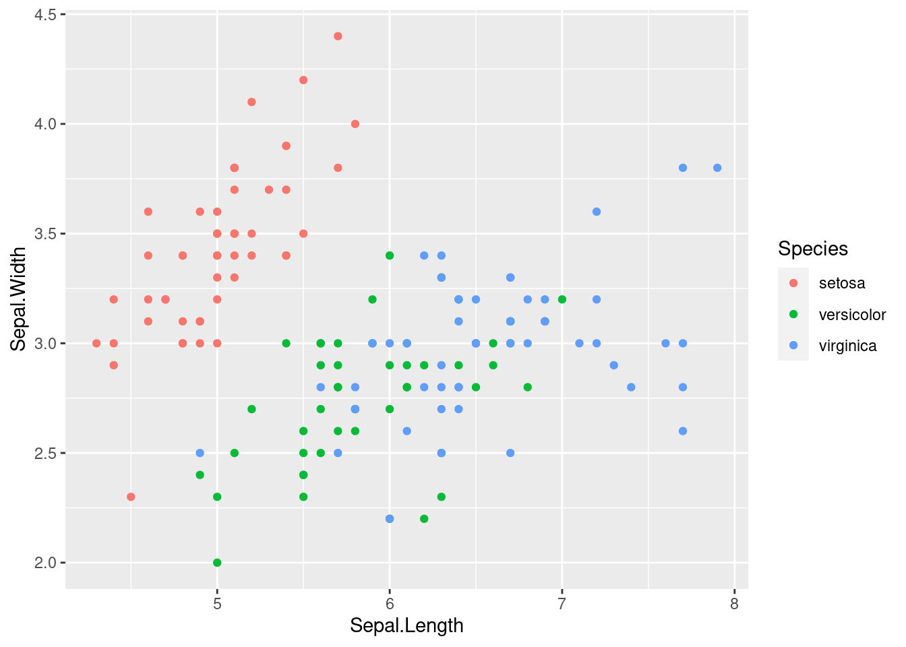

Barchart

```r
ggp2 <- ggplot(iris,               
               aes(x = Species,
                   y = Sepal.Width,
                   fill = Species)) +
  geom_bar(stat = "identity")
ggp2
```

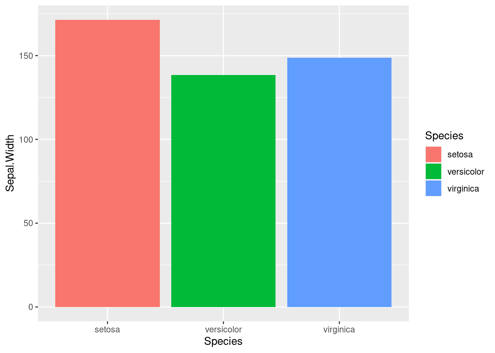

Boxplot

```r
ggp3 <- ggplot(iris,              
               aes(x = Species,
                   y = Sepal.Width,
                   col = Species)) +
  geom_boxplot()
ggp3
```

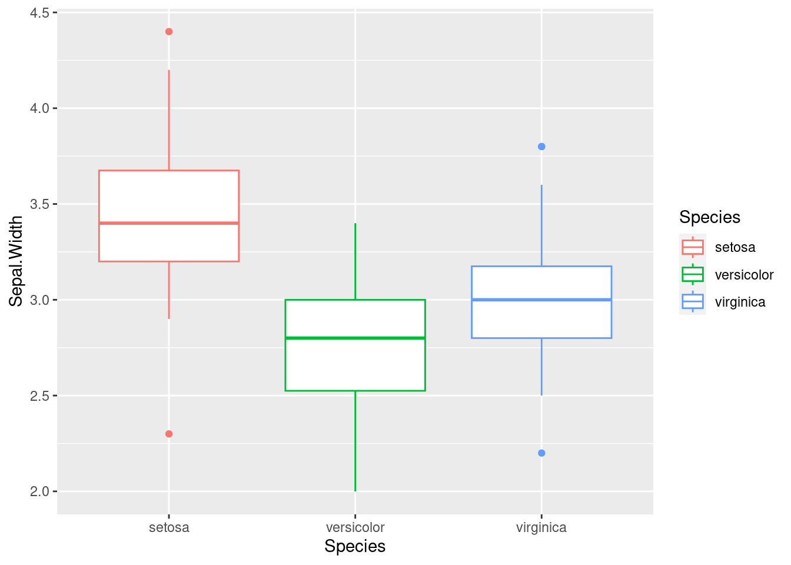

Composition plot using plot_arithmetic

```r
ggp1 + ggp2 + ggp3 + plot_layout(ncol = 1)
```

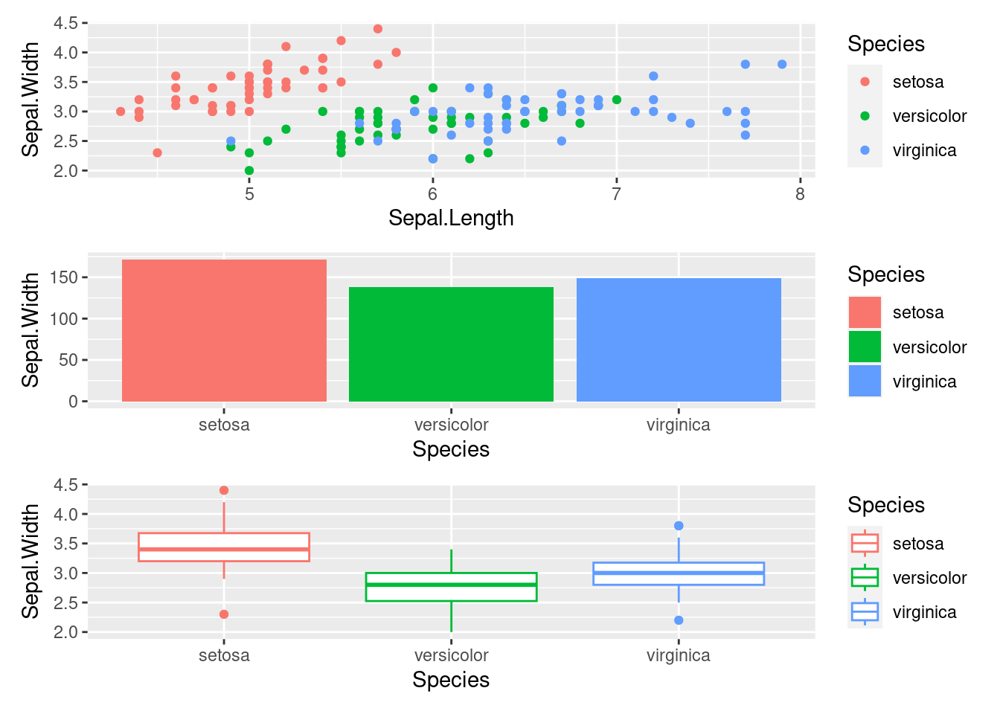

```r
ggp1 + ggp2 - ggp3 + plot_layout(ncol = 1)
```


```r
ggp_sbs <- (ggp1 + ggp2) / ggp3   
ggp_sbs  
```

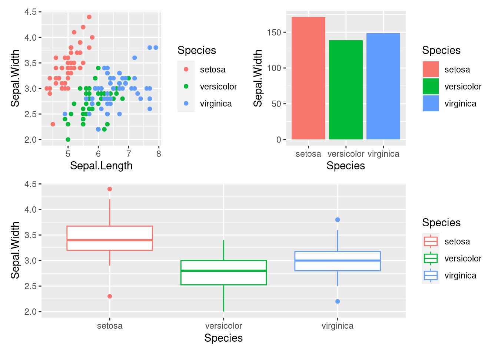

area()

```r
layout <- c(
  area(1, 1),
  area(1, 3, 3),
  area(3, 1, 3, 2)
)
plot(layout)
```

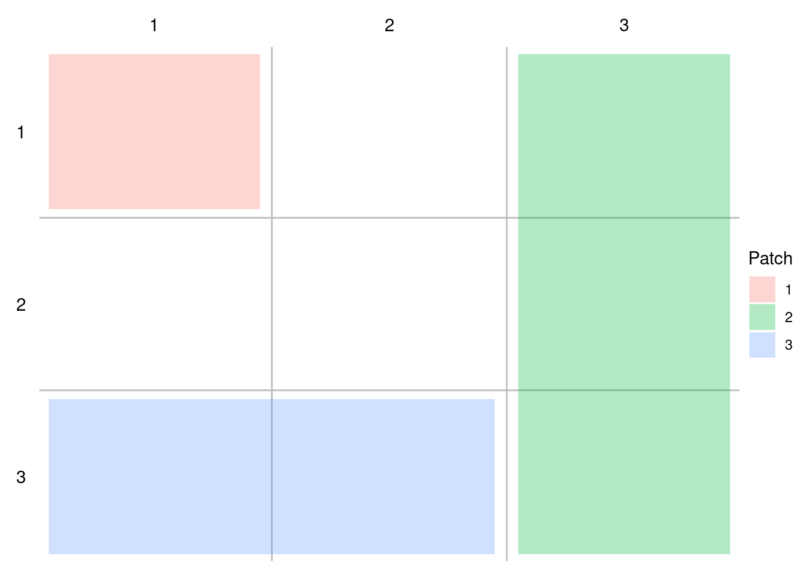

```r
ggp1 + ggp2 + ggp3 +plot_layout(design = layout)
```

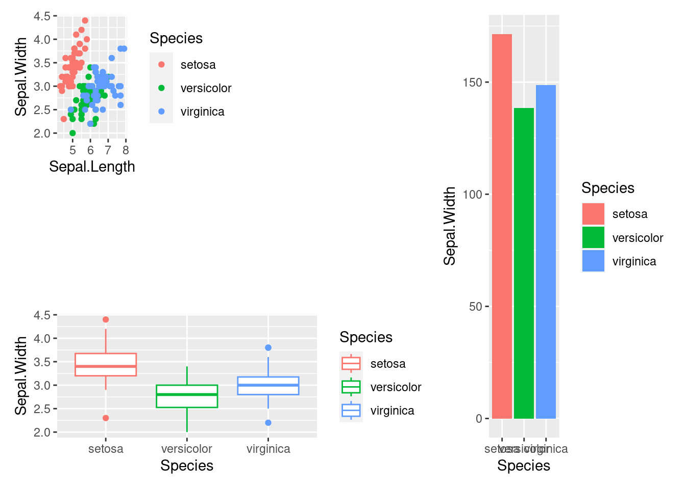

guide_area()

```r
ggp1 + ggp2 + ggp3 +  
  plot_layout(guides = 'collect', ncol = 2)
```

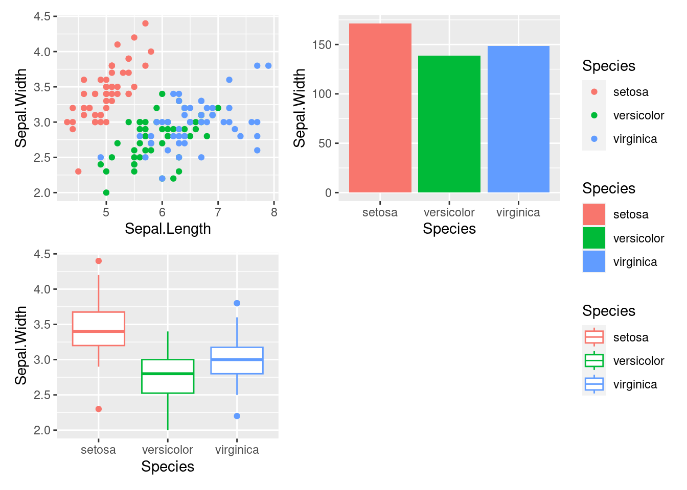

inset_element

```r
ggp1 +          
  inset_element(ggp2, 0.01, 0.01, 0.7, 0.5) +
  inset_element(ggp3, 0.4, 0.6, 0.99, 0.99)
```

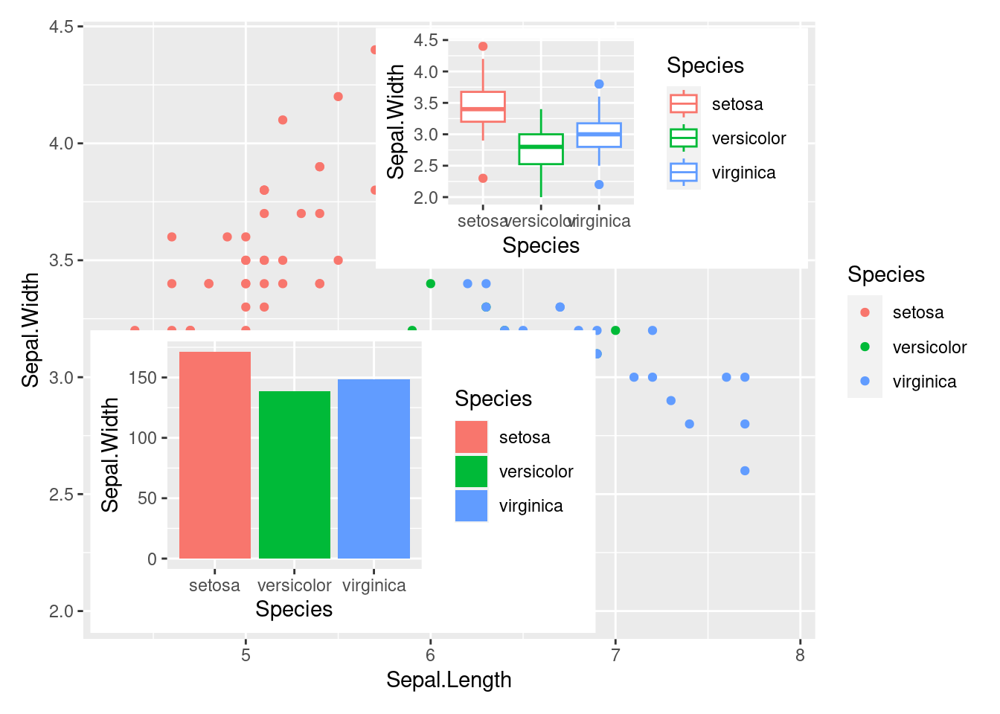

plot_annotation

```r
ggp1 / (ggp2 | ggp3) +
  plot_annotation(tag_levels = 'A')
```

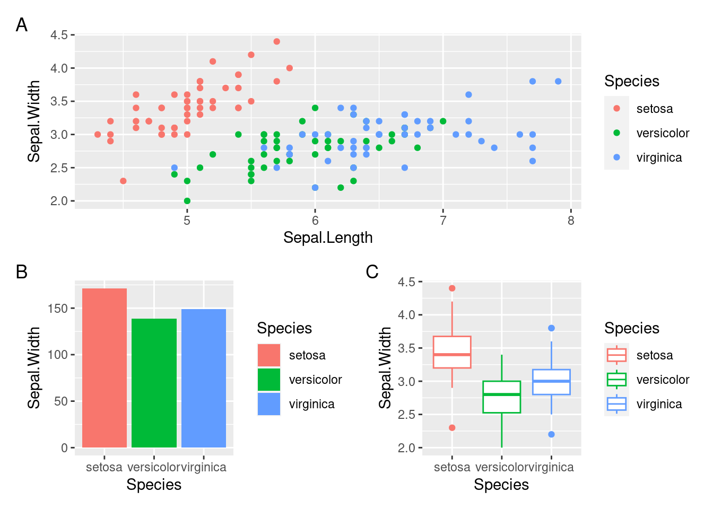

```r
ggp1 / ((ggp2 | ggp3) + plot_layout(tag_level = 'new')) +
  plot_annotation(tag_levels = c('A', '1'))
```

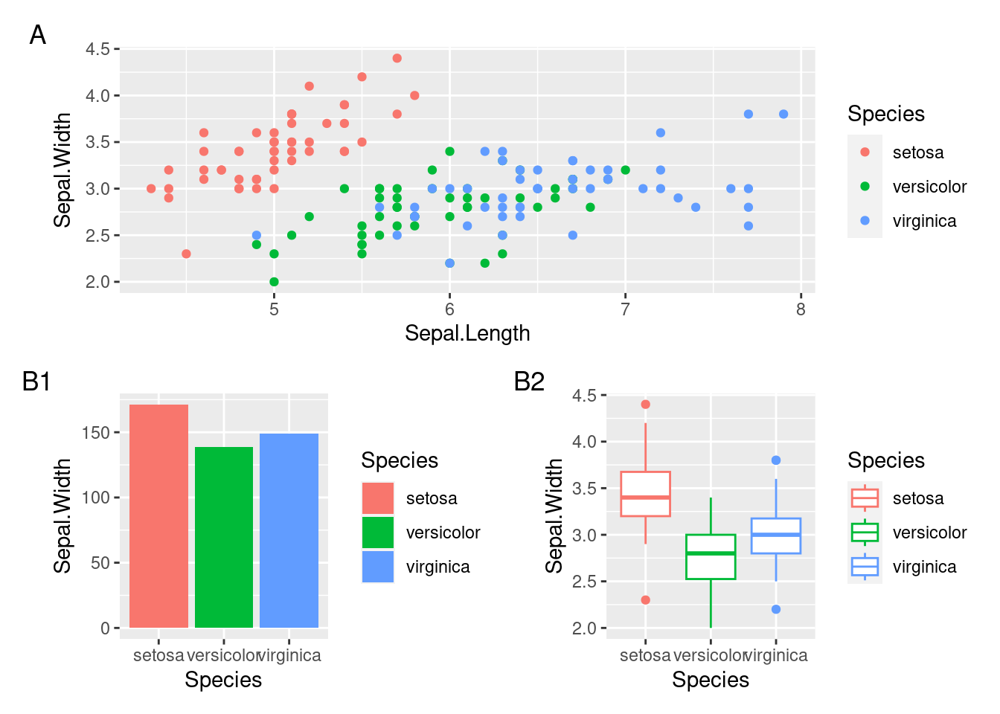

