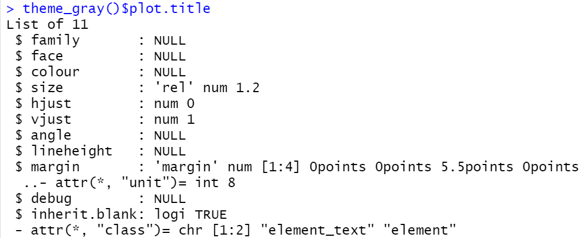

# Ggplot stats and theme

Keli Wang and Xinyu He

```{r, include=FALSE}
knitr::opts_chunk$set(echo = FALSE, options(warn=-1))

library(ggplot2)
library(tidyverse)
library(showtext)
library(ggtext)
library(ggrepel)
library(tibble)
library(extrafont)
library(readr)
```


## Explanation and Motivation

When generating plots using ggplot2 in our assignments, my partner and I find the plots are always in default aesthetics with uniform style of text and background elements, which may not reach expectations for various topics or specific requirements for artistic taste. For instance, when reporting data analysis of some pleasing holidays like sales of roses on Valentine’s Day, the monotonous black, white and gray will not match the topic being explored. Also, if the reporter prefers to present a more visually stimulating analysis plot, then a dark background with light text will better attract the audience's attention, compared to the default setting of light gray background and black text. This finding motivates us to design our customized theme for the plots in this project and thus replace the default design offered by ggplot2 with styles better fit the topics. We also build new stats that generate a creative view for analysts to develop a deeper understanding of the dataset.

This project enables us to have a further exploration of ggproto and ggplot, enhance our professional skills in generating aesthetic reports with customized design, and prepare us for our future study for data visualization techniques. Next time we plan to continue to explore how to personalize the establishment of geom in ggplot with various functions.


## Customize ggplot2 Stat

plot pointsets and draw the boundary of the point sets by figuring out the min and max of x axis and y axis respectively. The boundary can either be represented aesthetically by groups in rectangle, or be draw in one color thus generating one box boundary. Boundaries can also be represented merely by points without lines connecting each other. This stats and geom help the analysts to better understand the distribution of the points, and ggplot2 preserves aesthetics that are constant within each group.
```{r}
StatMBR <- ggproto("StatMBR", Stat, 
    required_aes = c("x", "y"),
    compute_group = function(data, scales){
    minx <- min(data$x)
    miny <- min(data$y)
    maxx <- max(data$x)
    maxy <- max(data$y)
    box <- data.frame(x = c(minx, maxx, maxx, minx))
    box$y <- c(maxy, maxy, miny, miny)
    return(box)})

stat_MBR <- function(mapping = NULL, data = NULL, geom = "polygon",
                    position = "identity", na.rm = FALSE, show.legend = NA, 
                    inherit.aes = TRUE, ...) {
    layer(stat = StatMBR,  data = data, mapping = mapping, geom = geom, 
    position = position, show.legend = show.legend, inherit.aes = inherit.aes,
    params = list(na.rm = na.rm, ...) )}


ggplot(mpg, aes(displ, hwy, colour = drv)) + 
   geom_point() + 
   stat_MBR(fill=NA)

ggplot(mpg, aes(displ, hwy)) + 
  geom_point() + 
  stat_MBR(fill = NA, colour = "black")

ggplot(mpg, aes(displ, hwy)) + 
  stat_MBR(geom = "point", size = 4, colour = "red") +
  geom_point()
```

## Customize ggplot2 Theme

In addition to Stat, we can also customize our own ggplot theme.The following are a couple of things we need to know to create a new theme.

### Create a Framework for a New Theme

To build a new theme, we often start from a built-in default theme, which is encapsulated by the theme_gray() function in ggplot2. Themes can be “added” using the + operator or %+replace% to plot commands in order to change the look and feel of a plot. Adding a theme will override elements of any default theme. Therefore, we can override the elements in default theme that we want to change by using the a theme() funtion.

Here's our simple framework to create a new theme:

`new_theme <- function(){theme_gray() %+replace% theme()}`


### Modify the attributes

We can do many different kind of modifications to different components in the default theme. For instance, we can change the font of all the text elements "montserrat" by doing the following:

`new_theme <- function(){theme_gray() %+replace% theme(text = element_text(family = "montserrat"))}`

Note text is our component of theme, and function element_text() is one of the element_ functions that specifies the display of how components of the plot are drawn.

Here's a list of other components that you can modify. You may look up the theme components by searching 'Modify components of a theme'.

```{r, results='asis'}
'theme(
  line,
  rect,
  text,
  title,
  aspect.ratio,
  axis.title,
  axis.title.x,
  axis.title.x.top,
  axis.title.x.bottom,
  axis.title.y,
  axis.title.y.left,
  axis.title.y.right,
  axis.text,
  axis.text.x,
  axis.text.x.top,
  axis.text.x.bottom,
  axis.text.y,
  axis.text.y.left,
  axis.text.y.right,
  axis.ticks,
  axis.ticks.x,
  axis.ticks.x.top,
  axis.ticks.x.bottom,
  axis.ticks.y,
  axis.ticks.y.left,
  axis.ticks.y.right,
  axis.ticks.length,
  axis.ticks.length.x,
  axis.ticks.length.x.top,
  axis.ticks.length.x.bottom,
  axis.ticks.length.y,
  axis.ticks.length.y.left,
  axis.ticks.length.y.right,
  axis.line,
  axis.line.x,
  axis.line.x.top,
  axis.line.x.bottom,
  axis.line.y,
  axis.line.y.left,
  axis.line.y.right,
  legend.background,
  legend.margin,
  legend.spacing,
  legend.spacing.x,
  legend.spacing.y,
  legend.key,
  legend.key.size,
  legend.key.height,
  legend.key.width,
  legend.text,
  legend.text.align,
  legend.title,
  legend.title.align,
  legend.position,
  legend.direction,
  legend.justification,
  legend.box,
  legend.box.just,
  legend.box.margin,
  legend.box.background,
  legend.box.spacing,
  panel.background,
  panel.border,
  panel.spacing,
  panel.spacing.x,
  panel.spacing.y,
  panel.grid,
  panel.grid.major,
  panel.grid.minor,
  panel.grid.major.x,
  panel.grid.major.y,
  panel.grid.minor.x,
  panel.grid.minor.y,
  panel.ontop,
  plot.background,
  plot.title,
  plot.title.position,
  plot.subtitle,
  plot.caption,
  plot.caption.position,
  plot.tag,
  plot.tag.position,
  plot.margin,
  strip.background,
  strip.background.x,
  strip.background.y,
  strip.clip,
  strip.placement,
  strip.text,
  strip.text.x,
  strip.text.y,
  strip.switch.pad.grid,
  strip.switch.pad.wrap,
  complete = FALSE,
  validate = TRUE
)
```

Also, here's a list of other element_ functions you may need to use. 
You may look up their usage and the attributes using help ?element_blank().

  *`element_blank()`: draws nothing, and assigns no space.

  *`element_rect()`: borders and backgrounds.

  *`element_line()`: lines.

  *`element_text()`: text.


### Demonstration: Create Darkmode Theme

#### Data Manipulation and Plot with Default Theme

```{r cars, include=FALSE}
loadfonts(device = "win", quiet = TRUE) 
font_add_google(family="patua-one", "Patua One")
font_add_google(family="montserrat", "Montserrat")
font_add_google(family="courier", 'Courier Prime')
```
```{r}
animal_data <- read_csv("data-SnXhD.csv",show_col_types = FALSE) %>% t()
colnames(animal_data)=animal_data[c(1),]
animal_data=animal_data[-c(1),]
animal_data <- as.data.frame(animal_data)
animal_data <- tibble::rownames_to_column(animal_data, "VALUE")
animal_data <- animal_data %>% rename(animal = VALUE)
animal_data <- animal_data %>%
  mutate(change = animal_data$`2015`-animal_data$`2005`) %>%
  pivot_longer(cols = !c(animal,change), names_to="year", values_to="count")
head(animal_data)

animal_labels <- animal_data %>%
  pivot_wider(names_from = "year", values_from="count") %>%
  mutate(year = "2005",
         count = `2005`) %>%
  select(animal, change, year, count)
head(animal_labels)
```

```{r, warning=FALSE}
p <- animal_data %>%
  ggplot(aes(x=year, y=count, group=animal, color=change)) +
  geom_line(show.legend=TRUE,
            size=1) +
  labs(title = "Population of animals on a fictional farm",
       caption = "This is a demonstration of customizing a theme",
       y= "Count of animal",
       color = NULL) + 
  scale_color_gradient2(name = NULL,
                        high = "#FF0000",
                        mid = "#FFFFFF",
                        low = "#0000FF") + 
  geom_label_repel(data = animal_labels,
                   aes(x=year, y=count, label = animal, color=change),
                   inherit.aes=FALSE, 
                   size = 5,
                   hjust = "outward",
                   family = "montserrat",
                   label.padding = 0.1,
                   label.size = 0,
                   min.segment.length = 0.5,
                   direction = "y",
                   show.legend=FALSE) 

p
```

The plot with default theme is not bad, but some people may prefer a dark background to see the trend of the lines better. Also, there are some minor aesthetic problems like the small size of the labels and distracting grid lines. In the following setion, we are going to create a more darkmode theme that is more concise.


#### Create Darkmode Theme 

First we define a new theme function starting from our default built-in theme, which is theme_gray(). A special operator %+replace% is used here. It allows us to replace the specific theme elements we want.

In the function definition, we then modify the elements we want. For instance, here we input the font "patua-one" to argument family of plo.title. Check and compare the attributes of plot.title of default theme and our darkmode theme, and we can see family is changed from NULL to chr "patua-one". 

{width=50%}
{width=50%}

Here's our codes of building the darkmode theme.

```{r, warning=FALSE}
background <- "#333333"
primary <- "#FFFFFF"
secondary <- "#555555"
p <- animal_data %>%
  ggplot(aes(x=year, y=count, group=animal, color=change)) +
  geom_line(show.legend=TRUE,
            size=1) +
  labs(title = "Population of animals on a fictional farm",
       caption = "This is a demonstration of customizing a theme",
       y= "Count of animal",
       color = NULL) + 
  scale_color_gradient2(name = NULL,
                        high = "#FF0000",
                        mid = "#FFFFFF",
                        low = "#0000FF") + 
  geom_label_repel(data = animal_labels,
                   aes(x=year, y=count, label = animal, color=change),
                   inherit.aes=FALSE, 
                   size = 5,
                   hjust = "outward",
                   family = "montserrat",
                   fill = background,
                   label.padding = 0,
                   label.size = 0,
                   min.segment.length = 0.5,
                   direction = "y",
                   show.legend=FALSE)

# Create Darkmode Theme
theme_darkmode <- function(bg ="#000000", primary="#FFFFFF", secondary="#888888"){
  
  theme_gray() %+replace%
    theme(
      text = element_text(family = "montserrat"),
      plot.title = element_textbox_simple(family = "patua-one", 
                                          color=primary,
                                          lineheight = 1, size=25,
                                          margin = margin(b=20)),
      plot.title.position = "plot",
      plot.caption = element_markdown(hjust = 0, color=secondary,
                                      lineheight = 1.5,
                                      margin= margin(t=10)),
      plot.caption.position = "plot",
      axis.title.y = element_text(color = secondary, angle=90, size = rel(2)),
      axis.text = element_text(color=secondary, size=rel(2)),
      axis.ticks = element_blank(),
      axis.title.x = element_text(color = secondary, size = rel(2)),
      legend.text = element_text(color=primary, size=rel(1.5)),
      panel.grid.major = element_line(color =secondary, size=0.25),
      panel.grid.minor = element_blank(),
      panel.background = element_rect(fill=bg, color=NA),
      plot.background = element_rect(fill=bg, color=NA),
      legend.background = element_rect(fill=bg, color=NA)
    )
}


p + 
  theme_darkmode(bg=background, primary=primary, secondary=secondary) +
  theme(
    panel.grid.major.x = element_blank(),
    legend.text = element_text(color = "#999999"),
    legend.text.align = 1
  ) +
  guides(color=guide_colorbar(ticks=FALSE))


#ggsave("animal", width=5, height=5)
```

We can see that the lines are more prominent in a dark background, which make it easier for us to compare their slopes. Horizontal

We may change the colors of background, title, and lebel by specifying the function arguments.

```{r, warning=FALSE}
background <- "#FFFFFF"
primary <- "#000000"
secondary <- "#555555"
p + 
  theme_darkmode(bg=background, primary=primary, secondary=secondary) +
  theme(
    panel.grid.major.x = element_blank(),
    legend.text = element_text(color = "#999999"),
    legend.text.align = 1
  ) +
  guides(color=guide_colorbar(ticks=FALSE))
```


### Demonstration2: Create Valentine Theme

Sometimes we want themes in cute style that adds aesthetic to our visualization. Here we create a valentine theme and use it to make a plot for a data set on value of valentine gifts. 


#### Data Manipulation and Plot with Default Theme

```{r, warning=FALSE, message=FALSE}
valentine_data <- read_csv("historical_gift_trends_per_person_spending.csv")%>% rename(year = `...1` )

valentine_data$Candy <- parse_number(valentine_data$Candy)
valentine_data$Flowers <-parse_number(valentine_data$Flowers)
valentine_data$Jewelry <-parse_number(valentine_data$Jewelry)
valentine_data$`Greeting cards` <-parse_number(valentine_data$`Greeting cards`)
valentine_data$`An evening out` <-parse_number(valentine_data$`An evening out`)
valentine_data$Clothing <-parse_number(valentine_data$Clothing)
valentine_data$`Gift cards` <-parse_number(valentine_data$`Gift cards`)
valentine_data$year <-factor(valentine_data$year)

df <- valentine_data %>%
  gather(key = "gift", value = "value", -year)


p2 <- ggplot(df, aes(x=year, y=value, group=gift, color=gift)) +
  geom_line()+
  labs(title = "Value of valentine Gifts",
       caption = "This is a demonstration of valentine theme",
       y= "Value of Gift",
       x= 'Year',
       color = NULL)
p2
```


#### Create Valentine Theme

```{r pressure, echo=FALSE, warning=FALSE}
theme_valentine <- function() {

  theme_gray() %+replace% 
    theme(
    text = element_text(family = "courier"),
    plot.title = element_textbox_simple(family = "courier", size=20,
                                        lineheight = 1,
                                        margin = margin(b=10),
                                        color = "Red"),
    plot.title.position = "plot",
    plot.caption = element_markdown(hjust = 0, color="lightgrey",
                                    lineheight = 1.5,
                                    margin= margin(t=10)),
    plot.caption.position = "plot",
    axis.title.y = element_text(color = "#ff748c", angle = 90, size = rel(2)),
    axis.text.y = element_text(color="#ff748c"),
    axis.title.x = element_text(color = "#ff748c",size = rel(2)),
    axis.text.x = element_text(color="#ff748c"),
    #panel.grid = element_blank(),
    panel.background = element_rect(fill="#fff3f5")
  )
}
p2 + theme_valentine()
```


## Reference

[1] https://bookdown.org/rdpeng/RProgDA/building-a-new-theme.html

[2] https://www.youtube.com/watch?v=z7Ci9NN3LUc


