# Quantmod & Tidyquant Tutorials and Comparison

Mildred Ouyang and Peishan Lyu


```r
#install.packages(“quantmod”) 
#install.packages("tidyverse")
#install.packages("tidyquant")
library("quantmod")
library("tidyverse")
library("tidyquant")
```

## Motivation:
All the Quantmod tutorials and documentations we have found did not provide a quick starter guide to beginners of R or people new to using Quantmod. The goal of our tutorial for Quantmod is to teach starters how to use the most essential exploratory data analysis tools and the most commonly used functions in Quantmod. We also hope that our tutorial can serve as a bridge for users to explore more advanced features of Quantmod in the future. 

We feel that our tutorial does a nice job in telling the users the tasks can be completed by some cores functions in Quantmod and Tidyquant. To make improvements, we might create an additional cheatsheet to illustrate the required arguments of each function so that users can conveniently make flexible and more advanced adjustments based on their needs. 

## Quantmod      

### Getting Data:     
The function used to load the data is : getSymbols(). This will return an object which stores the data.      
     
If not specifying the source (src="source_name") in getSymbols(), Quantmod will use the default source which is Yahoo Finance. Some common data sources to download data from are:Yahoo, the Federal Reserve Economic Data (FRED), local database source using MySQL, csv files, and so on.(Note: Google Finance is no longer a data source. It stopped providing data in March, 2018.)       
     
If getting data from local database using MySQL, username and password to access the database can be stored using the wrapper function: setDefaults(getSymbols.MySQL, user='____', password='____', dbname='_____'). After setting up, the user can get data using getSymbols() and change src='MySQL'.      
     
Data range can be specified by passing in range start and end dates, but end date is optional. If no end date, the latest available data will be shown.     
     
Example:

```r
getSymbols("META", src="yahoo", from="2022-01-01", to="2022-6-30")
```

```
## [1] "META"
```

```r
getSymbols("TSLA;AAPL;UBER", src="yahoo", from="2022-01-01", to="2022-6-30")
```

```
## [1] "TSLA" "AAPL" "UBER"
```
### Data Visualization:      
There are three primary chart types in Quantmod: bar chart, candle chart, and line chart.       
Primary function to create charts: chartSeries() - by default, the open-high-low-close chart and the volume data will be shown.     
     
Wrapper functions: barChart(), candleChart(), lineChart()     
     
Modify the original chart: reChart() - can dynamically change the chart by only specifying the changing argument(s). This can be used to can the log-scale the y-axis, subset the data to show a specific time period, and set the ticks, range of y-axis, chart title, colors, and so on.       
     
Examples:

```r
chartSeries(META)
```

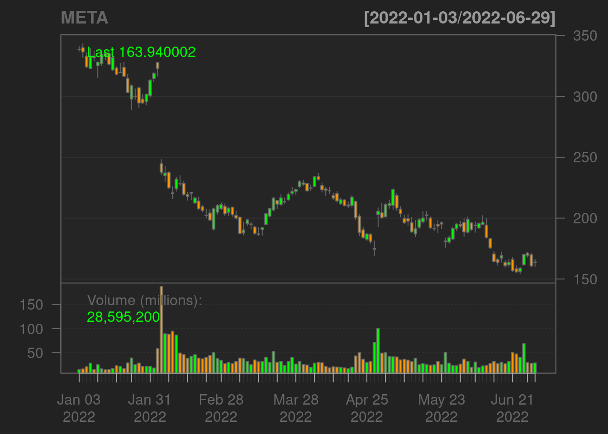

The above shows the open-high-low-close chart and the volume data. The orange color signifies that the closing price was lower than the opening price of the same day. The green color signifies the opposite.      
      
Users can also add stock indicators to the chart for analysis. There are 26 indicators available in Quantmod. Some commonly used stock indicators are: Bollinger Bands - addBBands(), Moving Average Convergence Divergence - addMACD(), Commodity Channel Index - addCCI(), Volume - addVo(), Williams %R - addWPR(),  Simple Moving Average - addSMA(), Rate of Change - addROC(), Momentum - addMomentum(), Parabolic Stop and Reverse - addSAR(), and so on.     
     
Example:      
The below example adds the Moving Average Convergence Divergence (MACD) indicator to the original graph. The below method will output two graphs, one original and one with the MACD. Later, we will introduce a way to only output one graph. The MACD has the following arguments: fast, slow, signal, type, histogram, and col. The fast and slow address the length of fast and slow periods. The signal addresses the length of the signal period. The type indicates which type of moving average to use. The histogram takes in boolean values to either or not output a histogram. Lastly, the col is optional. It changes the color for the lines. The second graph below is drawn with the default values of MACD (fast = 12, slow = 26, signal = 9, type = "EMA", histogram = TRUE).

```r
chartSeries(META)
```


```r
addMACD()
```

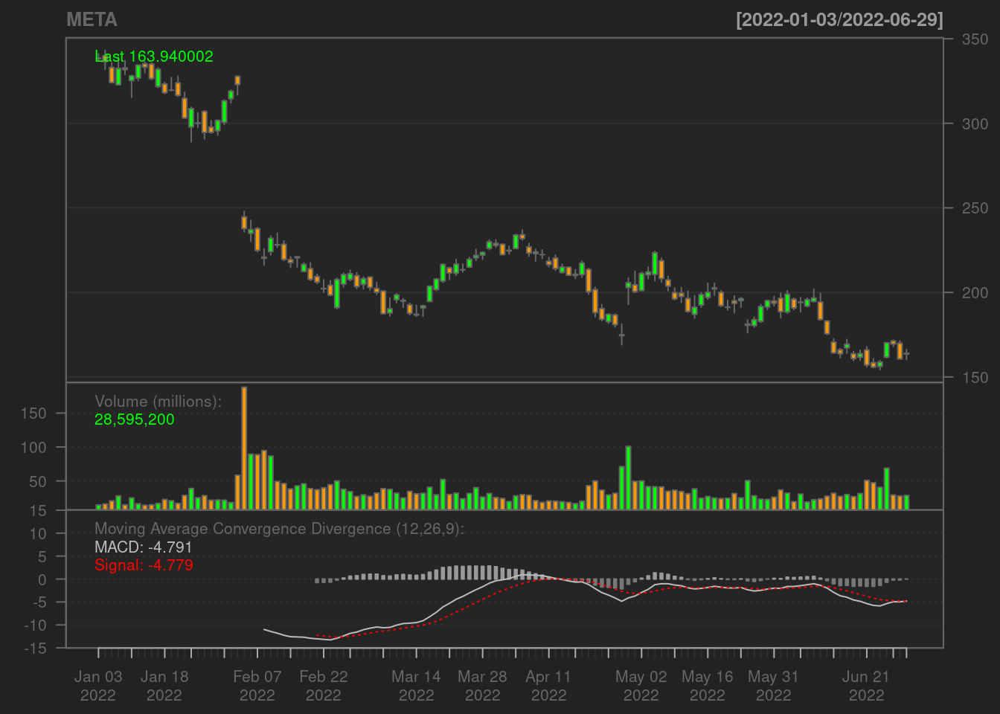

The indicator can also be passed directly as an argument into the chartSeries function. In this way, only one graph will be drawn.    
      
Example:       
The below chart shows the Bollinger Bands drawn with default argument values. The default sets the moving average period (n) to 20, the standard deviation (sd) to 2,  moving average type (maType) to simple moving average (can also be changed to weighted moving avarage and so on), and also the indicator to draw (draw) to 'bands' (can also be changed to percent or width).

```r
chartSeries(META, TA = "addBBands(n=20, sd=2, maType = 'SMA', draw = 'bands')")
```


     
The below chart shows the moving average over a period of 20 days.   

```r
chartSeries(META, TA = "addSMA(n=20)")
```


     
The below chart shows the moving average over a period of 40 days.

```r
chartSeries(META, TA = "addSMA(n=40)")
```

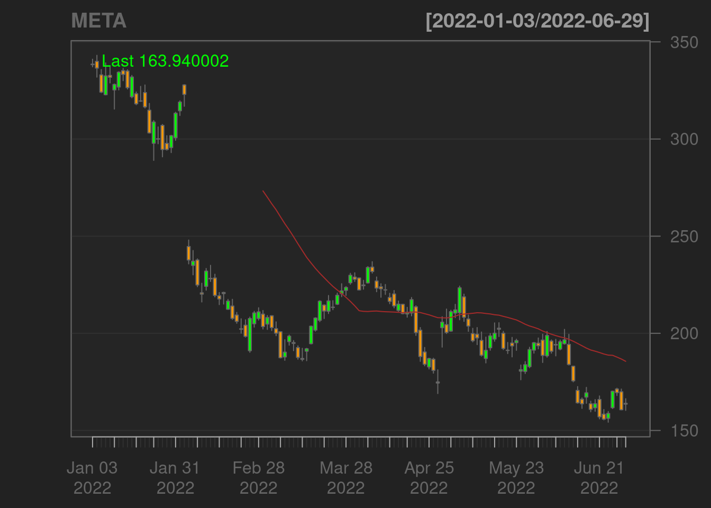
       
       
Multiple indicators can be passed in together and reflect on the same graph.   
The below graph shows both the Bollinger Bands and the Moving Average Convergence Divergence indicator (with default argument values). 

```r
chartSeries(META, TA = "addBBands();addMACD()")
```

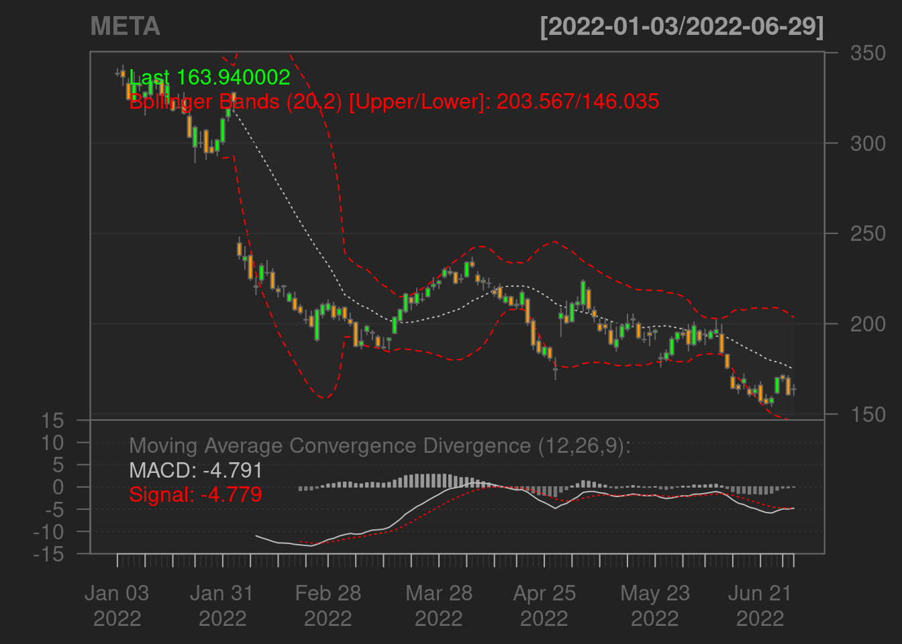

The below line chart plots the opening data for the stock.

```r
lineChart(META)
```

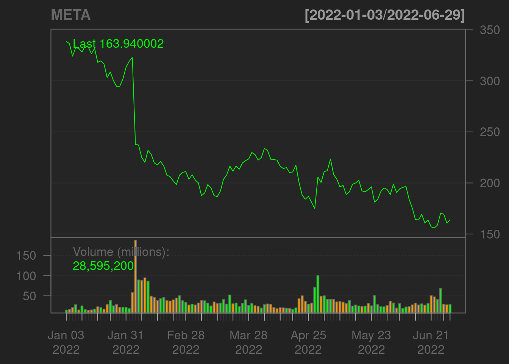

The below bar chart plots the highest, lowest, opening(the right horizontal line), and closing (the left horizontal line) prices of the stock.

```r
barChart(META)
```

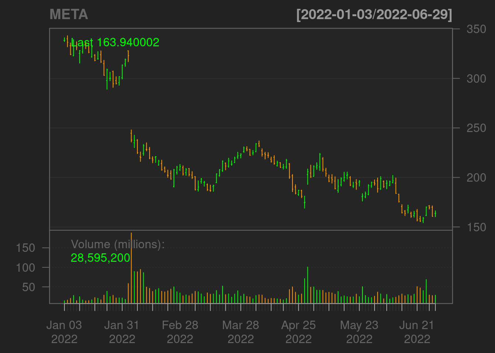

If only want to show the highest, lowest, and closing price of one day, the user can do the following: 

```r
barChart(META, bar.type='hlc')
```


The candle chart below graphs the OHLC data.

```r
candleChart(META)
```


      
      
Customization of the chart's color can be done by passing the arguments multi.col and theme.      
      
multi.col - changes the color of the bars      
theme - changes the color of the background      
      
Examples:

```r
chartSeries(META, multi.col = TRUE)
```


```r
chartSeries(META, theme = "white")
```


     
     
Moreover, Quantmod also allows only graphing a portion of the data. The subset argument can be used to select a specific range of data to graph.     
       
Example:
The below graph only plots the first two months of data.

```r
chartSeries(META, multi.col = TRUE, theme = "white", subset = "2022-1::2022-2")
```


Subset can also take in value like "first 3 months" and "last 6 weeks".

```r
chartSeries(META, subset = "last 6 weeks")
```


          
          
Furthermore, Qauntmod allows modifications of the original graph without restating all the original arguments again.     
       
Example:

```r
chartSeries(META, multi.col = TRUE)
```


```r
reChart(major.ticks = "months") # change the tick mark to months
```

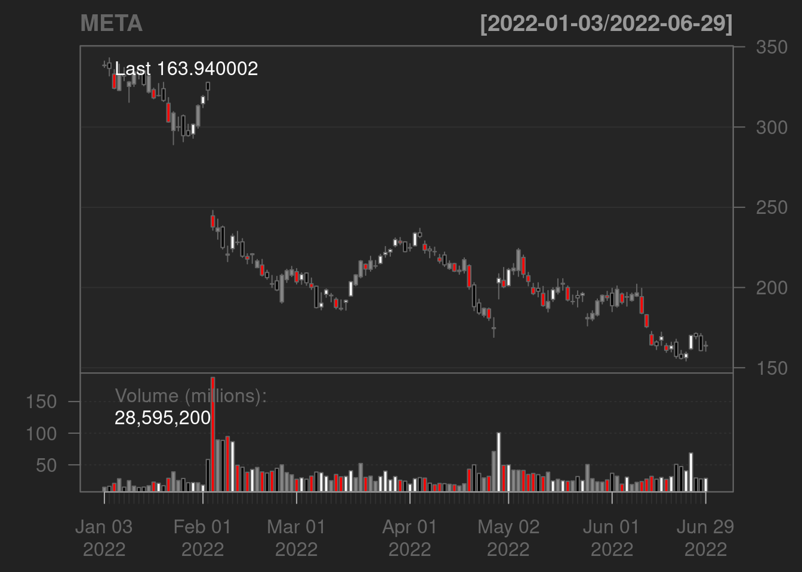
       

## Tidyquant           

Tidyquant integrates quantmod, xts, zoo, TTR, and PerformanceAnalytics packages, and we can use it to generate tidier graphs than using Quantmod only. In general, we can use Tidyquant to compare stock prices, evaluate stock performance, and evaluate portfolio performance. We can easily perform financial analysis using some core tidyquant functions to get stock indexes/exchange, get quantitative data from various web-sources, transmute and mutate quantitative data, and analyze the performance of assets and portfolios.        

The major functions introduced below are originally adapted from the documentation:       

https://cran.r-project.org/web/packages/tidyquant/         

which contains Vignettes introducing core functions and charting with Tidyquant.       

We feel that the original documentation with core functions is very tidy and useful, but the authors derive different datasets using different tools, which makes it a little hard to compare similarities and differences among tools for deriving data. We attempted to use different tools to achieve data of the same four companies and included some details and new tips. This tutorial provides some basic ideas in how to get data, clean data, and chart with Tidyquant.       

### Before Getting Data 
Before getting quantitative data, we want to check the list of stock index we could possibly retrieve. There are eighteen available (only 5 are shown here). They measure the performance of assets from different perspectives.         

```r
tq_index_options()
```

```
## [1] "DOW"       "DOWGLOBAL" "SP400"     "SP500"     "SP600"
```

There are three stock exchanges (where exhange of securities happen) available.         

```r
tq_exchange_options()
```

```
## [1] "AMEX"   "NASDAQ" "NYSE"
```

After browsing the specific data sources accessible from tq_get, we can get daily stock data from Yahoo Finance, economic data from FRED and Quandl, as well as financial data from Quandl, Tiingo, Alpha Vantage, and Bloomberg's Financial API (though paid account is required for Bloomberg).      

* "stock.prices" - Yahoo Finance        

* "economic.data" - FRED         

* "quandl" and "quandl.datatable" - Nasdaq API            

* "tiingo", "tiingo.iex", "tiingo.crypto" - Tiingo API     

* "alphavantager", "alphavantage" - Alpha Vantage API     

* "rblpapi" - Bloomberg    


```r
tq_get_options()
```

```
##  [1] "stock.prices"       "stock.prices.japan" "dividends"         
##  [4] "splits"             "economic.data"      "quandl"            
##  [7] "quandl.datatable"   "tiingo"             "tiingo.iex"        
## [10] "tiingo.crypto"      "alphavantager"      "alphavantage"      
## [13] "rblpapi"
```

### Getting Data       

**Example for calling tq_index("INDEXNAME") function**         

SP500 provides a dataset with 8 columns with a capitalization-weighted index such that companies with a higher market cap receives a higher weighting in the index.       


```r
tq_index("SP500")
```

```
## # A tibble: 503 × 8
##    symbol company                    ident…¹ sedol weight sector share…² local…³
##    <chr>  <chr>                      <chr>   <chr>  <dbl> <chr>    <dbl> <chr>  
##  1 AAPL   Apple Inc.                 037833… 2046… 0.0667 Infor…  1.69e8 USD    
##  2 MSFT   Microsoft Corporation      594918… 2588… 0.0545 Infor…  8.33e7 USD    
##  3 AMZN   Amazon.com Inc.            023135… 2000… 0.0258 Consu…  9.90e7 USD    
##  4 GOOGL  Alphabet Inc. Class A      02079K… BYVY… 0.0169 Commu…  6.70e7 USD    
##  5 BRK-B  Berkshire Hathaway Inc. C… 084670… 2073… 0.0165 Finan…  2.02e7 USD    
##  6 UNH    UnitedHealth Group Incorp… 91324P… 2917… 0.0153 Healt…  1.05e7 USD    
##  7 TSLA   Tesla Inc                  88160R… B616… 0.0153 Consu…  2.98e7 USD    
##  8 GOOG   Alphabet Inc. Class C      02079K… BYY8… 0.0152 Commu…  5.99e7 USD    
##  9 XOM    Exxon Mobil Corporation    30231G… 2326… 0.0139 Energy  4.66e7 USD    
## 10 JNJ    Johnson & Johnson          478160… 2475… 0.0138 Healt…  2.94e7 USD    
## # … with 493 more rows, and abbreviated variable names ¹​identifier,
## #   ²​shares_held, ³​local_currency
```

**Examples for calling tq_get() function**             

(1). Getting data from Yahoo!Finance - set tq_get(...get = "stock.prices"...)       

If we want to get stock prices of companies, Yahoo!Finance is a great choice.     

Assume we want stock prices of Apple, Meta, Tesla, and Uber:   


```r
aapl_price_yahoo  <- tq_get("AAPL", get = "stock.prices", from = "2022-01-01", to = "2022-06-30")
aapl_price_yahoo
```

```
## # A tibble: 123 × 8
##    symbol date        open  high   low close    volume adjusted
##    <chr>  <date>     <dbl> <dbl> <dbl> <dbl>     <dbl>    <dbl>
##  1 AAPL   2022-01-03  178.  183.  178.  182. 104487900     181.
##  2 AAPL   2022-01-04  183.  183.  179.  180.  99310400     179.
##  3 AAPL   2022-01-05  180.  180.  175.  175.  94537600     174.
##  4 AAPL   2022-01-06  173.  175.  172.  172   96904000     171.
##  5 AAPL   2022-01-07  173.  174.  171.  172.  86709100     171.
##  6 AAPL   2022-01-10  169.  172.  168.  172. 106765600     171.
##  7 AAPL   2022-01-11  172.  175.  171.  175.  76138300     174.
##  8 AAPL   2022-01-12  176.  177.  175.  176.  74805200     175.
##  9 AAPL   2022-01-13  176.  177.  172.  172.  84505800     171.
## 10 AAPL   2022-01-14  171.  174.  171.  173.  80440800     172.
## # … with 113 more rows
```


```r
meta_price_yahoo  <- tq_get("META", get = "stock.prices", from = "2022-01-01", to = "2022-06-30")
meta_price_yahoo 
```

```
## # A tibble: 123 × 8
##    symbol date        open  high   low close   volume adjusted
##    <chr>  <date>     <dbl> <dbl> <dbl> <dbl>    <dbl>    <dbl>
##  1 META   2022-01-03  338.  341.  337.  339. 14537900     339.
##  2 META   2022-01-04  340.  343.  332.  337. 15998000     337.
##  3 META   2022-01-05  333.  336.  324.  324. 20564500     324.
##  4 META   2022-01-06  323.  339.  323.  332. 27962800     332.
##  5 META   2022-01-07  333.  337   329.  332. 14722000     332.
##  6 META   2022-01-10  325.  328.  315.  328. 24942400     328.
##  7 META   2022-01-11  327.  335.  325.  334. 16226800     334.
##  8 META   2022-01-12  335.  336.  330.  333. 14104900     333.
##  9 META   2022-01-13  335.  336.  326.  326. 14797100     326.
## 10 META   2022-01-14  322.  333.  321.  332. 16868500     332.
## # … with 113 more rows
```


```r
tsla_price_yahoo  <- tq_get("TSLA", get = "stock.prices", from = "2022-01-01", to = "2022-06-30")
tsla_price_yahoo
```

```
## # A tibble: 123 × 8
##    symbol date        open  high   low close    volume adjusted
##    <chr>  <date>     <dbl> <dbl> <dbl> <dbl>     <dbl>    <dbl>
##  1 TSLA   2022-01-03  383.  400.  379.  400. 103931400     400.
##  2 TSLA   2022-01-04  397.  403.  374.  383. 100248300     383.
##  3 TSLA   2022-01-05  382.  390.  360.  363.  80119800     363.
##  4 TSLA   2022-01-06  359   363.  340.  355.  90336600     355.
##  5 TSLA   2022-01-07  360.  360.  337.  342.  84164700     342.
##  6 TSLA   2022-01-10  333.  353.  327.  353.  91815000     353.
##  7 TSLA   2022-01-11  351.  359.  346.  355.  66063300     355.
##  8 TSLA   2022-01-12  360.  372.  358.  369.  83739000     369.
##  9 TSLA   2022-01-13  370.  372.  342.  344.  97209900     344.
## 10 TSLA   2022-01-14  340.  351.  338.  350.  72924300     350.
## # … with 113 more rows
```


```r
uber_price_yahoo  <- tq_get("UBER", get = "stock.prices", from = "2022-01-01", to = "2022-06-30")
uber_price_yahoo
```

```
## # A tibble: 123 × 8
##    symbol date        open  high   low close   volume adjusted
##    <chr>  <date>     <dbl> <dbl> <dbl> <dbl>    <dbl>    <dbl>
##  1 UBER   2022-01-03  42.5  44.4  41.9  44.0 26089000     44.0
##  2 UBER   2022-01-04  44.2  44.8  42.6  44.4 30845300     44.4
##  3 UBER   2022-01-05  44.3  45.9  42.9  43.2 28498700     43.2
##  4 UBER   2022-01-06  43.1  44.1  41.0  42.0 32434300     42.0
##  5 UBER   2022-01-07  42    42.7  41.2  41.5 24875800     41.5
##  6 UBER   2022-01-10  41.5  42.8  40.2  42.6 29783800     42.6
##  7 UBER   2022-01-11  42.4  44.2  42.2  43.6 22161000     43.6
##  8 UBER   2022-01-12  44.0  44.1  42.5  43.0 18993900     43.0
##  9 UBER   2022-01-13  43.3  43.9  42.7  42.9 17190100     42.9
## 10 UBER   2022-01-14  42.4  42.7  40.4  41.5 25817800     41.5
## # … with 113 more rows
```

(2). Getting data from FRED Economic data - tq_get() function - set tq_get(...get = "economic.data"...)      

When considering if we want to retrieve data from FRED, we consider it covers major areas of macroeconoc analysis, including some major indicators:   

* Growth: GDP, real GDP, real potential GDP      

* Prices and inflation: CPI for all urban consumers for all items/all items less food & energy, GDP: implicit price deflater       

* Money Supply: St.Louise adjusted monetary, M1 money stock, M2 money stock, velocity of M1 money stock, velocity of M2 money stock          

* Interest rates: effective federal funds rate, 3-month treasury bill, 5/10/30 year treasury constant maturity rate, 5/10 year breakeven inflation rate, 5 year forward inflation expectation rate, TED Spread, bank prime loan rate         

* Employment: Civilian Unemployment Rate, Natural Long-Term/Short-Term Rate of Unemployment, Civilian Labor Force Participation Rate, Civilian Employment-Population Ratio, Unemployed, All Employees: Total nonfarm, All Employees: Manufacturing, Initial Claims, 4-Week Moving Average of Initial Claims             

* Income and expenditure: Real Median Household Income in the United States, Real Disposable Personal Income, Personal Consumption Expenditures, Personal Consumption Expenditures: Durable Goods, Personal Saving Rate, Real Retail and Food Services Sales, Disposable personal income.          
* Other economic indicators: 	Industrial Production Index, Capacity Utilization: Total Industry, Housing Starts: Total: New Privately Owned Housing Units Started, Gross Private Domestic Investment, Corporate Profits After Tax (without IVA and CCAdj), St. Louis Fed Financial Stress Index, 	Crude Oil Prices: West Texas Intermediate (WTI) - Cushing, Oklahoma, Leading Index for the United States, Trade Weighted U.S. Dollar Index: Major Currencies, Trade Weighted U.S. Dollar Index: Broad.             
* Debt: Federal Debt: Total Public Debt, Federal Debt: Total Public Debt as Percent of Gross Domestic Product, Excess Reserves of Depository Institutions, Commercial and Industrial Loans, All Commercial Banks         

(The code for these indicators can be accessed from the website: 
https://data.nasdaq.com/data/FRED-federal-reserve-economic-data/documentation)        

Assume we want to inspect the GDP within a given tiem window, we found only period data is available.         

```r
gdp_fred <- tq_get("GDP", get = "economic.data", from = "2010-01-01", to = "2022-01-01")
gdp_fred 
```

```
## # A tibble: 49 × 3
##    symbol date        price
##    <chr>  <date>      <dbl>
##  1 GDP    2010-01-01 14765.
##  2 GDP    2010-04-01 14980.
##  3 GDP    2010-07-01 15142.
##  4 GDP    2010-10-01 15309.
##  5 GDP    2011-01-01 15351.
##  6 GDP    2011-04-01 15558.
##  7 GDP    2011-07-01 15648.
##  8 GDP    2011-10-01 15842.
##  9 GDP    2012-01-01 16069.
## 10 GDP    2012-04-01 16207.
## # … with 39 more rows
```

(3). Getting data from Nasdaq Data Link (Quandl) API - set tq_get(...get = "quandl"...)         

a. quandl_search(... query = "KEY IN THE DATASET"...)       
This is useful for deciding which dataset we want to use. We can get info about the newest and oldest available date as well as the frequency of data. If we want to look for all datasets with "GDP" as part of the name, we set query = "GDP".       
We can also set database_code = "CODENAME" if already we know the code of the dataset. We can also set the number of returns per page.              

Datasets are available here: https://data.nasdaq.com/search         


```r
quandl_search(query = "GDP", page = 1)
```

```
## Gross Domestic Product
## Code: FRED/GDP
## Desc: Units: Billions of Dollars
## Seasonal Adjustment: Seasonally Adjusted Annual Rate
## Notes: A Guide to the National Income and Product Accounts of the United States (NIPA) - (http://www.bea.gov/national/pdf/nipaguid.pdf)
## Freq: quarterly
## Cols: Date | Value
## 
## (GDPS) Adjusted Stock Prices
## Code: OTCB/GDPS
## Desc:  <b>Ticker</b>: GDPS <br> <br> <b>Exchange</b>: OTCB <br> <br> Columns: <br> <br> Open,High,Low,Close,Volume are adjusted and shown in USD currency. <br> <br> Adjustment Factor shows the factor by which prices are adjusted on days which adjustments take place <br> <br> Adjustment Type is a number representing the type of adjustment. Refer to documentation for more information on these codes.
## Freq: daily
## Cols: Date | Open | High | Low | Close | Volume | Adjustment Factor | Adjustment Type
## 
## Goldplat Plc (GDP) Adjusted Stock Prices
## Code: XLON/GDP
## Desc:  <b>Ticker</b>: GDP <br> <br> <b>Exchange</b>: XLON <br> <br> Columns: <br> <br> Open,High,Low,Close,Volume are adjusted and shown in GBX currency. <br> <br> Adjustment Factor shows the factor by which prices are adjusted on days which adjustments take place <br> <br> Adjustment Type is a number representing the type of adjustment. Refer to documentation for more information on these codes.
## Freq: daily
## Cols: Date | Open | High | Low | Close | Volume | Adjustment Factor | Adjustment Type
## 
## GDP Volatility & Option Implied Surface
## Code: OPT/GDP
## Desc: <p><p>Implied volatility surface for GDP.</p><p>For more information please view <a href='https://www.quandl.com/data/OPT/documentation'>OPT Documentation</a>.</p>
## Freq: daily
## Cols: date | stockpx | iv30 | iv60 | iv90 | m1atmiv | m1dtex | m2atmiv | m2dtex | m3atmiv | m3dtex | m4atmiv | m4dtex | slope | deriv | slope_inf | deriv_inf | 10dclsHV | 20dclsHV | 60dclsHV | 120dclsHV | 252dclsHV | 10dORHV | 20dORHV | 60dORHV | 120dORHV | 252dORHV
## 
## Goodrich Petroleum Corp. (GDP) Adjusted Stock Prices
## Code: XNAS/GDP
## Desc:  <b>Ticker</b>: GDP <br> <br> <b>Exchange</b>: XNAS <br> <br> Columns: <br> <br> Open,High,Low,Close,Volume are adjusted and shown in USD currency. <br> <br> Adjustment Factor shows the factor by which prices are adjusted on days which adjustments take place <br> <br> Adjustment Type is a number representing the type of adjustment. Refer to documentation for more information on these codes.
## Freq: daily
## Cols: Date | Open | High | Low | Close | Volume | Adjustment Factor | Adjustment Type
## 
## Goodrich Petroleum Corp. (GDP) Adjusted Stock Prices
## Code: XNYS/GDP
## Desc:  <b>Ticker</b>: GDP <br> <br> <b>Exchange</b>: XNYS <br> <br> Columns: <br> <br> Open,High,Low,Close,Volume are adjusted and shown in USD currency. <br> <br> Adjustment Factor shows the factor by which prices are adjusted on days which adjustments take place <br> <br> Adjustment Type is a number representing the type of adjustment. Refer to documentation for more information on these codes.
## Freq: daily
## Cols: Date | Open | High | Low | Close | Volume | Adjustment Factor | Adjustment Type
## 
## Goodrich Petroleum Corp. (GDP) Adjusted Stock Prices
## Code: XASE/GDP
## Desc:  <b>Ticker</b>: GDP <br> <br> <b>Exchange</b>: XASE <br> <br> Columns: <br> <br> Open,High,Low,Close,Volume are adjusted and shown in USD currency. <br> <br> Adjustment Factor shows the factor by which prices are adjusted on days which adjustments take place <br> <br> Adjustment Type is a number representing the type of adjustment. Refer to documentation for more information on these codes.
## Freq: daily
## Cols: Date | Open | High | Low | Close | Volume | Adjustment Factor | Adjustment Type
## 
## Goodrich Petroleum Corporation (GDP) Market Betas, Correlations, and Risks
## Code: QRM/GDP
## Desc: Market Betas, Correlations, and Systematic and Unsystematic Risks for Goodrich Petroleum Corporation (GDP). All time periods are measured in calendar days. See documentation for methodology.
## Freq: daily
## Cols: Date | Beta30 | Cor30 | Srisk30 | Urisk30 | Beta60 | Cor60 | Srisk60 | Urisk60 | Beta90 | Cor90 | Srisk90 | Urisk90 | Beta360 | Cor360 | Srisk360 | Urisk360
## 
## Golden Pursuit Resources Ltd. (GDP) Adjusted Stock Prices
## Code: XTSX/GDP
## Desc:  <b>Ticker</b>: GDP <br> <br> <b>Exchange</b>: XTSX <br> <br> Columns: <br> <br> Open,High,Low,Close,Volume are adjusted and shown in CAD currency. <br> <br> Adjustment Factor shows the factor by which prices are adjusted on days which adjustments take place <br> <br> Adjustment Type is a number representing the type of adjustment. Refer to documentation for more information on these codes.
## Freq: daily
## Cols: Date | Open | High | Low | Close | Volume | Adjustment Factor | Adjustment Type
## 
## Daily Active Analyst Ratings for GDP — Goodrich Petroleum Corp.
## Code: CBARH/GDP
## Desc: <p>Daily active analyst ratings for GDP — Goodrich Petroleum Corp.</p>
## Freq: daily
## Cols: Date | Total | Average Rating | Rating Count Strong Sell | Rating Count Moderate Sell | Rating Count Hold | Rating Count Moderate Buy | Rating Count Strong Buy | Action Count Initiated | Action Count Upgraded | Action Count Downgraded | Action Count Reiterated | Action Ratio Upgraded | Action Ratio Downgraded
```

```
## # A tibble: 10 × 13
##         id datas…¹ datab…² name  descr…³ refre…⁴ newes…⁵ oldes…⁶ colum…⁷ frequ…⁸
##      <int> <chr>   <chr>   <chr> <chr>   <chr>   <chr>   <chr>   <list>  <chr>  
##  1  1.20e5 GDP     FRED    Gros… "Units… 2022-0… 2021-1… 1947-0… <chr>   quarte…
##  2  3.79e7 GDPS    OTCB    (GDP… " <b>T… 2017-0… 2006-1… 2006-1… <chr>   daily  
##  3  3.78e7 GDP     XLON    Gold… " <b>T… 2022-1… 2022-1… 2007-0… <chr>   daily  
##  4  2.35e7 GDP     OPT     GDP … "<p><p… 2021-1… 2021-1… 2010-0… <chr>   daily  
##  5  3.79e7 GDP     XNAS    Good… " <b>T… 2022-0… 2021-1… 2017-0… <chr>   daily  
##  6  4.35e7 GDP     XNYS    Good… " <b>T… 2022-0… 2021-1… 2018-0… <chr>   daily  
##  7  3.76e7 GDP     XASE    Good… " <b>T… 2022-0… 2021-1… 2017-0… <chr>   daily  
##  8  3.39e7 GDP     QRM     Good… "Marke… 2022-0… 2021-1… 2006-0… <chr>   daily  
##  9  3.78e7 GDP     XTSX    Gold… " <b>T… 2022-1… 2022-1… 2006-0… <chr>   daily  
## 10  2.60e7 GDP     CBARH   Dail… "<p>Da… 2021-0… 2021-0… 2012-0… <chr>   daily  
## # … with 3 more variables: type <chr>, premium <lgl>, database_id <int>, and
## #   abbreviated variable names ¹​dataset_code, ²​database_code, ³​description,
## #   ⁴​refreshed_at, ⁵​newest_available_date, ⁶​oldest_available_date,
## #   ⁷​column_names, ⁸​frequency
```


b. tq_get(...get  = "quandl"...) - get Quandl time series free data using the API key.         

The code can run successfully if users uncomment the code and insert their api key into the "my_api_key" argument.          

```r
#my_quandl_api <- quandl_api_key("my_api_key")
```

Types of free datasets in Quandl:        

* Wiki Continuous Futures, which is curated by the Quandl community and built on top of raw data from ICE, CME, LIFFE, etc.        

* Zillow Real Estate Data, which provides real estate and rental marketplace information.       

* FRED Economic Data, including indicators for macroeconomic analysis mentioned above in section.          
It provides additional info about dividends and split ratio as well as some adjusted measures than Yahoo!Finance, but data is not available for Meta and Uber, and for apple and tesla, and we can get 4 years from each call. No new data is available after 2018-03-27.          


```r
#tq_get("WIKI/META", get = "quandl")
#tq_get("WIKI/AAPL", get = "quandl", from = "2017-01-01", to = "2020-12-31")
#tq_get("WIKI/TSLA", get = "quandl", from = "2017-01-01", to = "2020-12-31")
#tq_get("WIKI/UBER", get = "quandl")
```


c. tq_get(...get = "quandl.datatable", datatable_code = "CODENAME"...) to get some larger datasets not in time series, and note that the argument "datatable_code" is required to filled in before getting data.        


(4). Getting data from Tiingo API - tq_get() - set tq_get(...get = "tiingo"/"tiingo.iex"...)      
The first step is to get tiingo api key.          

```r
#my_tiingo_api <- tiingo_api_key("my_api_key")
```

It kind of combined the benefits of Yahoo!Finance and Quandl API in the way that we have info about some adjusted measures while data is available for all four companies from the desired time window from a single call.          


```r
#tq_get(c("AAPL", "META","TSLA","UBER"), get = "tiingo", from = "2022-01-01", to = "2022-06-30")
```

We can continue to look at data each hour within a specific day/multiple days.        


```r
#tq_get(c("AAPL", "META","TSLA","UBER"), get = "tiingo.iex", from = "2022-11-01", to = "2022-11-01", resample_frequency = "60min")
```

(5). Getting data from Alpha Vantage - set tq_get(...get = "alphavantage"...)        

Also, The first step is to get tiingo api key.        


```r
#my_vantage_key <- av_api_key("my_api_key")
```

Like we did in former tools, we can get daily stock prices and adjusted info. The downside is it allows setting intervals only instead of the "from and to" date.       


```r
#c("AAPL","META","TSLA", "UBER") %>%
    #tq_get(get = "alphavantage", av_fun = "TIME_SERIES_DAILY_ADJUSTED", interval = "daily")
```

Like we did using Tiingo api, we can also easily inspect data for each hour by setting the interval, but also setting the start and end time is a concern.         


```r
#c("AAPL","META","TSLA", "UBER") %>%
    #tq_get(get = "alphavantage", av_fun = "TIME_SERIES_INTRADAY", interval = "60min")
```

(6). Bloomberg       

Bloomberg charges, so it might not be the best choice for the beginners. If we still want to use it, there are some steps to take:       

* create a Bloomberg Terminal account.     

* run blpConnect()        

* set tq_get(...get = "Rblpapi"...)        

More details could be found in the original Tidyquant documentation.         

### Data Handling             

**Transmute**           
         
We typically transmute when we want to change periodicity of data, and tq_transmute() will return a new data frame with new periodicity.           
          
Before transmuting, we might explore compatible functions such that we could set tq_transmute(...mutate_fun = "CODEFROMPACKAGES"...). CODEFROMPACKAGES are returned from the call below.           


```r
tq_transmute_fun_options()
```

```
## $zoo
##  [1] "rollapply"          "rollapplyr"         "rollmax"           
##  [4] "rollmax.default"    "rollmaxr"           "rollmean"          
##  [7] "rollmean.default"   "rollmeanr"          "rollmedian"        
## [10] "rollmedian.default" "rollmedianr"        "rollsum"           
## [13] "rollsum.default"    "rollsumr"          
## 
## $xts
##  [1] "apply.daily"     "apply.monthly"   "apply.quarterly" "apply.weekly"   
##  [5] "apply.yearly"    "diff.xts"        "lag.xts"         "period.apply"   
##  [9] "period.max"      "period.min"      "period.prod"     "period.sum"     
## [13] "periodicity"     "to_period"       "to.daily"        "to.hourly"      
## [17] "to.minutes"      "to.minutes10"    "to.minutes15"    "to.minutes3"    
## [21] "to.minutes30"    "to.minutes5"     "to.monthly"      "to.period"      
## [25] "to.quarterly"    "to.weekly"       "to.yearly"      
## 
## $quantmod
##  [1] "allReturns"      "annualReturn"    "ClCl"            "dailyReturn"    
##  [5] "Delt"            "HiCl"            "Lag"             "LoCl"           
##  [9] "LoHi"            "monthlyReturn"   "Next"            "OpCl"           
## [13] "OpHi"            "OpLo"            "OpOp"            "periodReturn"   
## [17] "quarterlyReturn" "seriesAccel"     "seriesDecel"     "seriesDecr"     
## [21] "seriesHi"        "seriesIncr"      "seriesLo"        "weeklyReturn"   
## [25] "yearlyReturn"   
## 
## $TTR
##  [1] "adjRatios"          "ADX"                "ALMA"              
##  [4] "aroon"              "ATR"                "BBands"            
##  [7] "CCI"                "chaikinAD"          "chaikinVolatility" 
## [10] "CLV"                "CMF"                "CMO"               
## [13] "CTI"                "DEMA"               "DonchianChannel"   
## [16] "DPO"                "DVI"                "EMA"               
## [19] "EMV"                "EVWMA"              "GMMA"              
## [22] "growth"             "HMA"                "keltnerChannels"   
## [25] "KST"                "lags"               "MACD"              
## [28] "MFI"                "momentum"           "OBV"               
## [31] "PBands"             "ROC"                "rollSFM"           
## [34] "RSI"                "runCor"             "runCov"            
## [37] "runMAD"             "runMax"             "runMean"           
## [40] "runMedian"          "runMin"             "runPercentRank"    
## [43] "runSD"              "runSum"             "runVar"            
## [46] "SAR"                "SMA"                "SMI"               
## [49] "SNR"                "stoch"              "TDI"               
## [52] "TRIX"               "ultimateOscillator" "VHF"               
## [55] "VMA"                "volatility"         "VWAP"              
## [58] "VWMA"               "wilderSum"          "williamsAD"        
## [61] "WMA"                "WPR"                "ZigZag"            
## [64] "ZLEMA"             
## 
## $PerformanceAnalytics
## [1] "Return.annualized"        "Return.annualized.excess"
## [3] "Return.clean"             "Return.cumulative"       
## [5] "Return.excess"            "Return.Geltner"          
## [7] "zerofill"
```

For convenience, we only work with data retrieved for Meta from Yahoo!Finance as an example.         
We transmute daily stock prices for Meta to weekly data.       


```r
meta_price_yahoo_weekly <- meta_price_yahoo %>%
  # No need to group at this point, but it allows the "META" name to show. can be deleted. 
  group_by(symbol) %>%
  # set indexAt allow the date to be the last day of each week. 
  tq_transmute(select = adjusted, mutate_fun = to.weekly, indexAt = "lastof")
meta_price_yahoo_weekly
```

```
## # A tibble: 26 × 3
## # Groups:   symbol [1]
##    symbol date       adjusted
##    <chr>  <date>        <dbl>
##  1 META   2022-01-07     332.
##  2 META   2022-01-14     332.
##  3 META   2022-01-21     303.
##  4 META   2022-01-28     302.
##  5 META   2022-02-04     237.
##  6 META   2022-02-11     220.
##  7 META   2022-02-18     206.
##  8 META   2022-02-25     210.
##  9 META   2022-03-04     200.
## 10 META   2022-03-11     188.
## # … with 16 more rows
```

Tesla data is converted for regression in the next steps.        


```r
tsla_price_yahoo_weekly <- tsla_price_yahoo %>%
  # No need to group at this point, but it allows the "TSLA" name to show. can be deleted. 
  group_by(symbol) %>%
  # set indexAt allow the date to be the last day of each week. 
  tq_transmute(select = adjusted, mutate_fun = to.weekly, indexAt = "lastof")
tsla_price_yahoo_weekly
```

```
## # A tibble: 26 × 3
## # Groups:   symbol [1]
##    symbol date       adjusted
##    <chr>  <date>        <dbl>
##  1 TSLA   2022-01-07     342.
##  2 TSLA   2022-01-14     350.
##  3 TSLA   2022-01-21     315.
##  4 TSLA   2022-01-28     282.
##  5 TSLA   2022-02-04     308.
##  6 TSLA   2022-02-11     287.
##  7 TSLA   2022-02-18     286.
##  8 TSLA   2022-02-25     270.
##  9 TSLA   2022-03-04     279.
## 10 TSLA   2022-03-11     265.
## # … with 16 more rows
```

**Mutate**             

We mutate weekly return data with the original dataset to show how tq_mutate() works.
tq_mutate(mutate_fun = periodReturn, period = "weekly") gives a weekly return.            

```r
meta_price_yahoo_weekly_returns <- meta_price_yahoo_weekly %>%
    group_by(symbol) %>%
    tq_mutate(mutate_fun = periodReturn, period = "weekly", type = "log")
meta_price_yahoo_weekly_returns
```

```
## # A tibble: 26 × 4
## # Groups:   symbol [1]
##    symbol date       adjusted weekly.returns
##    <chr>  <date>        <dbl>          <dbl>
##  1 META   2022-01-07     332.       0       
##  2 META   2022-01-14     332.       0.000331
##  3 META   2022-01-21     303.      -0.0905  
##  4 META   2022-01-28     302.      -0.00483 
##  5 META   2022-02-04     237.      -0.241   
##  6 META   2022-02-11     220.      -0.0769  
##  7 META   2022-02-18     206.      -0.0629  
##  8 META   2022-02-25     210.       0.0207  
##  9 META   2022-03-04     200.      -0.0508  
## 10 META   2022-03-11     188.      -0.0643  
## # … with 16 more rows
```

We might also want to show how to mutate info from computations across the columns in the original dataset. The original documentation takes rollapply from the zoo package as an example. Rollapply enables applying custom function across a rolling window. We may follow the documentation and use it to compute a rolling regression. We adapt the code from the original documentation and run the rolling regression on our Meta and Tesla dataset.           

To prepare for showing how to mutate rolling regressions on the returns of Meta and Tesla, we mutate the weekly returns of Tesla with the original Tesla dataset from Yahoo!Finance as well.            

```r
tsla_price_yahoo_weekly_returns <- tsla_price_yahoo_weekly %>%
    group_by(symbol) %>%
    tq_mutate( mutate_fun = periodReturn, period = "weekly", type = "log")
tsla_price_yahoo_weekly_returns
```

```
## # A tibble: 26 × 4
## # Groups:   symbol [1]
##    symbol date       adjusted weekly.returns
##    <chr>  <date>        <dbl>          <dbl>
##  1 TSLA   2022-01-07     342.        0      
##  2 TSLA   2022-01-14     350.        0.0218 
##  3 TSLA   2022-01-21     315.       -0.106  
##  4 TSLA   2022-01-28     282.       -0.109  
##  5 TSLA   2022-02-04     308.        0.0870 
##  6 TSLA   2022-02-11     287.       -0.0710 
##  7 TSLA   2022-02-18     286.       -0.00352
##  8 TSLA   2022-02-25     270.       -0.0565 
##  9 TSLA   2022-03-04     279.        0.0345 
## 10 TSLA   2022-03-11     265.       -0.0526 
## # … with 16 more rows
```

Again, to prepare for running rolling regressions, we select the weekly returns columns from each dataset and join them by date as shown below.               


```r
meta_price_yahoo_weekly_returns_only <- meta_price_yahoo_weekly_returns %>%
  select(weekly.returns, date)
tsla_price_yahoo_weekly_returns_only <- tsla_price_yahoo_weekly_returns %>%
  select(weekly.returns, date)

joined_returns <- left_join(meta_price_yahoo_weekly_returns_only, tsla_price_yahoo_weekly_returns_only, 
                            by ="date")
joined_returns
```

```
## # A tibble: 26 × 5
##    symbol.x weekly.returns.x date       symbol.y weekly.returns.y
##    <chr>               <dbl> <date>     <chr>               <dbl>
##  1 META             0        2022-01-07 TSLA              0      
##  2 META             0.000331 2022-01-14 TSLA              0.0218 
##  3 META            -0.0905   2022-01-21 TSLA             -0.106  
##  4 META            -0.00483  2022-01-28 TSLA             -0.109  
##  5 META            -0.241    2022-02-04 TSLA              0.0870 
##  6 META            -0.0769   2022-02-11 TSLA             -0.0710 
##  7 META            -0.0629   2022-02-18 TSLA             -0.00352
##  8 META             0.0207   2022-02-25 TSLA             -0.0565 
##  9 META            -0.0508   2022-03-04 TSLA              0.0345 
## 10 META            -0.0643   2022-03-11 TSLA             -0.0526 
## # … with 16 more rows
```

Here our joined_returns dataset will be passed into regr_fun as an xts object. 
The timetk::tk_tbl function converts our data into the dataframe.          


```r
regr_fun <- function(data) {
    coef(lm(weekly.returns.x ~ weekly.returns.y, data = timetk::tk_tbl(data, silent = TRUE)))
}
```

Notice that we make computations within the tq_mutate() function. The new dataframe is created with the coefficients with regressions attached.         
 

```r
joined_returns %>%
    tq_mutate(mutate_fun = rollapply,
              # 2-week window. 
              width = 2,
              FUN        = regr_fun,
              # We need to specify by.column since we don't want the regression to run on each                 column in the dataset.
              by.column  = FALSE)
```

```
## # A tibble: 26 × 7
##    symbol.x weekly.returns.x date       symbol.y weekly.retur…¹ X.Int…² weekly…³
##    <chr>               <dbl> <date>     <chr>             <dbl>   <dbl>    <dbl>
##  1 META             0        2022-01-07 TSLA            0       NA       NA     
##  2 META             0.000331 2022-01-14 TSLA            0.0218   0        0.0152
##  3 META            -0.0905   2022-01-21 TSLA           -0.106   -0.0152   0.710 
##  4 META            -0.00483  2022-01-28 TSLA           -0.109   -3.19   -29.2   
##  5 META            -0.241    2022-02-04 TSLA            0.0870  -0.136   -1.20  
##  6 META            -0.0769   2022-02-11 TSLA           -0.0710  -0.151   -1.04  
##  7 META            -0.0629   2022-02-18 TSLA           -0.00352 -0.0622   0.206 
##  8 META             0.0207   2022-02-25 TSLA           -0.0565  -0.0685  -1.58  
##  9 META            -0.0508   2022-03-04 TSLA            0.0345  -0.0237  -0.786 
## 10 META            -0.0643   2022-03-11 TSLA           -0.0526  -0.0561   0.155 
## # … with 16 more rows, and abbreviated variable names ¹​weekly.returns.y,
## #   ²​X.Intercept., ³​weekly.returns.y..1
```

Also, mutate_fun may require two different inputs. In this case, we want to use tq_mutate_xy() instead of tq_mutate() only. For example, If we want to mutate some indicator with the original dataset calculated from two columns of data from the original dataset, we want to set mutate_fun = CODENAME of the new indicator, and input the name of the two columns of x and y. Example is shown in the original documentation.          

### Charting with Tidyquant             

**Line Chart**                
     
Plotting opening price vs.time.         

```r
meta_price_yahoo %>%
    ggplot(aes(x = date, y = open)) +
    geom_line() +
    labs(title = "META Line Chart", y = "Opening Price", x = "") + 
    theme_tq()
```


```r
meta_price_yahoo %>%
    ggplot(aes(x = date, y = volume)) +
    geom_line() +
    labs(title = "META Line Chart", y = "Volume", x = "") + 
    theme_tq()
```

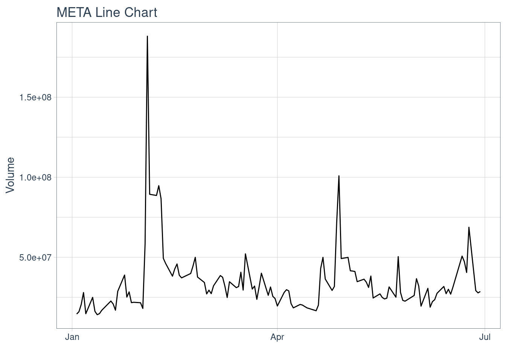

Changing color of the theme, using the first plot as an example.       

```r
meta_price_yahoo %>%
    ggplot(aes(x = date, y = open)) +
    geom_line() +
    labs(title = "META Line Chart", y = "Opening Price", x = "") + 
    theme_tq_green()
```

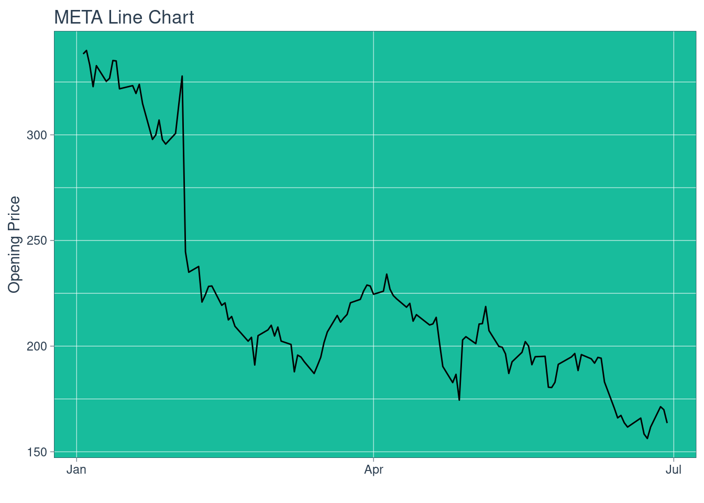

```r
meta_price_yahoo %>%
    ggplot(aes(x = date, y = open)) +
    geom_line() +
    labs(title = "META Line Chart", y = "Opening Price", x = "") + 
    theme_tq_dark()
```

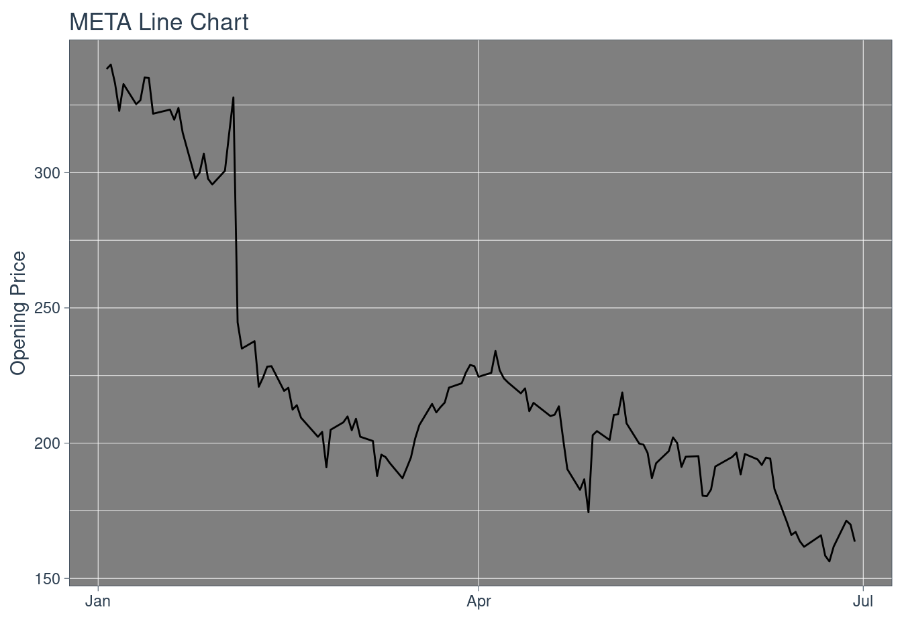

Additionally, scale_color_tq(theme = "green"/"dark") and scale_fill_tq(theme = "green"/"dark") may be used when color and fill are specified as aes().              

The change of themes applies for all other types of plots as well.           

**Bar Chart**     
      

```r
meta_price_yahoo %>%
  # We can also set y = close, which is equivalent to setting y = close. 
    ggplot(aes(x = date, y = open)) +
    geom_barchart(aes(open = open, high = high, low = low, close = close)) +
    labs(title = "META Bar Chart", y = "Price", x = "") + 
    theme_tq()
```

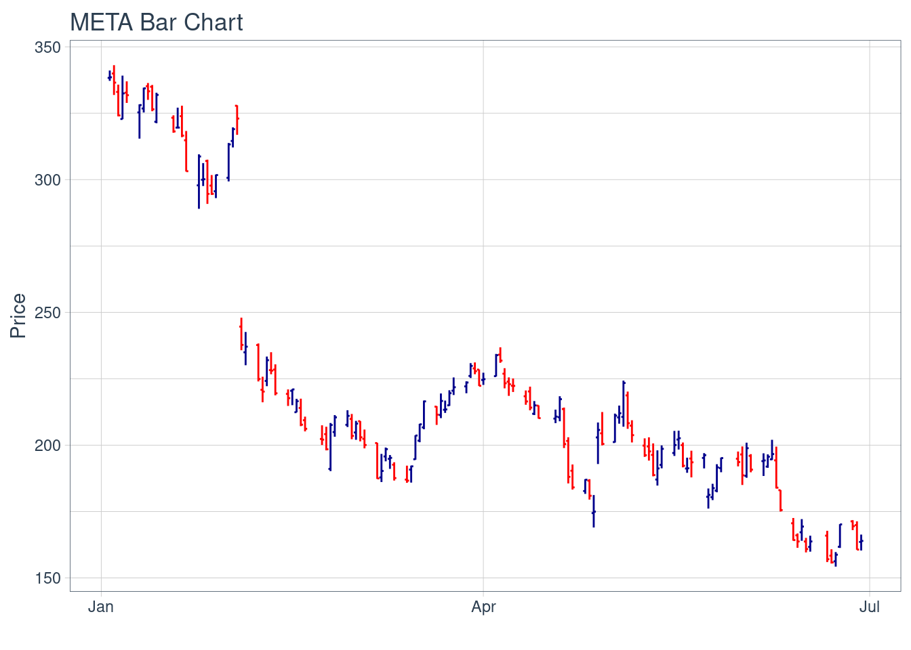

**Candlestick Chart**        


```r
meta_price_yahoo %>% 
  # We can also set y = close, which is equivalent to setting y = close.
    ggplot(aes(x = date, y = open)) +
    geom_candlestick(aes(open = open, high = high, low = low, close = close)) +
    labs(title = "META Candlestick Chart", y = "Price", x = "") +
    theme_tq()
```


We can further modify the candlestick chart by               

* color, "color_up" and "color_down" modifies the color of lines, while fill_up and fill_down modifies the color of rectangle fills.                  

* range of graph, we may use coord_x_date(xlim = ...) to zoom into specific sections of data. 
We may also set ylim = ... if zooming in causes a great change in the range of y values.       

Preparing for only charting a portion of data. We set the range of x.       


```r
start <- as_date("2022-04-30")
end <- as_date("2022-06-30")
```

Reseting the range of y if we adjust plotting the range of x.         

```r
reset_y_range <- meta_price_yahoo %>%
  # the last 60 lines of data. 
  tail(60) %>%
  summarise(
    # max value within the selected range
    max_high = max(high),
    # min value within the selected range
    min_low = min(low)
  )
reset_y_range
```

```
## # A tibble: 1 × 2
##   max_high min_low
##      <dbl>   <dbl>
## 1     237.    154.
```


```r
meta_price_yahoo %>%
    ggplot(aes(x = date, y = open)) +
    geom_candlestick(aes(open = open, high = high, low = low, close = close),                        colour_up = "darkgreen", colour_down = "darkred", 
                        fill_up  = "darkgreen", fill_down  = "darkred") +
    labs(title = "META Candlestick Chart", subtitle = "Zoomed in Version", y = "Price", x = "") +
    coord_x_date(xlim = c(start, end), ylim = c(reset_y_range$min_low, reset_y_range$max_high)) +
    theme_tq()
```

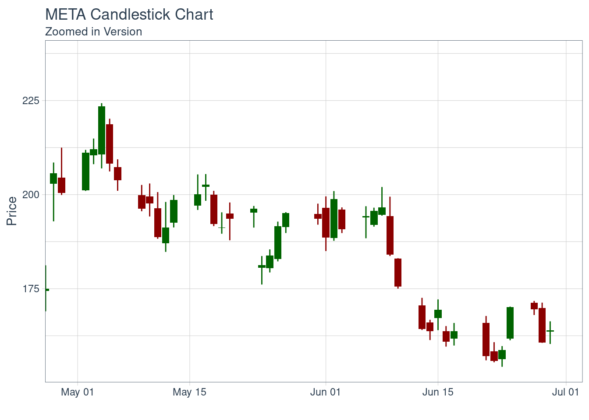

**Graphing different data from different companies**                  


```r
concat1 <- rbind(meta_price_yahoo, aapl_price_yahoo)
concat2 <- rbind(tsla_price_yahoo, concat1)
concat3 <- rbind(uber_price_yahoo, concat2)
concat3
```

```
## # A tibble: 492 × 8
##    symbol date        open  high   low close   volume adjusted
##    <chr>  <date>     <dbl> <dbl> <dbl> <dbl>    <dbl>    <dbl>
##  1 UBER   2022-01-03  42.5  44.4  41.9  44.0 26089000     44.0
##  2 UBER   2022-01-04  44.2  44.8  42.6  44.4 30845300     44.4
##  3 UBER   2022-01-05  44.3  45.9  42.9  43.2 28498700     43.2
##  4 UBER   2022-01-06  43.1  44.1  41.0  42.0 32434300     42.0
##  5 UBER   2022-01-07  42    42.7  41.2  41.5 24875800     41.5
##  6 UBER   2022-01-10  41.5  42.8  40.2  42.6 29783800     42.6
##  7 UBER   2022-01-11  42.4  44.2  42.2  43.6 22161000     43.6
##  8 UBER   2022-01-12  44.0  44.1  42.5  43.0 18993900     43.0
##  9 UBER   2022-01-13  43.3  43.9  42.7  42.9 17190100     42.9
## 10 UBER   2022-01-14  42.4  42.7  40.4  41.5 25817800     41.5
## # … with 482 more rows
```


```r
concat3 %>%
    ggplot(aes(x = date, y = close, group = symbol)) +
    geom_candlestick(aes(open = open, high = high, low = low, close = close)) +
    labs(title = "Multiple Candlestick Charts",
         y = "Price", x = "") + 
    coord_x_date(xlim = c(start, end)) +
    facet_wrap(~ symbol, ncol = 2, scale = "free_y") + 
    theme_tq()
```

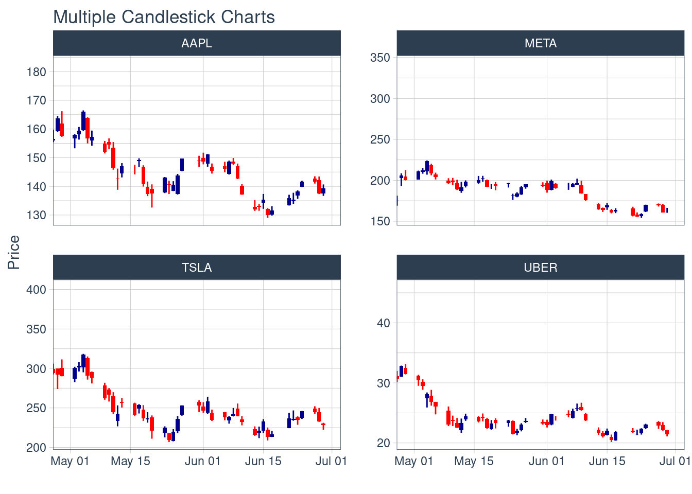

Instead of zooming into specific sections using coord_x_date, we could run scale_x_date instead, which removes out-of-bounds data from charting. There is a trade off between distorting the scale of the y-axis (removing too little) and not getting a moving average (removing too much). We may call the filter() function to remove an appropriate number of days to find a balance. Examples are included in the original documentation.          

**Visualizing Moving Averages**                

Moving averages help to evaluate time-series trends, and they are applied as an added layer to a chart with geom_ma function. Different types of moving averages are available: Simple moving averages(SMA), exponential moving averages (EMA), weighted moving averages(WMA), double exponential moving averages (DEMA), zero-lag exponential moving averages (ZLEMA), volume-weighted moving averages (VWMA), and elastic volume-weighted moving averages (EVWMA).           

We adapted sample code from the original documentation. We can set ma_fun argument equal to the types of moving average we want to graph and adjust the appearance by adjusting linetype, size, color, etc.             

a. charting moving average (SMA) - identify the trend direction of a stock.      
Graph SMA over 20/40 days:                     


```r
meta_price_yahoo %>%
    ggplot(aes(x = date, y = open)) +
    geom_candlestick(aes(open = open, high = high, low = low, close = close)) +
    geom_ma(ma_fun = SMA, n = 20, linetype = 5, size = 1.25) +
    geom_ma(ma_fun = SMA, n = 40, color = "red", size = 1.25) + 
    labs(title = "META Candlestick Chart", 
         subtitle = "20 and 40-Day SMA", 
         y = "Price", x = "") + 
    coord_x_date(xlim = c(start, end),
                 c(reset_y_range$min_low, reset_y_range$max_high)) + 
    theme_tq()
```

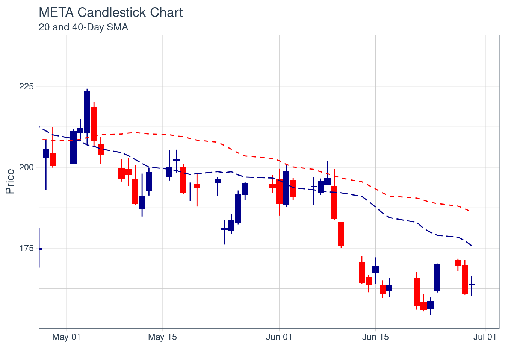

b. charting exponential moving average (EMA) - determine entry and exit points of a trade. 
formula: closing price * multiplier + EMA of the previous day * (1-multiplier)
multiplier formula: [2/(number of days of observation+1)]         


```r
meta_price_yahoo %>%
    ggplot(aes(x = date, y = open)) +
    geom_candlestick(aes(open = open, high = high, low = low, close = close)) +
    geom_ma(ma_fun = EMA, n = 20, wilder = TRUE, linetype = 5, size = 1.25) +
    geom_ma(ma_fun = EMA, n = 40, wilder = TRUE, color = "red", size = 1.25) + 
    labs(title = "META Candlestick Chart", 
         subtitle = "20 and 40-Day EMA", 
         y = "Price", x = "") + 
    coord_x_date(xlim = c(start, end),
                 c(reset_y_range$min_low, reset_y_range$max_high)) +
    theme_tq()
```


c. charting weighted moving averages (WMA) - determine trend directions and help see when to buy or sell stocks     


```r
meta_price_yahoo %>%
    ggplot(aes(x = date, y = open)) +
    geom_candlestick(aes(open = open, high = high, low = low, close = close)) +
    geom_ma(ma_fun = WMA, n = 20, wilder = TRUE, linetype = 5, size = 1.25) +
    geom_ma(ma_fun = WMA, n = 40, wilder = TRUE, color = "red", size = 1.25) + 
    labs(title = "META Candlestick Chart", 
         subtitle = "20 and 40-Day WMA", 
         y = "Price", x = "") + 
    coord_x_date(xlim = c(start, end),
                 c(reset_y_range$min_low, reset_y_range$max_high)) +
    theme_tq()
```


d. charting double exponential moving averages (DEMA) - improved EMA, which removes the lag associated with moving averages by placing more weights on recent values       


```r
meta_price_yahoo %>%
    ggplot(aes(x = date, y = open)) +
    geom_candlestick(aes(open = open, high = high, low = low, close = close)) +
    geom_ma(ma_fun = DEMA, n = 20, wilder = TRUE, linetype = 5, size = 1.25) +
    geom_ma(ma_fun = DEMA, n = 40, wilder = TRUE, color = "red", size = 1.25) + 
    labs(title = "META Candlestick Chart", 
         subtitle = "20 and 40-Day DEMA", 
         y = "Price", x = "") + 
    coord_x_date(xlim = c(start, end),
                 c(reset_y_range$min_low, reset_y_range$max_high)) +
    theme_tq()
```

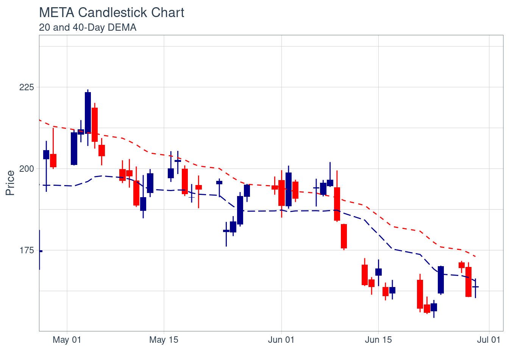

e. charting zero-lag exponential moving averages (ZLEMA) - improved EMA, reduce lags with removed inherent lag by removing data from lag days ago               


```r
meta_price_yahoo %>%
    ggplot(aes(x = date, y = open)) +
    geom_candlestick(aes(open = open, high = high, low = low, close = close)) +
    geom_ma(ma_fun = ZLEMA, n = 20, wilder = TRUE, linetype = 5, size = 1.25) +
    geom_ma(ma_fun = ZLEMA, n = 40, wilder = TRUE, color = "red", size = 1.25) + 
    labs(title = "META Candlestick Chart", 
         subtitle = "20 and 40-Day ZLEMA", 
         y = "Price", x = "") + 
    coord_x_date(xlim = c(start, end),
                 c(reset_y_range$min_low, reset_y_range$max_high)) +
    theme_tq()
```


f. charting volume-weighted moving averages (VWMA) - weighting prices based on the amount of trading activity within the time window            


```r
meta_price_yahoo %>%
    ggplot(aes(x = date, y = open, volume = volume)) +
    geom_candlestick(aes(open = open, high = high, low = low, close = close)) +
    geom_ma(ma_fun = VWMA, n = 20, wilder = TRUE, linetype = 5, size = 1.25) +
    geom_ma(ma_fun = VWMA, n = 40, wilder = TRUE, color = "red", size = 1.25) + 
    labs(title = "META Candlestick Chart", 
         subtitle = "20 and 40-Day VWMA", 
         y = "Price", x = "") + 
    coord_x_date(xlim = c(start, end),
                 c(reset_y_range$min_low, reset_y_range$max_high)) +
    theme_tq()
```


g. elastic volume-weighted moving averages (EVWMA) - approximate the average price paid per share. Large gaps between price and EVWMA is a signal of overbought/sold              


```r
meta_price_yahoo %>%
    ggplot(aes(x = date, y = close, volume = volume)) +
    geom_candlestick(aes(open = open, high = high, low = low, close = close)) +
    geom_ma(ma_fun = EVWMA, n = 20, wilder = TRUE, linetype = 5, size = 1.25) +
    geom_ma(ma_fun = EVWMA, n = 40, wilder = TRUE, color = "red", size = 1.25) + 
    labs(title = "META Candlestick Chart", 
         subtitle = "20 and 40-Day EVWMA", 
         y = "Price", x = "") + 
    coord_x_date(xlim = c(start, end),
                 c(reset_y_range$min_low, reset_y_range$max_high)) +
    theme_tq()
```


**Adding Bollinger Bands**           

Bollinger bands are used to visualize volatility by plotting a range around a moving average two standard deviations up and down. Geom_bbands works almost identically to geom_ma. We can use color_ma, color_bands, alpha, and fill arguments to change the appearance of bollinger bands.    


```r
meta_price_yahoo %>%
  # high, low, and close information are required. 
    ggplot(aes(x = date, y = close, open = open, high = high, low = low, close = close)) +
    geom_candlestick() +
  # sd = 2 by default. 
    geom_bbands(ma_fun = SMA, sd = 2, n = 20) +
    labs(title = "META Candlestick Chart", 
         subtitle = "BBands with SMA", 
         y = "Closing Price", x = "") + 
        coord_x_date(xlim = c(start, end),
                       c(reset_y_range$min_low, reset_y_range$max_high)) +
    theme_tq()
```

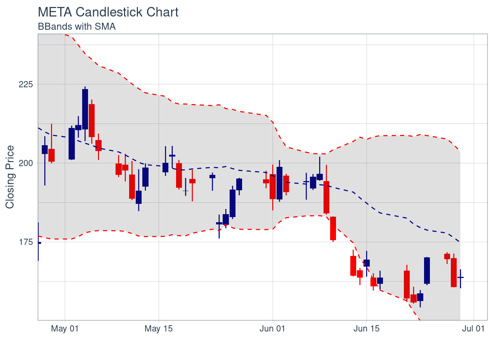

## Quantmod vs. Tidyquant                       
### Quantmod:                     
Pros-                      
1. Beginner friendly, no need to have knowledge of other R libraries/packages to create graphs  
2. Easy syntax    
3. Contains all the essential tools and indicators for traders                      
       
Cons-      
1. Not flexible (for example, cannot freely edit elements on the chart, like the caption and volume number)    
2. Limited functions (for example, cannot conduct data cleaning directly and cannot create multi-facet plot)    
3. Limited data source connections, currently only has 3 direct online data source connections (Yahoo Finance, FRED, oanda)    

### Tidyquant:       
Pros-     
1. Can use tidyverse and ggplot packages, which contains functions to clean data, make tidy graphs, and implement modeling and scaling analysis    
2. Contain all the quantitative analytical functions in Quantmod, xts, TTR, and PerformanceAnalytics    
3. Multiple data source connections available, currently has 6 connections (Yahoo Finance, FRED, Quandl, Tiingo, Alpha Vantage, Bloomberg)     
4. Flexible (since can use tidyverse and ggplot)    

Cons-                
1. Not beginner friendly comparing with Quantmod                            
2. Syntax can be complex                           

## Sources:                   

1. https://cran.r-project.org/web/packages/quantmod/quantmod.pdf       
2. https://www.rdocumentation.org/packages/quantmod/versions/0.4.20       
3. https://www.quantmod.com/documentation/      
4. https://rdrr.io/cran/quantmod/
5. https://cran.r-project.org/web/packages/tidyquant/vignettes/
6. https://data.nasdaq.com/data/FRED-federal-reserve-economic-data/documentation
7. https://www.analyticsvidhya.com/blog/2017/09/comparative-stock-analysis/
8. https://www.business-science.io/code-tools/2017/03/19/tidyquant-quandl-integration.html

