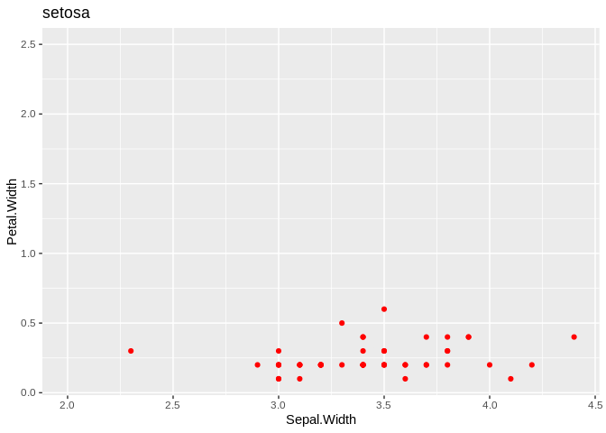

# Testing


```r
library(gganimate)
library(ggplot2)
anim <- ggplot(iris, aes(Sepal.Width, Petal.Width)) +
geom_point(color = "red") +
  labs(title = "{closest_state}") +
  transition_states(Species, transition_length = 3, state_length = 1)
animate(anim)
```


