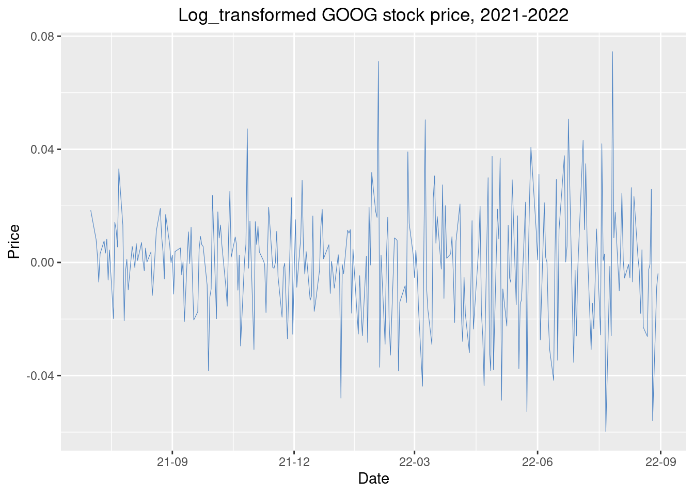
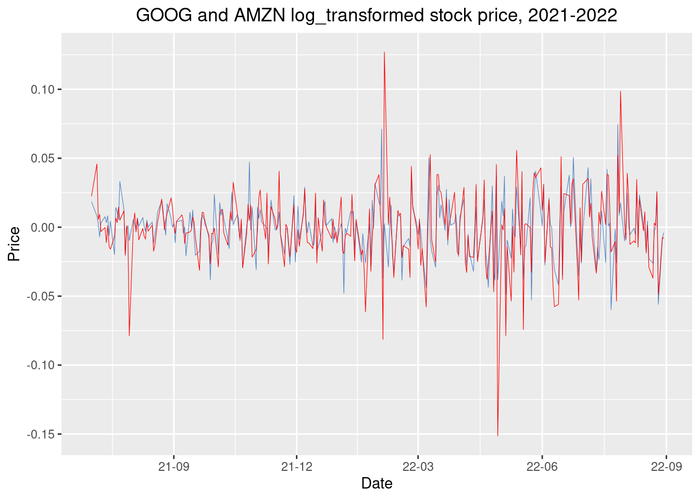

# Time Series Visualization - R tutorial

Shuyu He, Zhongyuan Ye

# Introduction
R studio contains lots of powerful packages to solve real-world data visualization problems. In this tutorial, we will be focusing on how to combine the data visualization library we learned in class(like "ggplot2", "tidyverse", "ploty", et al) with some new packages (like "quantmod", "TSstudio", and fpp2) to solve the Time series visualization problem.\

Before going into how to do a time series analysis with R, let's think about a basic question: What is time series analysis? Why should anyone learn it?\

A time series is a set of numerical measurements of the same entity taken at equally spaced intervals over time. For example, Amazon stock is the entity, the stock price of Amazon is the numerical measurement, and the set of the everyday stock price of Amazon of 2022 August is a time series.\
Time Series analysis is usually used to find the pattern of the non-stationary data and use the pattern for future prediction. By visualizing time series with R, we can observe the data more intuitively, which can help us find the pattern of non-stationary data more efficiently. \
Time Series Analysis is widely used in many industries like Finance, Economics, and Retailing. This tutorial will focus on how to use R to visualize the Time Series of stock prices.
install.packages("package-name")

\
The tutorial will contains 5 Sections: \
[1. Environment Setup](#S1) \
[2. Raw Data Process](#S2) \
[3. Time series visualization: ggplot and ggplot2](#S3) \
[4. Time series visualization: TSstudio](#S4) \
[5. Time series visualization: Plotly](#S5) \


Each section contains a description of the function used in that section and a practical example. The practical example we use in our tutorial is the Time series visualization of Google and Amazon Stock from 2021-07-01 to 2021-08-31.

## Section 1: Environment Setup {#S1}

First and foremost, we need to set up our R environment before doing anything else.
The package we will use in this tutorial are: "quantmod", "TSstudio", "xts", "ggplot2", "gridExtra", "fpp2", "tidyverse", "plotly" \

If there is any package is not yet been installed/updated, please type the following code in your R terminal:
install.packages("package-name")

\
<font size="5"><span style="color: blue;">Coding Time: </span></font>

```r
library(quantmod)
library(TSstudio)
library(xts)
library(ggplot2)
library(gridExtra)
library(fpp2)
library(tidyverse)
library(plotly)
```


## Section 2: Raw Data Processing {#S2}
Before any visualization, it's always important to extract and process the raw data.
This part will have 2 subopic: \
2.1:Stock Data Extraction with quantmod \
2.2:Basic Stock Data transformation: Log transformation

\
<font size="5"><span style="color: Black;">2.1:Stock Data Extraction with quantmod </span></font>
For data analysts, there is always a tough problem that needs to solve: where does the raw data come from? This tutorial will show you how to easily extract the high credibility stock data with "quantmod" package.\
Based on the [author](http://www.quantmod.com/) of the "quantmod", this package is designed to 'assist the quantitative trader in the development, testing, and deployment of statistically based trading models.' \
The function getSymbols() from quantmod package is the method we used in this tutorial to extract the time series of a specific stock.
The getSymbols() function provides an interface that imports data as an xts object. By default, it imports data from Yahoo! Finance. Use the ''  to specify the stock code, and 'from=' & 't=' to specify the date interval. 

\
<font size="5"><span style="color: Orange;">Practical Example: </span></font> \

We will extract Google stock price from 2021-07-01 to 2022-08-31 using quantmod package in R. The quantmod package contains functions to extract, chart, and analyze quantitative trading data. In this case, we extract the adjusted price on the 6th row to create visualization. 
We also extract Amazon stock price from 2021-07-01 to 2022-08-31 for further visualization. Extract all stock data from Yahoo! Finance.
\
<font size="5"><span style="color: blue;">Coding Time: </span></font>

```r
sdate = as.Date('2021-07-01')
edate = as.Date('2022-08-31')
sdata = getSymbols('GOOG',from = sdate,t = edate,auto.assign = F)
no.na <- which(is.na(sdata[,6]))      # no for NA
sdata[no.na,6] <- sdata[no.na-1,6]
head(sdata)
```

```
##            GOOG.Open GOOG.High GOOG.Low GOOG.Close GOOG.Volume GOOG.Adjusted
## 2021-07-01  124.8497  126.4625 124.8497   126.3685    17120000      126.3685
## 2021-07-02  126.8395  128.8480 126.7690   128.7190    21160000      128.7190
## 2021-07-06  129.4495  129.8845 128.4090   129.7710    21350000      129.7710
## 2021-07-07  130.3410  130.6399 129.7600   130.0775    16680000      130.0775
## 2021-07-08  128.2500  130.0325 128.0400   129.1770    19780000      129.1770
## 2021-07-09  128.9445  129.8495 128.9435   129.5745    15106000      129.5745
```

```r
#extract only the adjusted price in 6th row
s_price <- sdata[,6]

#extract stock price data in Amazon
sdata_amzn = getSymbols('AMZN',from = sdate,t = edate,auto.assign = F)
no.na_amzn <- which(is.na(sdata_amzn[,6]))
sdata_amzn[no.na,6] <- sdata_amzn[no.na_amzn-1,6]
s_price_amzn <- sdata_amzn[,6]
head(sdata_amzn)
```

```
##            AMZN.Open AMZN.High AMZN.Low AMZN.Close AMZN.Volume AMZN.Adjusted
## 2021-07-01  171.7305  172.8500 170.4710   171.6485    40742000      171.6485
## 2021-07-02  172.5820  175.5860 171.8460   175.5490    63388000      175.5490
## 2021-07-06  176.5055  184.2740 176.4500   183.7870   134896000      183.7870
## 2021-07-07  185.8690  186.7100 183.9455   184.8290   106562000      184.8290
## 2021-07-08  182.1780  187.9995 181.0560   186.5705   103612000      186.5705
## 2021-07-09  186.1260  187.4000 184.6700   185.9670    74964000      185.9670
```
\
<font size="5"><span style="color: Black;">2.2:Basic Stock Data transformation: Log transformation </span></font>\

Log-transformation scaling is typically used before analyzing stock price data. After log transformation, equivalent price changes can be represented by the same vertical distance. Log returns are more symmetric, and works better than linear price scales to observe the relative change of price, instead of absolute change. It helps to visualize how far the price moves to reach a sell or buy target.

<font size="5"><span style="color: Orange;">Practical Example: </span></font> \
Use log-transformation to transfer the Google and Amazon stock price we got in 2.1

\
<font size="5"><span style="color: blue;">Coding Time: </span></font>

```r
# log return using adjusted stock price
ts_goog <- diff(log(s_price),1)
head(ts_goog)
```

```
##            GOOG.Adjusted
## 2021-07-01            NA
## 2021-07-02   0.018429445
## 2021-07-06   0.008139641
## 2021-07-07   0.002359091
## 2021-07-08  -0.006946847
## 2021-07-09   0.003072379
```

```r
ts_amzn <- diff(log(s_price_amzn),1)
head(ts_amzn)
```

```
##            AMZN.Adjusted
## 2021-07-01            NA
## 2021-07-02   0.022469408
## 2021-07-06   0.045859311
## 2021-07-07   0.005653552
## 2021-07-08   0.009378116
## 2021-07-09  -0.003239951
```

# Section 3.Time series visualization with ggplot and ggplot2 {#S3}

The first method to visualize stock price is to use line graphs in ggplot. The function geom_line creates lines connecting observations ordered by x value. We create visualization for both raw data and log_transfomred data for GOOG stock price. 
\

<font size="5"><span style="color: Orange;">Practical Example: </span></font> \
Use ggplot2 to create visualization for both raw data and log_transfomred data for GOOG stock price with the line graph.
\
<font size="5"><span style="color: blue;">Coding Time: </span></font>

```r
#line plot for stock price raw data
ggplot(s_price, aes(x = index(s_price), y = s_price)) +
    geom_line(color = '#4E84C4', size=0.2) + 
    ggtitle('GOOG stock price, 2021-2022') + xlab('Date') + ylab('Price') + 
    theme(plot.title = element_text(hjust = 0.5)) + 
    scale_x_date(date_labels = '%y-%m', date_breaks = '3 months')
```


```r
#line plot for log Transformed GOOGstock price 
ggplot(ts_goog, aes(x = index(ts_goog), y = ts_goog)) +
    geom_line(color = '#4E84C4', size=0.2) + 
    ggtitle('Log_transformed GOOG stock price, 2021-2022') + xlab('Date') + ylab('Price') + 
    theme(plot.title = element_text(hjust = 0.5)) + 
    scale_x_date(date_labels = '%y-%m', date_breaks = '3 months')
```



From two plots, we observe that the log_transformed stock price better represents the change in perentage for stock prices. We will use the log_transformed stock data in further visualizations. 


<font size="5"><span style="color: Orange;">Practical Example: </span></font> \
Why don't we visualized the Google stock price and Amazon stock price on the same graph for comparison?
Code below create line plots for GOOG and AMZN log_transformed stock prices at same plot by adding two geom_line. 

\
<font size="5"><span style="color: blue;">Coding Time: </span></font>

```r
ts_bind <- cbind(ts_goog, ts_amzn)
ggplot(ts_bind, aes(x = index(ts_bind))) +
    geom_line(aes(y = GOOG.Adjusted), color = '#4E84C4', size=0.2) + 
    geom_line(aes(y = AMZN.Adjusted), color = 'red', size=0.2) + 
    ggtitle('GOOG and AMZN log_transformed stock price, 2021-2022') + xlab('Date') + ylab('Price') + 
    theme(plot.title = element_text(hjust = 0.5)) + 
    scale_x_date(date_labels = '%y-%m', date_breaks = '3 months')
```



Another way to create ts visualization is to use autoplot function in ggplot2. The function autoplot() in ggplot2 provides a simple and direct plot for a particular object. \

<font size="5"><span style="color: Orange;">Practical Example: </span></font> \
Use function autoplot() to visualized the Google and Amazon log_transformed stock price.
\
<font size="5"><span style="color: blue;">Coding Time: </span></font>

```r
autoplot(ts_bind)  + 
    ggtitle(' GOOG and AMZN log_transformed stock price in autoplot') + xlab('Date') + ylab('Price')
```


# AutoCorrelation plot
The auto-correlation plot  is used to determine whether a time series is dependent on its past. In ggplot, ggAcf function plots the auto-correlation function for a univariate time series. It is used to analyze the raw data to determine if the data can fit into a time-series model.


\
<font size="5"><span style="color: Orange;">Practical Example: </span></font> \
Use auto-correlation plot to visualized the Google and Amazon log_transformed stock price.
\
<font size="5"><span style="color: blue;">Coding Time: </span></font>

```r
ggAcf(ts_goog, lag.max = 20) + 
    ggtitle('Auto-correlation plot for log_transformed GOOG stock price')
```


```r
ggAcf(ts_amzn, lag.max = 20) + 
    ggtitle('Auto-correlation plot for log_transformed AMZN stock price')
```


# Section 4. Time series visualization with TSstudio: ts_plot {#S4}
There are several big problems when visualization with the ggplot2 library: what if the viewer wants the precise stock value of a certain day? What if the viewer wants to see the exact date of one peak value? That is why we introduced the "ts_plot" library and "ploty" library to you.\

TSstudio package provides a set of tools to describe, visualize, and predict time series data. ts_plot function is used to produce interactive visualization for time series objects. \
By visualization time series with ts_plot, we solved the problem "the viewer might be interested in a precise data point." By creating a graph with line.mode= "lines+markers", the viewer can get the precise value of any data point by putting the mouse pointer to that point.
\
\
<font size="5"><span style="color: Orange;">Practical Example: </span></font> \
Use ts_plot to visualized the Google and Amazon real stock price.
\

<font size="5"><span style="color: blue;">Coding Time: </span></font>

```r
#Google
ts_plot(s_price,
        title = "ts_plot: GOOG stock price",
        Xtitle = "Time",
        Ytitle = "Amazon Stock Price",
        line.mode =  "lines+markers")
```

```{=html}
<div id="htmlwidget-59dde2771b9348942e69" style="width:80%;height:480px;" class="plotly html-widget"></div>
<script type="application/json" data-for="htmlwidget-59dde2771b9348942e69">{"x":{"visdat":{"275c43b49a3e":["function () ","plotlyVisDat"]},"cur_data":"275c43b49a3e","attrs":{"275c43b49a3e":{"x":{},"y":{},"mode":"lines+markers","marker":{"color":"#00526d"},"line":{"width":2,"dash":null,"color":"#00526d"},"alpha_stroke":1,"sizes":[10,100],"spans":[1,20],"type":"scatter"}},"layout":{"margin":{"b":40,"l":60,"t":25,"r":10},"xaxis":{"domain":[0,1],"automargin":true,"title":"Time","showgrid":false},"yaxis":{"domain":[0,1],"automargin":true,"title":"Amazon Stock Price","showgrid":false},"title":"ts_plot: GOOG stock price","hovermode":"closest","showlegend":false},"source":"A","config":{"modeBarButtonsToAdd":["hoverclosest","hovercompare"],"showSendToCloud":false},"data":[{"x":["2021-07-01","2021-07-02","2021-07-06","2021-07-07","2021-07-08","2021-07-09","2021-07-12","2021-07-13","2021-07-14","2021-07-15","2021-07-16","2021-07-19","2021-07-20","2021-07-21","2021-07-22","2021-07-23","2021-07-26","2021-07-27","2021-07-28","2021-07-29","2021-07-30","2021-08-02","2021-08-03","2021-08-04","2021-08-05","2021-08-06","2021-08-09","2021-08-10","2021-08-11","2021-08-12","2021-08-13","2021-08-16","2021-08-17","2021-08-18","2021-08-19","2021-08-20","2021-08-23","2021-08-24","2021-08-25","2021-08-26","2021-08-27","2021-08-30","2021-08-31","2021-09-01","2021-09-02","2021-09-03","2021-09-07","2021-09-08","2021-09-09","2021-09-10","2021-09-13","2021-09-14","2021-09-15","2021-09-16","2021-09-17","2021-09-20","2021-09-21","2021-09-22","2021-09-23","2021-09-24","2021-09-27","2021-09-28","2021-09-29","2021-09-30","2021-10-01","2021-10-04","2021-10-05","2021-10-06","2021-10-07","2021-10-08","2021-10-11","2021-10-12","2021-10-13","2021-10-14","2021-10-15","2021-10-18","2021-10-19","2021-10-20","2021-10-21","2021-10-22","2021-10-25","2021-10-26","2021-10-27","2021-10-28","2021-10-29","2021-11-01","2021-11-02","2021-11-03","2021-11-04","2021-11-05","2021-11-08","2021-11-09","2021-11-10","2021-11-11","2021-11-12","2021-11-15","2021-11-16","2021-11-17","2021-11-18","2021-11-19","2021-11-22","2021-11-23","2021-11-24","2021-11-26","2021-11-29","2021-11-30","2021-12-01","2021-12-02","2021-12-03","2021-12-06","2021-12-07","2021-12-08","2021-12-09","2021-12-10","2021-12-13","2021-12-14","2021-12-15","2021-12-16","2021-12-17","2021-12-20","2021-12-21","2021-12-22","2021-12-23","2021-12-27","2021-12-28","2021-12-29","2021-12-30","2021-12-31","2022-01-03","2022-01-04","2022-01-05","2022-01-06","2022-01-07","2022-01-10","2022-01-11","2022-01-12","2022-01-13","2022-01-14","2022-01-18","2022-01-19","2022-01-20","2022-01-21","2022-01-24","2022-01-25","2022-01-26","2022-01-27","2022-01-28","2022-01-31","2022-02-01","2022-02-02","2022-02-03","2022-02-04","2022-02-07","2022-02-08","2022-02-09","2022-02-10","2022-02-11","2022-02-14","2022-02-15","2022-02-16","2022-02-17","2022-02-18","2022-02-22","2022-02-23","2022-02-24","2022-02-25","2022-02-28","2022-03-01","2022-03-02","2022-03-03","2022-03-04","2022-03-07","2022-03-08","2022-03-09","2022-03-10","2022-03-11","2022-03-14","2022-03-15","2022-03-16","2022-03-17","2022-03-18","2022-03-21","2022-03-22","2022-03-23","2022-03-24","2022-03-25","2022-03-28","2022-03-29","2022-03-30","2022-03-31","2022-04-01","2022-04-04","2022-04-05","2022-04-06","2022-04-07","2022-04-08","2022-04-11","2022-04-12","2022-04-13","2022-04-14","2022-04-18","2022-04-19","2022-04-20","2022-04-21","2022-04-22","2022-04-25","2022-04-26","2022-04-27","2022-04-28","2022-04-29","2022-05-02","2022-05-03","2022-05-04","2022-05-05","2022-05-06","2022-05-09","2022-05-10","2022-05-11","2022-05-12","2022-05-13","2022-05-16","2022-05-17","2022-05-18","2022-05-19","2022-05-20","2022-05-23","2022-05-24","2022-05-25","2022-05-26","2022-05-27","2022-05-31","2022-06-01","2022-06-02","2022-06-03","2022-06-06","2022-06-07","2022-06-08","2022-06-09","2022-06-10","2022-06-13","2022-06-14","2022-06-15","2022-06-16","2022-06-17","2022-06-21","2022-06-22","2022-06-23","2022-06-24","2022-06-27","2022-06-28","2022-06-29","2022-06-30","2022-07-01","2022-07-05","2022-07-06","2022-07-07","2022-07-08","2022-07-11","2022-07-12","2022-07-13","2022-07-14","2022-07-15","2022-07-18","2022-07-19","2022-07-20","2022-07-21","2022-07-22","2022-07-25","2022-07-26","2022-07-27","2022-07-28","2022-07-29","2022-08-01","2022-08-02","2022-08-03","2022-08-04","2022-08-05","2022-08-08","2022-08-09","2022-08-10","2022-08-11","2022-08-12","2022-08-15","2022-08-16","2022-08-17","2022-08-18","2022-08-19","2022-08-22","2022-08-23","2022-08-24","2022-08-25","2022-08-26","2022-08-29","2022-08-30"],"y":[126.3685,128.718994,129.770996,130.077499,129.177002,129.574493,130.563995,130.994507,132.082504,131.266495,131.845505,129.253998,131.101501,132.600494,133.328506,137.815994,139.644501,136.796494,136.3815,136.540497,135.220993,135.989502,136.279999,136.028503,136.940002,137.035995,138.001999,138.096497,137.689499,138.389496,138.406006,138.916,137.300507,136.570007,136.913498,138.436996,141.099503,142.398499,142.949997,142.123001,144.550507,145.469498,145.462006,145.841995,144.218994,144.774994,145.518997,144.883499,144.913498,141.921005,143.464996,143.406006,145.205994,144.373505,141.463501,139.016998,139.6465,140.938507,141.826508,142.632996,141.501007,136.184006,134.520996,133.265503,136.462494,133.764999,136.177002,137.354004,139.185501,140.056,138.847504,136.712997,137.899994,141.412003,141.675003,142.960495,143.822006,142.414993,142.780502,138.625,138.772995,139.671997,146.427505,146.128998,148.270493,143.774002,145.863007,146.789993,148.682999,149.240997,149.351501,149.248505,146.626007,146.748001,149.645493,149.388,149.076004,149.061996,150.709,149.952499,147.078506,146.757004,146.717499,142.806,146.113998,142.451996,141.617996,143.776505,142.520493,143.796494,148.036499,148.720505,148.106003,148.675003,146.704498,144.970505,147.3685,144.838501,142.802994,142.401505,144.220505,146.949005,147.142502,148.063995,146.447998,146.504501,146.002502,144.679504,145.074493,144.416504,137.653503,137.550995,137.004501,138.574005,140.017502,141.647995,139.130997,139.786499,136.290497,135.651993,133.5065,130.091995,130.371994,126.735497,129.240005,129.121002,133.289505,135.698502,137.878494,148.036499,142.650497,143.016006,138.938004,139.212997,141.453003,138.602493,134.130005,135.300003,136.425507,137.487503,132.308502,130.467499,129.402496,127.584999,132.673492,134.519501,134.891006,134.167999,134.751495,134.307999,132.121994,126.4645,127.278503,133.865997,132.682007,130.475494,126.740997,129.660507,133.690506,134.600494,136.801498,136.4785,140.277496,138.503494,141.311996,141.5215,141.949997,143.25,142.644501,139.649506,140.699997,143.642502,141.063004,137.175995,136.464996,134.010498,129.796494,128.374496,130.285995,127.252998,127.960999,130.531006,128.245499,124.9375,119.613998,123.25,119.505997,115.0205,119.411499,114.966499,117.156998,118.129501,122.574997,116.746498,115.660004,113.084,114.584503,113.960999,113.161003,116.515503,114.792503,116.7015,112.401001,110.745499,109.313004,111.666496,105.926003,105.8395,108.295998,112.799004,114.039001,114.137001,117.746002,114.564003,117.010498,117.2295,117.237999,114.917999,111.427498,106.876503,107.194,110.390503,106.636002,107.865501,112.014999,112.033997,112.684502,118.538002,116.622498,112.571503,112.2565,109.372498,109.081001,113.887001,115.213501,119.306,120.168503,116.522499,114.849503,112.186996,111.440002,112.766998,109.910004,114.620003,114.699997,115.040001,108.360001,108.209999,105.440002,113.599998,114.589996,116.639999,115.480003,115.900002,118.779999,118.870003,118.220001,118.139999,117.5,120.650002,119.82,122.650002,122.879997,122.510002,120.32,120.860001,118.120003,115.07,114.769997,114.699997,117.699997,111.300003,110.339996,109.910004],"mode":"lines+markers","marker":{"color":"#00526d","line":{"color":"rgba(31,119,180,1)"}},"line":{"color":"#00526d","width":2,"dash":[]},"type":"scatter","error_y":{"color":"rgba(31,119,180,1)"},"error_x":{"color":"rgba(31,119,180,1)"},"xaxis":"x","yaxis":"y","frame":null}],"highlight":{"on":"plotly_click","persistent":false,"dynamic":false,"selectize":false,"opacityDim":0.2,"selected":{"opacity":1},"debounce":0},"shinyEvents":["plotly_hover","plotly_click","plotly_selected","plotly_relayout","plotly_brushed","plotly_brushing","plotly_clickannotation","plotly_doubleclick","plotly_deselect","plotly_afterplot","plotly_sunburstclick"],"base_url":"https://plot.ly"},"evals":[],"jsHooks":[]}</script>
```

```r
#Amazon
ts_plot(s_price_amzn,
        title = "ts_plot: AMZN stock price",
        Xtitle = "Time",
        Ytitle = "AMZN Stock Price",
        line.mode =  "lines+markers")
```

```{=html}
<div id="htmlwidget-9d3bf12e0a331d8a425f" style="width:80%;height:480px;" class="plotly html-widget"></div>
<script type="application/json" data-for="htmlwidget-9d3bf12e0a331d8a425f">{"x":{"visdat":{"275c44319082":["function () ","plotlyVisDat"]},"cur_data":"275c44319082","attrs":{"275c44319082":{"x":{},"y":{},"mode":"lines+markers","marker":{"color":"#00526d"},"line":{"width":2,"dash":null,"color":"#00526d"},"alpha_stroke":1,"sizes":[10,100],"spans":[1,20],"type":"scatter"}},"layout":{"margin":{"b":40,"l":60,"t":25,"r":10},"xaxis":{"domain":[0,1],"automargin":true,"title":"Time","showgrid":false},"yaxis":{"domain":[0,1],"automargin":true,"title":"AMZN Stock Price","showgrid":false},"title":"ts_plot: AMZN stock price","hovermode":"closest","showlegend":false},"source":"A","config":{"modeBarButtonsToAdd":["hoverclosest","hovercompare"],"showSendToCloud":false},"data":[{"x":["2021-07-01","2021-07-02","2021-07-06","2021-07-07","2021-07-08","2021-07-09","2021-07-12","2021-07-13","2021-07-14","2021-07-15","2021-07-16","2021-07-19","2021-07-20","2021-07-21","2021-07-22","2021-07-23","2021-07-26","2021-07-27","2021-07-28","2021-07-29","2021-07-30","2021-08-02","2021-08-03","2021-08-04","2021-08-05","2021-08-06","2021-08-09","2021-08-10","2021-08-11","2021-08-12","2021-08-13","2021-08-16","2021-08-17","2021-08-18","2021-08-19","2021-08-20","2021-08-23","2021-08-24","2021-08-25","2021-08-26","2021-08-27","2021-08-30","2021-08-31","2021-09-01","2021-09-02","2021-09-03","2021-09-07","2021-09-08","2021-09-09","2021-09-10","2021-09-13","2021-09-14","2021-09-15","2021-09-16","2021-09-17","2021-09-20","2021-09-21","2021-09-22","2021-09-23","2021-09-24","2021-09-27","2021-09-28","2021-09-29","2021-09-30","2021-10-01","2021-10-04","2021-10-05","2021-10-06","2021-10-07","2021-10-08","2021-10-11","2021-10-12","2021-10-13","2021-10-14","2021-10-15","2021-10-18","2021-10-19","2021-10-20","2021-10-21","2021-10-22","2021-10-25","2021-10-26","2021-10-27","2021-10-28","2021-10-29","2021-11-01","2021-11-02","2021-11-03","2021-11-04","2021-11-05","2021-11-08","2021-11-09","2021-11-10","2021-11-11","2021-11-12","2021-11-15","2021-11-16","2021-11-17","2021-11-18","2021-11-19","2021-11-22","2021-11-23","2021-11-24","2021-11-26","2021-11-29","2021-11-30","2021-12-01","2021-12-02","2021-12-03","2021-12-06","2021-12-07","2021-12-08","2021-12-09","2021-12-10","2021-12-13","2021-12-14","2021-12-15","2021-12-16","2021-12-17","2021-12-20","2021-12-21","2021-12-22","2021-12-23","2021-12-27","2021-12-28","2021-12-29","2021-12-30","2021-12-31","2022-01-03","2022-01-04","2022-01-05","2022-01-06","2022-01-07","2022-01-10","2022-01-11","2022-01-12","2022-01-13","2022-01-14","2022-01-18","2022-01-19","2022-01-20","2022-01-21","2022-01-24","2022-01-25","2022-01-26","2022-01-27","2022-01-28","2022-01-31","2022-02-01","2022-02-02","2022-02-03","2022-02-04","2022-02-07","2022-02-08","2022-02-09","2022-02-10","2022-02-11","2022-02-14","2022-02-15","2022-02-16","2022-02-17","2022-02-18","2022-02-22","2022-02-23","2022-02-24","2022-02-25","2022-02-28","2022-03-01","2022-03-02","2022-03-03","2022-03-04","2022-03-07","2022-03-08","2022-03-09","2022-03-10","2022-03-11","2022-03-14","2022-03-15","2022-03-16","2022-03-17","2022-03-18","2022-03-21","2022-03-22","2022-03-23","2022-03-24","2022-03-25","2022-03-28","2022-03-29","2022-03-30","2022-03-31","2022-04-01","2022-04-04","2022-04-05","2022-04-06","2022-04-07","2022-04-08","2022-04-11","2022-04-12","2022-04-13","2022-04-14","2022-04-18","2022-04-19","2022-04-20","2022-04-21","2022-04-22","2022-04-25","2022-04-26","2022-04-27","2022-04-28","2022-04-29","2022-05-02","2022-05-03","2022-05-04","2022-05-05","2022-05-06","2022-05-09","2022-05-10","2022-05-11","2022-05-12","2022-05-13","2022-05-16","2022-05-17","2022-05-18","2022-05-19","2022-05-20","2022-05-23","2022-05-24","2022-05-25","2022-05-26","2022-05-27","2022-05-31","2022-06-01","2022-06-02","2022-06-03","2022-06-06","2022-06-07","2022-06-08","2022-06-09","2022-06-10","2022-06-13","2022-06-14","2022-06-15","2022-06-16","2022-06-17","2022-06-21","2022-06-22","2022-06-23","2022-06-24","2022-06-27","2022-06-28","2022-06-29","2022-06-30","2022-07-01","2022-07-05","2022-07-06","2022-07-07","2022-07-08","2022-07-11","2022-07-12","2022-07-13","2022-07-14","2022-07-15","2022-07-18","2022-07-19","2022-07-20","2022-07-21","2022-07-22","2022-07-25","2022-07-26","2022-07-27","2022-07-28","2022-07-29","2022-08-01","2022-08-02","2022-08-03","2022-08-04","2022-08-05","2022-08-08","2022-08-09","2022-08-10","2022-08-11","2022-08-12","2022-08-15","2022-08-16","2022-08-17","2022-08-18","2022-08-19","2022-08-22","2022-08-23","2022-08-24","2022-08-25","2022-08-26","2022-08-29","2022-08-30"],"y":[171.648499,175.548996,183.787003,184.828995,186.570496,185.966995,185.927505,183.867996,184.084,181.559998,178.681503,177.479507,178.6595,179.259995,181.901505,182.832001,184.990997,181.319504,181.516006,179.996002,166.379501,166.574005,168.311996,167.735992,168.7995,167.246994,167.093506,166.033997,164.605499,165.175003,164.698502,164.949493,162.098007,160.061005,159.387497,159.997498,163.293503,165.289001,164.959,165.800003,167.481506,171.078506,173.539505,173.949997,173.156006,173.902496,175.464493,176.274994,174.207993,173.457504,172.858505,172.5,173.789505,174.412003,173.126007,167.786499,167.181503,169.002502,170.800003,171.276001,170.289993,165.798004,165.056,164.251999,164.162994,159.488998,161.050003,163.100494,165.121506,164.431,162.315002,162.366501,164.214005,164.992996,170.451004,172.337006,172.207504,170.753006,171.750504,166.777496,166.018494,168.803497,169.624496,172.328506,168.621506,165.905502,165.637497,169.199997,173.850006,175.949493,174.449005,178.811493,174.102493,173.625,176.257507,177.283997,177.035004,177.449997,184.802994,183.828506,178.628494,179.001999,179.020493,175.227997,178.078506,175.3535,172.186005,171.867996,169.489502,171.3685,176.164505,176.158005,174.171005,172.212006,169.567505,169.091507,173.315002,168.871002,170.017502,167.078995,170.417007,171.037003,171.068497,169.669495,170.660995,169.201004,168.644501,166.716995,170.404495,167.522003,164.356995,163.253998,162.554001,161.485992,165.362,165.207001,161.214005,162.138,158.917496,156.298996,151.667496,142.643005,144.544006,139.985992,138.872498,139.637497,143.977997,149.573502,151.193497,150.612503,138.845505,157.639496,157.935501,161.413498,161.189499,159.003494,153.293503,155.167007,156.510498,158.100494,154.652496,152.601501,150.197495,144.826996,151.358002,153.788498,153.563004,151.141998,152.052505,147.898499,145.641006,137.453003,136.014496,139.279007,146.817505,145.524506,141.852997,147.366501,153.104004,157.238998,161.250504,161.491501,164.889008,163.408005,163.649506,164.773499,168.990494,169.315002,166.300995,162.997498,163.559998,168.346497,164.054993,158.755997,157.7845,154.460495,151.121994,150.787506,155.541,151.706497,152.785004,158.115494,153.998001,148.296005,144.350006,146.074005,139.391006,138.167007,144.596497,124.281502,124.5,124.253502,125.928497,116.406998,114.772499,108.789001,108.859001,105.372002,106.930496,113.055,110.810501,115.3685,107.112503,107.319,107.591003,107.556999,104.099998,106.775002,111.077499,115.1465,120.209503,121.683998,125.511002,122.349998,124.790001,123,121.18,116.150002,109.650002,103.669998,102.309998,107.669998,103.660004,106.220001,108.68,108.949997,112.440002,116.459999,113.220001,107.400002,108.919998,106.209999,109.559998,113.5,114.330002,116.330002,115.540001,111.75,109.220001,110.400002,110.629997,113.550003,113.760002,118.209999,122.769997,124.629997,122.419998,121.139999,114.809998,120.970001,122.279999,134.949997,135.389999,134.160004,139.520004,142.570007,140.800003,139.410004,137.830002,142.690002,140.639999,143.550003,143.179993,144.779999,142.100006,142.300003,138.229996,133.220001,133.619995,133.800003,137.279999,130.75,129.789993,128.729996],"mode":"lines+markers","marker":{"color":"#00526d","line":{"color":"rgba(31,119,180,1)"}},"line":{"color":"#00526d","width":2,"dash":[]},"type":"scatter","error_y":{"color":"rgba(31,119,180,1)"},"error_x":{"color":"rgba(31,119,180,1)"},"xaxis":"x","yaxis":"y","frame":null}],"highlight":{"on":"plotly_click","persistent":false,"dynamic":false,"selectize":false,"opacityDim":0.2,"selected":{"opacity":1},"debounce":0},"shinyEvents":["plotly_hover","plotly_click","plotly_selected","plotly_relayout","plotly_brushed","plotly_brushing","plotly_clickannotation","plotly_doubleclick","plotly_deselect","plotly_afterplot","plotly_sunburstclick"],"base_url":"https://plot.ly"},"evals":[],"jsHooks":[]}</script>
```

# Section 5. Time series visualization with Plotly {#S5}
Plotly creates high-quality, interactive, web-based data visualization in R. Plotly uses the pipe operator %>% instead of plus sign. 
\
<font size="5"><span style="color: Orange;">Practical Example: </span></font> \
This time, Use ploty to visualized the Google Adjusted stock price, and Google & Amazon Adjusted stock price.
\
<font size="5"><span style="color: blue;">Coding Time: </span></font>

```r
# convert time series to data frame object
df <- data.frame(ts_bind)
df$date <- as.Date(rownames(df))
```


```r
plot_ly(df, type = 'scatter', mode = 'lines')%>%
  add_trace(x = ~date, y = ~GOOG.Adjusted, name = 'GOOG')%>%
  layout(showlegend = F, title = 'GOOG Adjusted stock price')
```

```{=html}
<div id="htmlwidget-b2cc978c91182b0c0b1b" style="width:80%;height:480px;" class="plotly html-widget"></div>
<script type="application/json" data-for="htmlwidget-b2cc978c91182b0c0b1b">{"x":{"visdat":{"275c6a08a78b":["function () ","plotlyVisDat"]},"cur_data":"275c6a08a78b","attrs":{"275c6a08a78b":{"mode":"lines","alpha_stroke":1,"sizes":[10,100],"spans":[1,20],"type":"scatter"},"275c6a08a78b.1":{"mode":"lines","alpha_stroke":1,"sizes":[10,100],"spans":[1,20],"type":"scatter","x":{},"y":{},"name":"GOOG","inherit":true}},"layout":{"margin":{"b":40,"l":60,"t":25,"r":10},"showlegend":false,"title":"GOOG Adjusted stock price","xaxis":{"domain":[0,1],"automargin":true,"title":"date"},"yaxis":{"domain":[0,1],"automargin":true,"title":"GOOG.Adjusted"},"hovermode":"closest"},"source":"A","config":{"modeBarButtonsToAdd":["hoverclosest","hovercompare"],"showSendToCloud":false},"data":[{"mode":"lines","type":"scatter","marker":{"color":"rgba(31,119,180,1)","line":{"color":"rgba(31,119,180,1)"}},"error_y":{"color":"rgba(31,119,180,1)"},"error_x":{"color":"rgba(31,119,180,1)"},"line":{"color":"rgba(31,119,180,1)"},"xaxis":"x","yaxis":"y","frame":null},{"mode":"lines","type":"scatter","x":["2021-07-02","2021-07-06","2021-07-07","2021-07-08","2021-07-09","2021-07-12","2021-07-13","2021-07-14","2021-07-15","2021-07-16","2021-07-19","2021-07-20","2021-07-21","2021-07-22","2021-07-23","2021-07-26","2021-07-27","2021-07-28","2021-07-29","2021-07-30","2021-08-02","2021-08-03","2021-08-04","2021-08-05","2021-08-06","2021-08-09","2021-08-10","2021-08-11","2021-08-12","2021-08-13","2021-08-16","2021-08-17","2021-08-18","2021-08-19","2021-08-20","2021-08-23","2021-08-24","2021-08-25","2021-08-26","2021-08-27","2021-08-30","2021-08-31","2021-09-01","2021-09-02","2021-09-03","2021-09-07","2021-09-08","2021-09-09","2021-09-10","2021-09-13","2021-09-14","2021-09-15","2021-09-16","2021-09-17","2021-09-20","2021-09-21","2021-09-22","2021-09-23","2021-09-24","2021-09-27","2021-09-28","2021-09-29","2021-09-30","2021-10-01","2021-10-04","2021-10-05","2021-10-06","2021-10-07","2021-10-08","2021-10-11","2021-10-12","2021-10-13","2021-10-14","2021-10-15","2021-10-18","2021-10-19","2021-10-20","2021-10-21","2021-10-22","2021-10-25","2021-10-26","2021-10-27","2021-10-28","2021-10-29","2021-11-01","2021-11-02","2021-11-03","2021-11-04","2021-11-05","2021-11-08","2021-11-09","2021-11-10","2021-11-11","2021-11-12","2021-11-15","2021-11-16","2021-11-17","2021-11-18","2021-11-19","2021-11-22","2021-11-23","2021-11-24","2021-11-26","2021-11-29","2021-11-30","2021-12-01","2021-12-02","2021-12-03","2021-12-06","2021-12-07","2021-12-08","2021-12-09","2021-12-10","2021-12-13","2021-12-14","2021-12-15","2021-12-16","2021-12-17","2021-12-20","2021-12-21","2021-12-22","2021-12-23","2021-12-27","2021-12-28","2021-12-29","2021-12-30","2021-12-31","2022-01-03","2022-01-04","2022-01-05","2022-01-06","2022-01-07","2022-01-10","2022-01-11","2022-01-12","2022-01-13","2022-01-14","2022-01-18","2022-01-19","2022-01-20","2022-01-21","2022-01-24","2022-01-25","2022-01-26","2022-01-27","2022-01-28","2022-01-31","2022-02-01","2022-02-02","2022-02-03","2022-02-04","2022-02-07","2022-02-08","2022-02-09","2022-02-10","2022-02-11","2022-02-14","2022-02-15","2022-02-16","2022-02-17","2022-02-18","2022-02-22","2022-02-23","2022-02-24","2022-02-25","2022-02-28","2022-03-01","2022-03-02","2022-03-03","2022-03-04","2022-03-07","2022-03-08","2022-03-09","2022-03-10","2022-03-11","2022-03-14","2022-03-15","2022-03-16","2022-03-17","2022-03-18","2022-03-21","2022-03-22","2022-03-23","2022-03-24","2022-03-25","2022-03-28","2022-03-29","2022-03-30","2022-03-31","2022-04-01","2022-04-04","2022-04-05","2022-04-06","2022-04-07","2022-04-08","2022-04-11","2022-04-12","2022-04-13","2022-04-14","2022-04-18","2022-04-19","2022-04-20","2022-04-21","2022-04-22","2022-04-25","2022-04-26","2022-04-27","2022-04-28","2022-04-29","2022-05-02","2022-05-03","2022-05-04","2022-05-05","2022-05-06","2022-05-09","2022-05-10","2022-05-11","2022-05-12","2022-05-13","2022-05-16","2022-05-17","2022-05-18","2022-05-19","2022-05-20","2022-05-23","2022-05-24","2022-05-25","2022-05-26","2022-05-27","2022-05-31","2022-06-01","2022-06-02","2022-06-03","2022-06-06","2022-06-07","2022-06-08","2022-06-09","2022-06-10","2022-06-13","2022-06-14","2022-06-15","2022-06-16","2022-06-17","2022-06-21","2022-06-22","2022-06-23","2022-06-24","2022-06-27","2022-06-28","2022-06-29","2022-06-30","2022-07-01","2022-07-05","2022-07-06","2022-07-07","2022-07-08","2022-07-11","2022-07-12","2022-07-13","2022-07-14","2022-07-15","2022-07-18","2022-07-19","2022-07-20","2022-07-21","2022-07-22","2022-07-25","2022-07-26","2022-07-27","2022-07-28","2022-07-29","2022-08-01","2022-08-02","2022-08-03","2022-08-04","2022-08-05","2022-08-08","2022-08-09","2022-08-10","2022-08-11","2022-08-12","2022-08-15","2022-08-16","2022-08-17","2022-08-18","2022-08-19","2022-08-22","2022-08-23","2022-08-24","2022-08-25","2022-08-26","2022-08-29","2022-08-30"],"y":[0.0184294454459781,0.00813964059691408,0.0023590911476985,-0.00694684657680522,0.00307237886820122,0.00760753842969564,0.00329190131830881,0.00827136661501449,-0.00619718787369639,0.00440125068158803,-0.0198513752353211,0.0141923947675888,0.0113689632555447,0.00547524954943679,0.033103365823302,0.0131804959941695,-0.0206055383968673,-0.00303827049287975,0.00116514623031616,-0.0097108267187016,0.00566726635639458,0.00213389387474283,-0.00184714079553228,0.00667844363845305,0.000700740247168596,0.00702454201451541,0.000684523856949504,-0.00295155157529337,0.00507100150837569,0.000119293846180035,0.00367799571533745,-0.011697428500133,-0.00533465046485482,0.00251197000432413,0.0110659946503509,0.0190500169271992,0.00916412166401148,0.00386543958997798,-0.00580201089372956,0.0169360890048447,0.00633745300299537,-5.15035319219592e-05,0.00260888428735218,-0.011190873641385,0.00384783565811553,0.00512586999451603,-0.00437667735768787,0.000207034582261123,-0.0208663988967857,0.0108204751397123,-0.000411264996603045,0.0124735723967486,-0.00574965628630508,-0.020361985896832,-0.0174455269233214,0.0045180159965339,0.00920944526208789,0.00628086129568484,0.00567033373506121,-0.00796803604756136,-0.0382998770954348,-0.0122866656221703,-0.00937688945400339,0.0237064061441297,-0.019965286093524,0.0178710032875742,0.00860603908602897,0.0132460190742414,0.00623475963804676,-0.00866610527274236,-0.0154924213369645,0.00864492526854121,0.0251488954161498,0.00185808652529218,0.00903261012126588,0.00600813221544616,-0.00983118421078011,0.00256321860987985,-0.0295360542961882,0.00106702295408834,0.00645732657896048,0.0472336643602649,-0.00204068000902513,0.0145484814847618,-0.0307956248653509,0.0144252368282078,0.00633507327952998,0.0128135697803504,0.00374591278293135,0.000740165983975416,-0.000689859357101419,-0.0177275606618812,0.000831661999392885,0.0195522800960219,-0.00172216871800845,-0.00209067833615784,-9.3969906623137e-05,0.0109885252049331,-0.00503225453846756,-0.0193520719671385,-0.00218831364730931,-0.000269222708172201,-0.0270218964591882,0.0229000594258348,-0.0253820524755977,-0.00587180919996388,0.0151267817099718,-0.00877424539449212,0.00891326400960413,0.0290597943196502,0.00460988082570868,-0.00414048517458365,0.00383448189524049,-0.0133423898786473,-0.0118900379561717,0.0164059447749176,-0.0173169172181193,-0.0141533194206307,-0.00281544832999714,0.0126928453350184,0.0187422087541869,0.00131589674176702,0.00624306038218503,-0.0109741759697082,0.000385748548952236,-0.00343239298685027,-0.00910277972524032,0.00272637650390628,-0.00454584176995176,-0.0479618336901835,-0.000744958788724048,-0.00398094177456532,0.0113907357497345,0.0103629140286072,0.0115776424885397,-0.0179291577819205,0.00470033767148781,-0.0253276363908688,-0.00469588384897968,-0.0159425654260392,-0.0259083117607881,0.00215000245472119,-0.0282896426536805,0.0195689658101532,-0.000921214929432423,0.0317735271874993,0.017912035821074,0.0159372913245228,0.0710860391768602,-0.0370612965192185,0.0025589923608198,-0.0289287348179341,0.00197729354635534,0.0159624148443136,-0.0203574540318439,-0.0328005574157588,0.00868504115842494,0.00828417204335086,0.00775429631035784,-0.0383966936087221,-0.0140121861584124,-0.00819647502922116,-0.0141448696033155,0.0391083612254164,0.0138180148504645,0.00275791200285092,-0.00537435080647608,0.00433956577124306,-0.00329664190666978,-0.0164099696915603,-0.0437640563771335,0.00641598611772753,0.0504616547172656,-0.00888393662197196,-0.016769916896644,-0.0290398133254683,0.0227739396031783,0.0306079218973752,0.00678361547429507,0.0162198680832724,-0.00236386235925856,0.0274554820367712,-0.0127270223523972,0.0200746307223518,0.0014814655355897,0.00302321278082651,0.00911649381007162,-0.00423582757426733,-0.0212197730506185,0.00749418782841804,0.0206976449541658,-0.018120960296816,-0.0279418910287061,-0.00519659424869623,-0.0181500020125096,-0.0319503470464522,-0.0110160508764041,0.0147802533789969,-0.0235547805474434,0.00554830710355247,0.0198852702334573,-0.0176644044930789,-0.0261327756578282,-0.0435437374589709,0.029944938121151,-0.0308482587099954,-0.0382561808665693,0.0374651295077539,-0.0379347299741033,0.0188741256718217,0.00826659023997589,0.036941574270803,-0.0487181626807045,-0.00935001306758387,-0.0225239819273,0.0131816628736727,-0.00545629243551904,-0.00704466587493879,0.0292127271635954,-0.0148981602387463,0.0164932158053812,-0.0375465495664571,-0.0148380760980329,-0.0130194036130122,0.0213013513947393,-0.0527759493658975,-0.000816969748007601,0.0229444047319074,0.0407393088221601,0.010932994684179,0.000858986091147429,0.0311302890161622,-0.0273961340390976,0.0211300122781681,0.00186989468649035,7.24961885119058e-05,-0.019987226296581,-0.0308446845981321,-0.0417001469326568,0.00296628660512699,0.0293838296709721,-0.0346029220470259,0.0114639053615315,0.0377476920649791,0.000169587906079904,0.00578952618405637,0.0506417050859715,-0.0162913955864497,-0.0353536035913153,-0.00280217056521348,-0.0260269624170864,-0.00266873430127035,0.0431160028272402,0.0115802000618803,0.0349046836418294,0.00720332827629022,-0.0308105706703836,-0.0144617770809461,-0.0234555155488021,-0.00668073877497122,0.0118373779163239,-0.0256618398605299,0.0419604498228132,0.000697662683102784,0.00295990468522866,-0.0598208762199741,-0.00138525210312412,-0.0259316846199367,0.0745413989590862,0.00867701684987932,0.0177317541556636,-0.00999487891370165,0.00363038682870354,0.0245452665668271,0.000757450061398046,-0.00548318037515827,-0.000676950440473334,-0.00543201983034169,0.0264554750637025,-0.00690319199213718,0.0233441703552826,0.00187345797423788,-0.00301556935402214,-0.0180378154297474,0.0044779990059185,-0.0229317769338264,-0.026160443438255,-0.00261053928202504,-0.000610101573204958,0.0258189907975632,-0.0559097035420235,-0.00866281364297894,-0.00390458611847677],"name":"GOOG","marker":{"color":"rgba(255,127,14,1)","line":{"color":"rgba(255,127,14,1)"}},"error_y":{"color":"rgba(255,127,14,1)"},"error_x":{"color":"rgba(255,127,14,1)"},"line":{"color":"rgba(255,127,14,1)"},"xaxis":"x","yaxis":"y","frame":null}],"highlight":{"on":"plotly_click","persistent":false,"dynamic":false,"selectize":false,"opacityDim":0.2,"selected":{"opacity":1},"debounce":0},"shinyEvents":["plotly_hover","plotly_click","plotly_selected","plotly_relayout","plotly_brushed","plotly_brushing","plotly_clickannotation","plotly_doubleclick","plotly_deselect","plotly_afterplot","plotly_sunburstclick"],"base_url":"https://plot.ly"},"evals":[],"jsHooks":[]}</script>
```

```r
plot_ly(df, type = 'scatter', mode = 'lines')%>%
  add_trace(x = ~date, y = ~GOOG.Adjusted, name = 'GOOG')%>%
  add_trace(x = ~date, y = ~AMZN.Adjusted, name = 'AMZN')%>%
  layout(showlegend = F, title = 'GOOG and AMZN Adjusted stock price')
```

```{=html}
<div id="htmlwidget-4f8bbaa45c8fbac408fd" style="width:80%;height:480px;" class="plotly html-widget"></div>
<script type="application/json" data-for="htmlwidget-4f8bbaa45c8fbac408fd">{"x":{"visdat":{"275c402b83b0":["function () ","plotlyVisDat"]},"cur_data":"275c402b83b0","attrs":{"275c402b83b0":{"mode":"lines","alpha_stroke":1,"sizes":[10,100],"spans":[1,20],"type":"scatter"},"275c402b83b0.1":{"mode":"lines","alpha_stroke":1,"sizes":[10,100],"spans":[1,20],"type":"scatter","x":{},"y":{},"name":"GOOG","inherit":true},"275c402b83b0.2":{"mode":"lines","alpha_stroke":1,"sizes":[10,100],"spans":[1,20],"type":"scatter","x":{},"y":{},"name":"AMZN","inherit":true}},"layout":{"margin":{"b":40,"l":60,"t":25,"r":10},"showlegend":false,"title":"GOOG and AMZN Adjusted stock price","xaxis":{"domain":[0,1],"automargin":true,"title":"date"},"yaxis":{"domain":[0,1],"automargin":true,"title":"GOOG.Adjusted"},"hovermode":"closest"},"source":"A","config":{"modeBarButtonsToAdd":["hoverclosest","hovercompare"],"showSendToCloud":false},"data":[{"mode":"lines","type":"scatter","marker":{"color":"rgba(31,119,180,1)","line":{"color":"rgba(31,119,180,1)"}},"error_y":{"color":"rgba(31,119,180,1)"},"error_x":{"color":"rgba(31,119,180,1)"},"line":{"color":"rgba(31,119,180,1)"},"xaxis":"x","yaxis":"y","frame":null},{"mode":"lines","type":"scatter","x":["2021-07-02","2021-07-06","2021-07-07","2021-07-08","2021-07-09","2021-07-12","2021-07-13","2021-07-14","2021-07-15","2021-07-16","2021-07-19","2021-07-20","2021-07-21","2021-07-22","2021-07-23","2021-07-26","2021-07-27","2021-07-28","2021-07-29","2021-07-30","2021-08-02","2021-08-03","2021-08-04","2021-08-05","2021-08-06","2021-08-09","2021-08-10","2021-08-11","2021-08-12","2021-08-13","2021-08-16","2021-08-17","2021-08-18","2021-08-19","2021-08-20","2021-08-23","2021-08-24","2021-08-25","2021-08-26","2021-08-27","2021-08-30","2021-08-31","2021-09-01","2021-09-02","2021-09-03","2021-09-07","2021-09-08","2021-09-09","2021-09-10","2021-09-13","2021-09-14","2021-09-15","2021-09-16","2021-09-17","2021-09-20","2021-09-21","2021-09-22","2021-09-23","2021-09-24","2021-09-27","2021-09-28","2021-09-29","2021-09-30","2021-10-01","2021-10-04","2021-10-05","2021-10-06","2021-10-07","2021-10-08","2021-10-11","2021-10-12","2021-10-13","2021-10-14","2021-10-15","2021-10-18","2021-10-19","2021-10-20","2021-10-21","2021-10-22","2021-10-25","2021-10-26","2021-10-27","2021-10-28","2021-10-29","2021-11-01","2021-11-02","2021-11-03","2021-11-04","2021-11-05","2021-11-08","2021-11-09","2021-11-10","2021-11-11","2021-11-12","2021-11-15","2021-11-16","2021-11-17","2021-11-18","2021-11-19","2021-11-22","2021-11-23","2021-11-24","2021-11-26","2021-11-29","2021-11-30","2021-12-01","2021-12-02","2021-12-03","2021-12-06","2021-12-07","2021-12-08","2021-12-09","2021-12-10","2021-12-13","2021-12-14","2021-12-15","2021-12-16","2021-12-17","2021-12-20","2021-12-21","2021-12-22","2021-12-23","2021-12-27","2021-12-28","2021-12-29","2021-12-30","2021-12-31","2022-01-03","2022-01-04","2022-01-05","2022-01-06","2022-01-07","2022-01-10","2022-01-11","2022-01-12","2022-01-13","2022-01-14","2022-01-18","2022-01-19","2022-01-20","2022-01-21","2022-01-24","2022-01-25","2022-01-26","2022-01-27","2022-01-28","2022-01-31","2022-02-01","2022-02-02","2022-02-03","2022-02-04","2022-02-07","2022-02-08","2022-02-09","2022-02-10","2022-02-11","2022-02-14","2022-02-15","2022-02-16","2022-02-17","2022-02-18","2022-02-22","2022-02-23","2022-02-24","2022-02-25","2022-02-28","2022-03-01","2022-03-02","2022-03-03","2022-03-04","2022-03-07","2022-03-08","2022-03-09","2022-03-10","2022-03-11","2022-03-14","2022-03-15","2022-03-16","2022-03-17","2022-03-18","2022-03-21","2022-03-22","2022-03-23","2022-03-24","2022-03-25","2022-03-28","2022-03-29","2022-03-30","2022-03-31","2022-04-01","2022-04-04","2022-04-05","2022-04-06","2022-04-07","2022-04-08","2022-04-11","2022-04-12","2022-04-13","2022-04-14","2022-04-18","2022-04-19","2022-04-20","2022-04-21","2022-04-22","2022-04-25","2022-04-26","2022-04-27","2022-04-28","2022-04-29","2022-05-02","2022-05-03","2022-05-04","2022-05-05","2022-05-06","2022-05-09","2022-05-10","2022-05-11","2022-05-12","2022-05-13","2022-05-16","2022-05-17","2022-05-18","2022-05-19","2022-05-20","2022-05-23","2022-05-24","2022-05-25","2022-05-26","2022-05-27","2022-05-31","2022-06-01","2022-06-02","2022-06-03","2022-06-06","2022-06-07","2022-06-08","2022-06-09","2022-06-10","2022-06-13","2022-06-14","2022-06-15","2022-06-16","2022-06-17","2022-06-21","2022-06-22","2022-06-23","2022-06-24","2022-06-27","2022-06-28","2022-06-29","2022-06-30","2022-07-01","2022-07-05","2022-07-06","2022-07-07","2022-07-08","2022-07-11","2022-07-12","2022-07-13","2022-07-14","2022-07-15","2022-07-18","2022-07-19","2022-07-20","2022-07-21","2022-07-22","2022-07-25","2022-07-26","2022-07-27","2022-07-28","2022-07-29","2022-08-01","2022-08-02","2022-08-03","2022-08-04","2022-08-05","2022-08-08","2022-08-09","2022-08-10","2022-08-11","2022-08-12","2022-08-15","2022-08-16","2022-08-17","2022-08-18","2022-08-19","2022-08-22","2022-08-23","2022-08-24","2022-08-25","2022-08-26","2022-08-29","2022-08-30"],"y":[0.0184294454459781,0.00813964059691408,0.0023590911476985,-0.00694684657680522,0.00307237886820122,0.00760753842969564,0.00329190131830881,0.00827136661501449,-0.00619718787369639,0.00440125068158803,-0.0198513752353211,0.0141923947675888,0.0113689632555447,0.00547524954943679,0.033103365823302,0.0131804959941695,-0.0206055383968673,-0.00303827049287975,0.00116514623031616,-0.0097108267187016,0.00566726635639458,0.00213389387474283,-0.00184714079553228,0.00667844363845305,0.000700740247168596,0.00702454201451541,0.000684523856949504,-0.00295155157529337,0.00507100150837569,0.000119293846180035,0.00367799571533745,-0.011697428500133,-0.00533465046485482,0.00251197000432413,0.0110659946503509,0.0190500169271992,0.00916412166401148,0.00386543958997798,-0.00580201089372956,0.0169360890048447,0.00633745300299537,-5.15035319219592e-05,0.00260888428735218,-0.011190873641385,0.00384783565811553,0.00512586999451603,-0.00437667735768787,0.000207034582261123,-0.0208663988967857,0.0108204751397123,-0.000411264996603045,0.0124735723967486,-0.00574965628630508,-0.020361985896832,-0.0174455269233214,0.0045180159965339,0.00920944526208789,0.00628086129568484,0.00567033373506121,-0.00796803604756136,-0.0382998770954348,-0.0122866656221703,-0.00937688945400339,0.0237064061441297,-0.019965286093524,0.0178710032875742,0.00860603908602897,0.0132460190742414,0.00623475963804676,-0.00866610527274236,-0.0154924213369645,0.00864492526854121,0.0251488954161498,0.00185808652529218,0.00903261012126588,0.00600813221544616,-0.00983118421078011,0.00256321860987985,-0.0295360542961882,0.00106702295408834,0.00645732657896048,0.0472336643602649,-0.00204068000902513,0.0145484814847618,-0.0307956248653509,0.0144252368282078,0.00633507327952998,0.0128135697803504,0.00374591278293135,0.000740165983975416,-0.000689859357101419,-0.0177275606618812,0.000831661999392885,0.0195522800960219,-0.00172216871800845,-0.00209067833615784,-9.3969906623137e-05,0.0109885252049331,-0.00503225453846756,-0.0193520719671385,-0.00218831364730931,-0.000269222708172201,-0.0270218964591882,0.0229000594258348,-0.0253820524755977,-0.00587180919996388,0.0151267817099718,-0.00877424539449212,0.00891326400960413,0.0290597943196502,0.00460988082570868,-0.00414048517458365,0.00383448189524049,-0.0133423898786473,-0.0118900379561717,0.0164059447749176,-0.0173169172181193,-0.0141533194206307,-0.00281544832999714,0.0126928453350184,0.0187422087541869,0.00131589674176702,0.00624306038218503,-0.0109741759697082,0.000385748548952236,-0.00343239298685027,-0.00910277972524032,0.00272637650390628,-0.00454584176995176,-0.0479618336901835,-0.000744958788724048,-0.00398094177456532,0.0113907357497345,0.0103629140286072,0.0115776424885397,-0.0179291577819205,0.00470033767148781,-0.0253276363908688,-0.00469588384897968,-0.0159425654260392,-0.0259083117607881,0.00215000245472119,-0.0282896426536805,0.0195689658101532,-0.000921214929432423,0.0317735271874993,0.017912035821074,0.0159372913245228,0.0710860391768602,-0.0370612965192185,0.0025589923608198,-0.0289287348179341,0.00197729354635534,0.0159624148443136,-0.0203574540318439,-0.0328005574157588,0.00868504115842494,0.00828417204335086,0.00775429631035784,-0.0383966936087221,-0.0140121861584124,-0.00819647502922116,-0.0141448696033155,0.0391083612254164,0.0138180148504645,0.00275791200285092,-0.00537435080647608,0.00433956577124306,-0.00329664190666978,-0.0164099696915603,-0.0437640563771335,0.00641598611772753,0.0504616547172656,-0.00888393662197196,-0.016769916896644,-0.0290398133254683,0.0227739396031783,0.0306079218973752,0.00678361547429507,0.0162198680832724,-0.00236386235925856,0.0274554820367712,-0.0127270223523972,0.0200746307223518,0.0014814655355897,0.00302321278082651,0.00911649381007162,-0.00423582757426733,-0.0212197730506185,0.00749418782841804,0.0206976449541658,-0.018120960296816,-0.0279418910287061,-0.00519659424869623,-0.0181500020125096,-0.0319503470464522,-0.0110160508764041,0.0147802533789969,-0.0235547805474434,0.00554830710355247,0.0198852702334573,-0.0176644044930789,-0.0261327756578282,-0.0435437374589709,0.029944938121151,-0.0308482587099954,-0.0382561808665693,0.0374651295077539,-0.0379347299741033,0.0188741256718217,0.00826659023997589,0.036941574270803,-0.0487181626807045,-0.00935001306758387,-0.0225239819273,0.0131816628736727,-0.00545629243551904,-0.00704466587493879,0.0292127271635954,-0.0148981602387463,0.0164932158053812,-0.0375465495664571,-0.0148380760980329,-0.0130194036130122,0.0213013513947393,-0.0527759493658975,-0.000816969748007601,0.0229444047319074,0.0407393088221601,0.010932994684179,0.000858986091147429,0.0311302890161622,-0.0273961340390976,0.0211300122781681,0.00186989468649035,7.24961885119058e-05,-0.019987226296581,-0.0308446845981321,-0.0417001469326568,0.00296628660512699,0.0293838296709721,-0.0346029220470259,0.0114639053615315,0.0377476920649791,0.000169587906079904,0.00578952618405637,0.0506417050859715,-0.0162913955864497,-0.0353536035913153,-0.00280217056521348,-0.0260269624170864,-0.00266873430127035,0.0431160028272402,0.0115802000618803,0.0349046836418294,0.00720332827629022,-0.0308105706703836,-0.0144617770809461,-0.0234555155488021,-0.00668073877497122,0.0118373779163239,-0.0256618398605299,0.0419604498228132,0.000697662683102784,0.00295990468522866,-0.0598208762199741,-0.00138525210312412,-0.0259316846199367,0.0745413989590862,0.00867701684987932,0.0177317541556636,-0.00999487891370165,0.00363038682870354,0.0245452665668271,0.000757450061398046,-0.00548318037515827,-0.000676950440473334,-0.00543201983034169,0.0264554750637025,-0.00690319199213718,0.0233441703552826,0.00187345797423788,-0.00301556935402214,-0.0180378154297474,0.0044779990059185,-0.0229317769338264,-0.026160443438255,-0.00261053928202504,-0.000610101573204958,0.0258189907975632,-0.0559097035420235,-0.00866281364297894,-0.00390458611847677],"name":"GOOG","marker":{"color":"rgba(255,127,14,1)","line":{"color":"rgba(255,127,14,1)"}},"error_y":{"color":"rgba(255,127,14,1)"},"error_x":{"color":"rgba(255,127,14,1)"},"line":{"color":"rgba(255,127,14,1)"},"xaxis":"x","yaxis":"y","frame":null},{"mode":"lines","type":"scatter","x":["2021-07-02","2021-07-06","2021-07-07","2021-07-08","2021-07-09","2021-07-12","2021-07-13","2021-07-14","2021-07-15","2021-07-16","2021-07-19","2021-07-20","2021-07-21","2021-07-22","2021-07-23","2021-07-26","2021-07-27","2021-07-28","2021-07-29","2021-07-30","2021-08-02","2021-08-03","2021-08-04","2021-08-05","2021-08-06","2021-08-09","2021-08-10","2021-08-11","2021-08-12","2021-08-13","2021-08-16","2021-08-17","2021-08-18","2021-08-19","2021-08-20","2021-08-23","2021-08-24","2021-08-25","2021-08-26","2021-08-27","2021-08-30","2021-08-31","2021-09-01","2021-09-02","2021-09-03","2021-09-07","2021-09-08","2021-09-09","2021-09-10","2021-09-13","2021-09-14","2021-09-15","2021-09-16","2021-09-17","2021-09-20","2021-09-21","2021-09-22","2021-09-23","2021-09-24","2021-09-27","2021-09-28","2021-09-29","2021-09-30","2021-10-01","2021-10-04","2021-10-05","2021-10-06","2021-10-07","2021-10-08","2021-10-11","2021-10-12","2021-10-13","2021-10-14","2021-10-15","2021-10-18","2021-10-19","2021-10-20","2021-10-21","2021-10-22","2021-10-25","2021-10-26","2021-10-27","2021-10-28","2021-10-29","2021-11-01","2021-11-02","2021-11-03","2021-11-04","2021-11-05","2021-11-08","2021-11-09","2021-11-10","2021-11-11","2021-11-12","2021-11-15","2021-11-16","2021-11-17","2021-11-18","2021-11-19","2021-11-22","2021-11-23","2021-11-24","2021-11-26","2021-11-29","2021-11-30","2021-12-01","2021-12-02","2021-12-03","2021-12-06","2021-12-07","2021-12-08","2021-12-09","2021-12-10","2021-12-13","2021-12-14","2021-12-15","2021-12-16","2021-12-17","2021-12-20","2021-12-21","2021-12-22","2021-12-23","2021-12-27","2021-12-28","2021-12-29","2021-12-30","2021-12-31","2022-01-03","2022-01-04","2022-01-05","2022-01-06","2022-01-07","2022-01-10","2022-01-11","2022-01-12","2022-01-13","2022-01-14","2022-01-18","2022-01-19","2022-01-20","2022-01-21","2022-01-24","2022-01-25","2022-01-26","2022-01-27","2022-01-28","2022-01-31","2022-02-01","2022-02-02","2022-02-03","2022-02-04","2022-02-07","2022-02-08","2022-02-09","2022-02-10","2022-02-11","2022-02-14","2022-02-15","2022-02-16","2022-02-17","2022-02-18","2022-02-22","2022-02-23","2022-02-24","2022-02-25","2022-02-28","2022-03-01","2022-03-02","2022-03-03","2022-03-04","2022-03-07","2022-03-08","2022-03-09","2022-03-10","2022-03-11","2022-03-14","2022-03-15","2022-03-16","2022-03-17","2022-03-18","2022-03-21","2022-03-22","2022-03-23","2022-03-24","2022-03-25","2022-03-28","2022-03-29","2022-03-30","2022-03-31","2022-04-01","2022-04-04","2022-04-05","2022-04-06","2022-04-07","2022-04-08","2022-04-11","2022-04-12","2022-04-13","2022-04-14","2022-04-18","2022-04-19","2022-04-20","2022-04-21","2022-04-22","2022-04-25","2022-04-26","2022-04-27","2022-04-28","2022-04-29","2022-05-02","2022-05-03","2022-05-04","2022-05-05","2022-05-06","2022-05-09","2022-05-10","2022-05-11","2022-05-12","2022-05-13","2022-05-16","2022-05-17","2022-05-18","2022-05-19","2022-05-20","2022-05-23","2022-05-24","2022-05-25","2022-05-26","2022-05-27","2022-05-31","2022-06-01","2022-06-02","2022-06-03","2022-06-06","2022-06-07","2022-06-08","2022-06-09","2022-06-10","2022-06-13","2022-06-14","2022-06-15","2022-06-16","2022-06-17","2022-06-21","2022-06-22","2022-06-23","2022-06-24","2022-06-27","2022-06-28","2022-06-29","2022-06-30","2022-07-01","2022-07-05","2022-07-06","2022-07-07","2022-07-08","2022-07-11","2022-07-12","2022-07-13","2022-07-14","2022-07-15","2022-07-18","2022-07-19","2022-07-20","2022-07-21","2022-07-22","2022-07-25","2022-07-26","2022-07-27","2022-07-28","2022-07-29","2022-08-01","2022-08-02","2022-08-03","2022-08-04","2022-08-05","2022-08-08","2022-08-09","2022-08-10","2022-08-11","2022-08-12","2022-08-15","2022-08-16","2022-08-17","2022-08-18","2022-08-19","2022-08-22","2022-08-23","2022-08-24","2022-08-25","2022-08-26","2022-08-29","2022-08-30"],"y":[0.0224694081025962,0.0458593112603349,0.00565355156072389,0.00937811604914707,-0.00323995056876836,-0.000212372057927901,-0.0111387525716449,0.00117408807214758,-0.013806008601148,-0.015981258438388,-0.00674975940516198,0.00662661092881578,0.00335547837887962,0.0146281212298813,0.00510234460721026,0.0117394551554266,-0.0200464684556367,0.00108314657080566,-0.00840919761202663,-0.0786633098397376,0.00116835545276217,0.0103796909918774,-0.00342810898838941,0.00632035292322009,-0.00923989431951178,-0.000918153862799365,-0.00636100329739175,-0.00864087264507862,0.00345384013112415,-0.002888994261105,0.0015227821937831,-0.0174381902248388,-0.0126461099717412,-0.00421669842699579,0.00381985222395365,0.0203910359028434,0.0121462494737914,-0.00199850481357444,0.00508530262066298,0.0100906724336918,0.0212496173349965,0.0142827174289737,0.00236261635867052,-0.00457492741691112,0.00430181739900881,0.00894192901461999,0.00460853821904461,-0.0117952941602848,-0.00431731173892125,-0.00345926599845825,-0.00207613319829925,0.00744758903602349,0.0035755081404254,-0.00740064011667929,-0.0313273616146867,-0.00361226537605486,0.0108334530067697,0.0105797793716595,0.00278299735528975,-0.00577347134199702,-0.0267326209041583,-0.00448539376912649,-0.00488298249637786,-0.000542027642319809,-0.0288848583308052,0.00973995261558613,0.0126516440340954,0.0123150644520811,-0.00419057356822083,-0.0129521253094769,0.000317227806055698,0.0113143538880776,0.00473253880719415,0.0325448643422028,0.0110040081682543,-0.000751728745283842,-0.00848206529879203,0.0058247626148189,-0.029382300840461,-0.00456137296600367,0.0166361069824061,0.00485184811857486,0.0158154269520852,-0.0217459800630531,-0.0162382325760886,-0.00161671372451533,0.0212797819627122,0.0271114635247542,0.012004089296636,-0.00856451828651039,0.0246996752206217,-0.0266879731688139,-0.00274636495380598,0.0150482326186197,0.0058069158661409,-0.0014054738260425,0.002341386453109,0.0406014981887104,-0.00528706998721695,-0.0286950937972614,0.00208877678559638,0.000103311945085061,-0.021412319357343,0.0161365320402664,-0.0154205615373444,-0.0182286195529304,-0.00184859986884156,-0.0139357272458529,0.0110252188446429,0.0276020373459476,-3.68980114311412e-05,-0.0113437440268225,-0.0113112931339669,-0.0154752036943462,-0.00281107719909635,0.0246707296981867,-0.0259756379375169,0.00676626300734817,-0.0174346601638593,0.019781691224634,0.00363150915327104,0.000184118642284403,-0.00821164586394563,0.00582670571278143,-0.00859172243664919,-0.0032944259733263,-0.0114952208170207,0.0218772589849561,-0.0170602893232488,-0.0190738430211876,-0.00673360290823144,-0.0042969974906768,-0.00659185835318077,0.023718608065038,-0.000937771000245391,-0.0244665331722258,0.00571511851304951,-0.0200626499974979,-0.0166143606045326,-0.0300802154625757,-0.0613455580449074,0.0132389606271932,-0.0320416405216468,-0.00798612886451711,0.00549352581688556,0.0306107318772266,0.0381274348933314,0.0107725293779248,-0.00385012039318866,-0.0813484930037287,0.126948914999279,0.00187597299928211,0.021782654907204,-0.00138869779934581,-0.0136545084491955,-0.0365717727942654,0.0121475973598111,0.00862108621555802,0.0101077812125663,-0.0220502301441661,-0.0133506836960757,-0.0158788935470069,-0.0364111623893892,0.044108005860731,0.0159303639400248,-0.00146733651204922,-0.0158911532905366,0.0060061097947095,-0.0276996679153667,-0.0153814901897134,-0.0578626684090873,-0.0105205940260751,0.0237176976200315,0.0527111870293844,-0.00884585439434016,-0.0255532095625695,0.0381313989996759,0.0381947671795322,0.0266494729460973,0.0251921531433572,0.00149343463855711,0.0208200528718629,-0.00902239732881327,0.00147681087129747,0.00684481520040059,0.0252706673146585,0.0019184323244108,-0.0179615278008258,-0.0200645183482386,0.00344503227281034,0.028844454281276,-0.0258226427631083,-0.0328332813494363,-0.00613823545194858,-0.0212918101361188,-0.0218509499309043,-0.00221581723567432,0.0310377617778812,-0.0249616490731821,0.00708401716768758,0.0342940101236531,-0.0263861188687375,-0.0377293116667623,-0.0269693624685559,0.0118724291733203,-0.0468303999716664,-0.00881982776334489,0.0454839348688161,-0.151397913916759,0.00175654583981366,-0.00198186621455232,0.0133904120542239,-0.0786216079793336,-0.0141407543268244,-0.053541663876751,0.000643240477931073,-0.0325565108932224,0.014682088160157,0.0556953726571523,-0.0200528817729344,0.0403098090171925,-0.0742516412046283,0.00192599558314566,0.00253132140378121,-0.000316098685249955,-0.0326689738962225,0.0253718790498798,0.0395043114223341,0.0359770837871336,0.0430308482082298,0.0121914252083064,0.0309659159835922,-0.0255076465259689,0.0197465589910921,-0.0144479771608088,-0.0149073118555743,-0.0423945670813115,-0.0575889833317804,-0.0560807350607142,-0.0132053577006195,0.0510635749099322,-0.037954623903099,0.0243960730594255,0.0228953601494712,0.00248124929691418,0.0315307299705339,0.0351280939967396,-0.0282150203814595,-0.0527726367441375,0.0140534487467203,-0.025195392525319,0.0310540692219003,0.0353305107814181,0.00728618412564241,0.0173419759740447,-0.00681419801301431,-0.033352565514452,-0.0229000276138382,0.0107459460790968,0.00208112097046342,0.0260520220422462,0.00184768866415563,0.0383717116669624,0.0378499664540461,0.0150366620102238,-0.017891584681311,-0.0105108457878345,-0.0536683226122543,0.0522640185526342,0.0107708996064124,0.0985908283888763,0.00325517788739216,-0.00912634779085142,0.0391748415002953,0.0216251674341628,-0.0124926912337964,-0.00992120457341805,-0.0113982042403658,0.0346534027419061,-0.0144710321323682,0.0204800006391999,-0.00258089638718584,0.0111128108794354,-0.0186842646311236,0.00140644885118668,-0.0290185906390397,-0.0369170310475733,0.00299800858636878,0.00134625703786995,0.0256764583396176,-0.0487355255102377,-0.0073693971786426,-0.00820054916763535],"name":"AMZN","marker":{"color":"rgba(44,160,44,1)","line":{"color":"rgba(44,160,44,1)"}},"error_y":{"color":"rgba(44,160,44,1)"},"error_x":{"color":"rgba(44,160,44,1)"},"line":{"color":"rgba(44,160,44,1)"},"xaxis":"x","yaxis":"y","frame":null}],"highlight":{"on":"plotly_click","persistent":false,"dynamic":false,"selectize":false,"opacityDim":0.2,"selected":{"opacity":1},"debounce":0},"shinyEvents":["plotly_hover","plotly_click","plotly_selected","plotly_relayout","plotly_brushed","plotly_brushing","plotly_clickannotation","plotly_doubleclick","plotly_deselect","plotly_afterplot","plotly_sunburstclick"],"base_url":"https://plot.ly"},"evals":[],"jsHooks":[]}</script>
```


references: 

http://www.quantmod.com

https://www.openriskmanagement.com/21_ways_to_visualize_a_timeseries/

https://r-graph-gallery.com/time-series.html

https://plotly.com/r/time-series/

https://rstudio-pubs-static.s3.amazonaws.com/464590_529f604d55674bd3a046d7e76f862a1f.html


