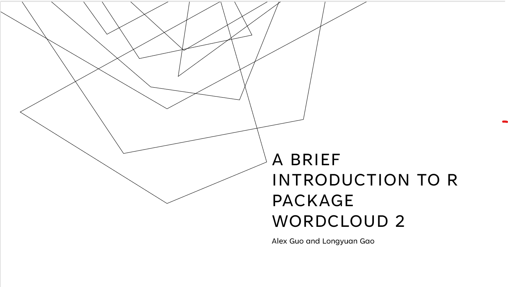

# Wordclouds: a video tutorial on how to make wordclouds from raw text

Jianxun Guo and Longyuan Gao

```{r}
library(stringi) #install.packages(stringi)
library(dplyr)
library(devtools)
#install_github("lchiffon/wordcloud2")
library(wordcloud2) #Must be installed from source
```
## Introduction
Wordclouds are aggregations of words appear in the text with size depending on the frequency of the words. Although word clouds are less used in rigorous EDAV, it is an eye-catching and powerful tool to present ideas and information to the mass. In this project, we provide a short yet fairly comprehensive video tutorial that covers the R library WordCloud2, and we also provide several methods to an often ignored issue, which is to convert raw text to word count dataframes that can be fed directly into wordcloud2 functions. After watching this tutorial, we believe one can easily generate various kinds of word clouds from raw texts in R.

## Link to Youtube video

[Link](https://youtu.be/GXB54_iGWFc)

## Slides
[The slide is in this link, and is also in the resources folder](https://drive.google.com/drive/folders/1uCz7hWf-uUpV-SlDNEExPw0Hd9baPIuz?usp=share_link)

## Code Examples
Here is the example we are going to use in this tutorial, which is from https://www.gsas.columbia.edu/content/academic-integrity-and-responsible-conduct-research, Academic Integrity and Responsible Conduct of Research, Columbia University.
```{r}
code <- "Students should be aware that academic dishonesty (for example, plagiarism, cheating on an
examination, or dishonesty in dealing with a faculty member or other University official) or
the threat of violence or harassment are particularly serious offenses and will be dealt
with severely under Dean's Discipline. Graduate students are expected to exhibit the high level of personal and academic integrity
and honesty required of all members of an academic community as they engage in scholarly
discourse and research. Scholars draw inspiration from the work done by other scholars; they argue their claims with
reference to others’ work; they extract evidence from the world or from earlier scholarly
works. When a student engages in these activities, it is vital to credit properly the source
of his or her claims or evidence. Failing to do so violates one’s scholarly responsibility. In practical terms, students must not cheat on examinations, and deliberate plagiarism is of
course prohibited. Plagiarism includes buying, stealing, borrowing, or otherwise obtaining
all or part of a paper (including obtaining or posting a paper online); hiring someone to
write a paper; copying from or paraphrasing another source without proper citation or
falsification of citations; and building on the ideas of another without citation.  "
```
### First step: from raw text to word count dataframe
Since here we assign the string directly, we do not need to do the readline from file step. However, if you need to do so, you can do it by 1) readline from file and 2)covert the read lines to one long string:
```{r}
#code <- readLines(“.\\conductCode.txt”)
#code <- paste(code, collapse = " ")
```
Next, we use regular expressions to extract all individual words, and convert them to lower case, in case of same words with different cases:
```{r}
code <- stri_extract_all_regex(code, "(\\w+[[:punct:]]\\w+)|(\\b\\w+\\b)")
code <- lapply(code, tolower)
```
Notice here we use regular expressions to extract all words with no special chars in them or with special chars within them, like "one's", "that's", etc. You can also change the regex to catch more possible words. Also notice that there are many other libraries that can do the same thing.

Next, we convert the extracted words to a frequency table and then to a dataframe (so that we can feed the df directly into wordcloud functions):
```{r}
code <- table(code)
code <- data.frame(code)
head(code)
```

Notice that there are some function words like "in", "and", "or" that make up a good portion of the frequency table. You can consider filtering some of these function words by:
```{r}
filterwords <- c("and", "a", "of","or", "is","are","in","from","the","on","at","not","an","as") #list of unwanted words
filterwords <- paste(c("^",paste(filterwords,collapse = "$|^"),"$"),collapse = "") #glue words together, forming regex
code <- code %>% dplyr::filter(!grepl(filterwords,code))
head(code)
```
### Step 2: from word counts to wordclouds using Wordcloud2
First, we explore some functionalities in function 
wordcloud2. The data is the word count data frame:

#### wordcloud2 function

```{r}
wordcloud2(data = code, 
           color = "random-light",
           fontFamily = "Times New Roman", 
           shape="cardioid")
```
There are several parameters you can tune:

* Parameters
  + color: color theme of the wordcloud
  + min/maxRotation: if words rotate, the range (in rad) the word will rotate
  + shape: the shape of the wordcloud
  + figPath: path to the figure used for masking the wordcloud
  + rotateRatio: the proportion of words to be rotated (ranging from 0 to 1)
  + ...
  
You can find more detailed descriptions on [Wordcloud CRAN site](https://cran.r-project.org/web/packages/wordcloud2/vignettes/wordcloud.html). The parameters allow for great variabilities of wordclouds.

Here is another example using rotation:
```{r}
wordcloud2(data = code, 
           minRotation = pi/4,
           maxRotation = pi/3,
           rotateRatio = 1)

```
Here is an example with figPath set. The figure will define the shape of the generated wordcloud:

**Important note**: There is an inherent bug in wordcloud2 library. When figPath is set or we use lettercloud function, the generated wordcloud would not render. Possible fixes are to run this code in a R script and open the wordcloud in a browser. Alternatively you can hit the refresh button in the R viewer until the image appears. The logo is from [Wikipedia](https://commons.wikimedia.org/wiki/File:Apple_logo_black.svg)


```{r}
wordcloud2(data = code, figPath = "resources/wordclouds_video_tutorial/Apple_logo_black.png.png")
```

**Rendered results are in the slides.**

#### lettercloud function
This function allows for wordclouds masked by a letter or a word. In this function we must set the "word" argument.
Some parameters we can tune:

* Parameters
  + word: a required argument. Creates shape for wordcloud
  + wordSize: default=2. Parameter of size of the word
  + letterFont: set font
  + Other parameters are the same as wordcloud2 function.
  
Here is an example with "E" masking:

**The bug aforementioned may prevent this fromm rendering. Please see slides for a rendered image.**

```{r}
letterCloud(code,
            word ="E", 
            wordSize = 2)
```

Here is an example with "EDAV" word masking:

**The bug aforementioned may prevent this from rendering. Please see slides for a rendered image.**

```{r}
letterCloud(code,
            word ="EDAV", 
            wordSize = 2)

```

## Reflections
From this project, we consolidated our R programming skills. More specifically, we learned many ways to deal with raw texts in R, such as extracting English words from the texts using Regex. We also mastered the wordcloud functions and parameters in detail.
Regarding what we might do differently next time, we will probably spend more times dealing with the inherent bugs in the library, like the one that makes rendered word clouds disappear. We will spend more time finding ways to overcome or circumvent this bug.
